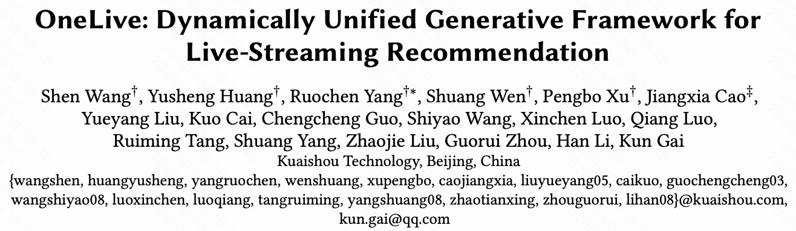
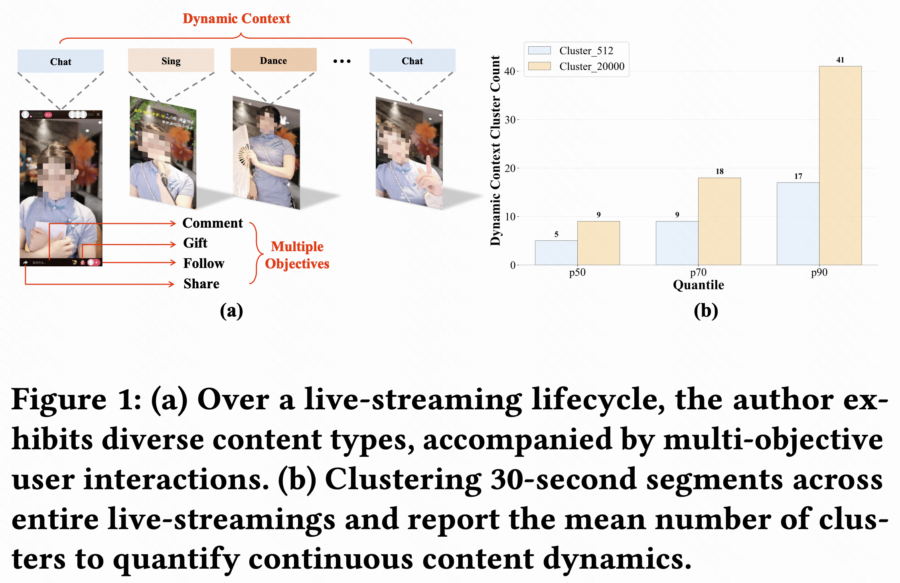
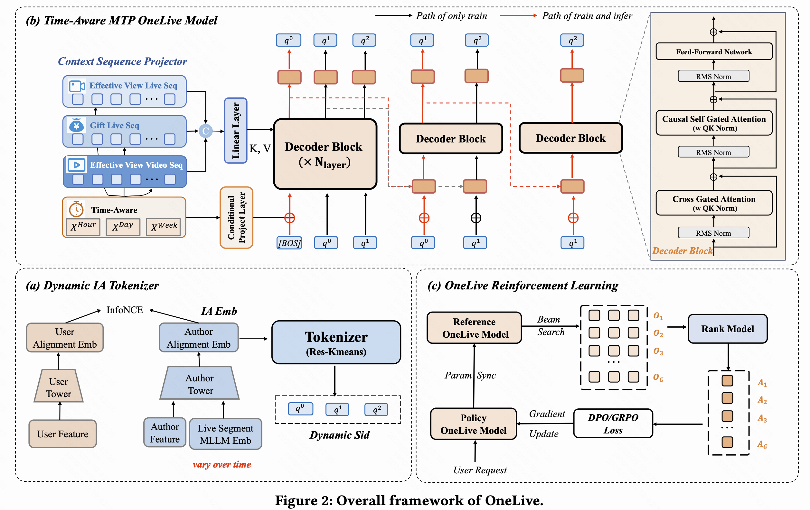
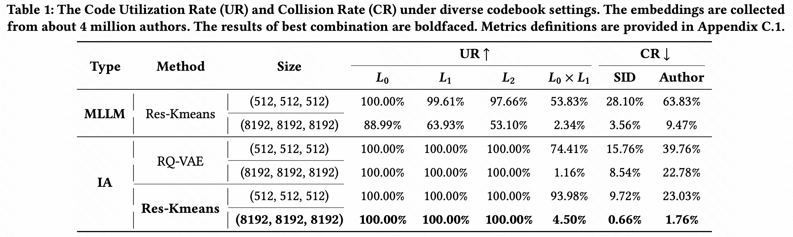
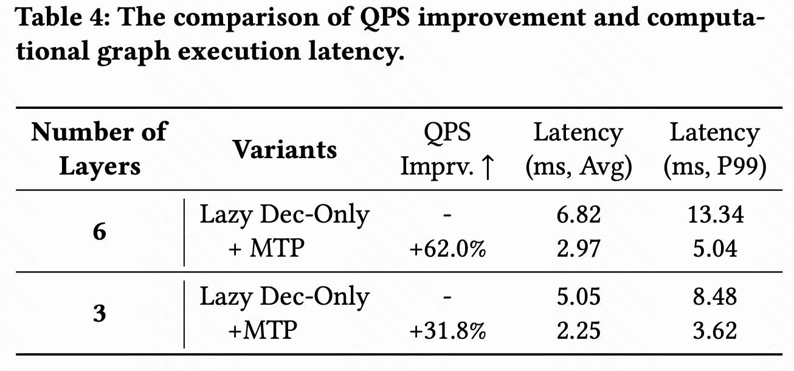
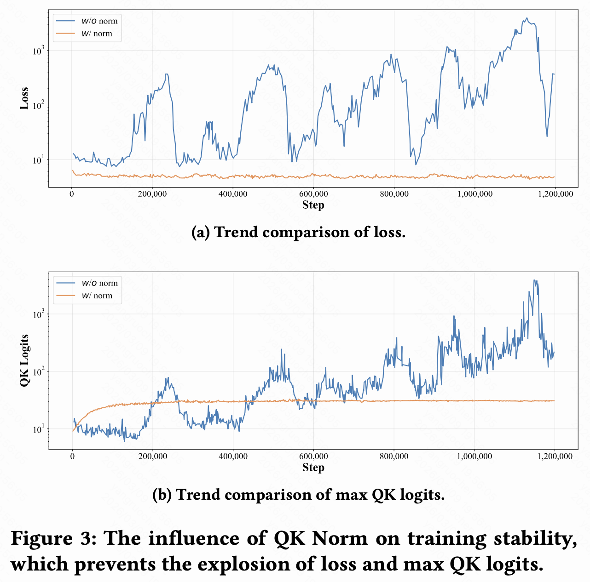
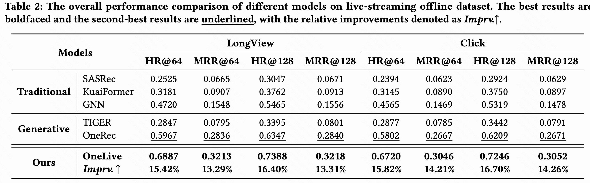
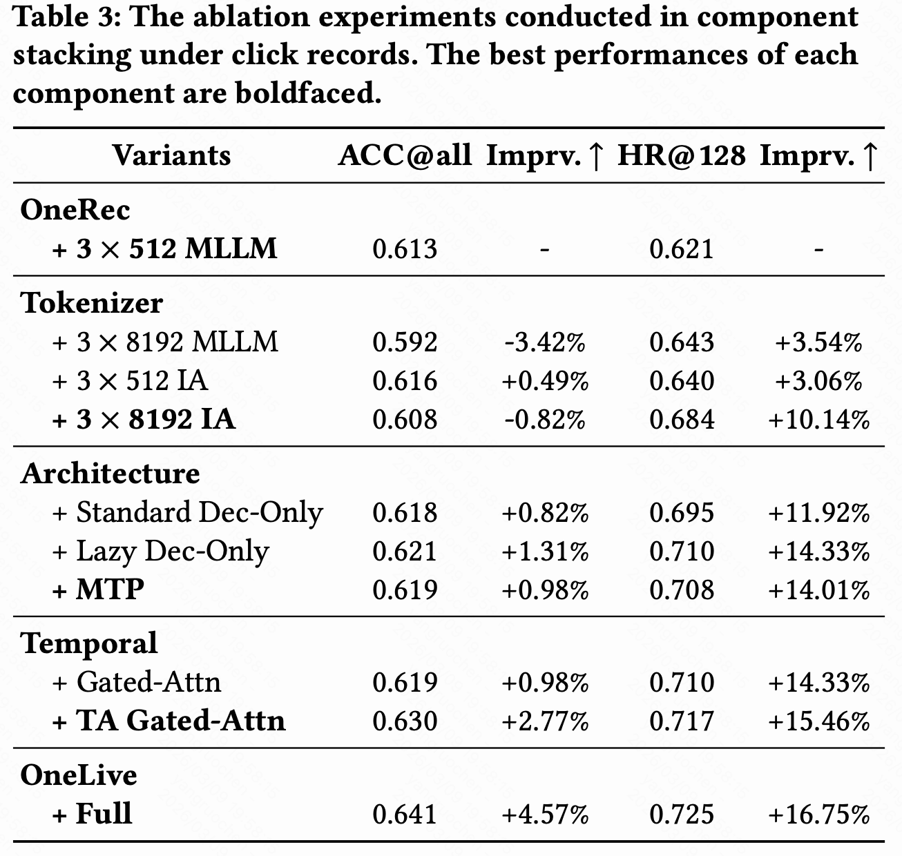
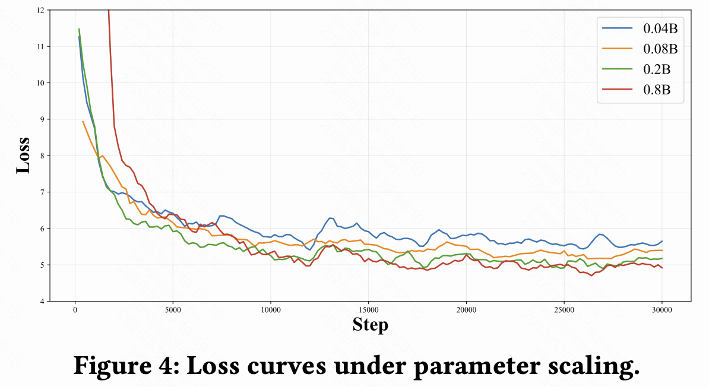
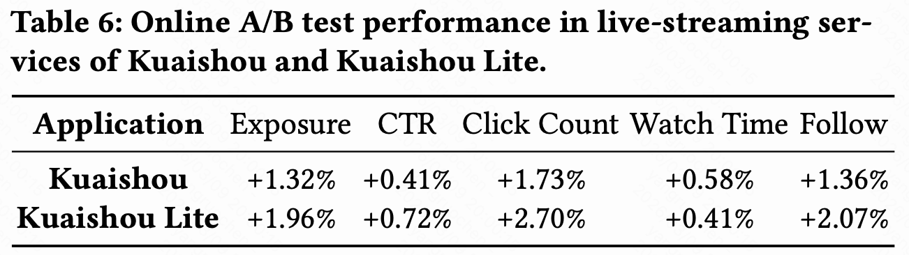

# 快手OneLive：生成式推荐在直播场景的首次落地！

TLDR：

生成式AI正推动推荐系统从传统级联架构，向 **生成式推荐（Generative Recommendation）** 加速演进。但在直播推荐这类强动态、强实时、短生命周期的真实场景中，现有生成式范式仍面临显著落地挑战。

快手推荐模型部直播模型组近期在ArXiv发布论文 **OneLive: Dynamically Unified Generative Framework for Live-Streaming Recommendation**，面向直播场景核心痛点，提出 **业界首个专为直播场景设计的生成式推荐框架**，针对直播动态特性重新设计生成式结构，并已在大规模工业级直播推荐系统中实现落地。

**论文链接:** https://arxiv.org/abs/2602.08612 

---
## 一、背景：生成式推荐在直播场景下的困境

  
  
<strong>直播内容持续动态变化</strong>

直播推荐系统是连接海量用户与主播实时互动的核心基础设施，传统工业界普遍采用 “召回 - 粗排 - 精排” 的复杂级联架构，以应对线上高并发场景的需求。近年来，生成式推荐通过将推荐的匹配任务转化为序列的生成任务，为打破传统级联架构的性能瓶颈提供了新路径。但需注意的是，现有生成式推荐架构均依赖内容与表征静态不变的前提假设 —— 例如短视频、商品等内容在上传后即固定不变，可通过单次编码形成稳定表征进行复用。

当这种静态生成式范式直接应用于直播场景时，会面临四大核心挑战：
1. **动态内容（Dynamic Content）：** 与上传后即固定的短视频、图文内容不同，直播内容在开播期间持续演变，主播行为、实时弹幕反馈、直播间互动氛围均会随时间发生显著变化。传统静态表征范式无法捕捉这种动态变化，更难以应对直播内容漂移问题，无法用固定表征精准刻画直播间的实时状态。
2. **极短生命周期（Limited Lifecycle）：** 直播系统有着严格时间约束 —— 只有正在开播的直播才具备推荐资格，而非传统平台的持久化内容库存，直播必须在黄金曝光窗口内完成推荐才能实现其全部价值。
3. **实时响应约束（Real-Time Response Constraint）：** 直播推荐运行在高并发、低延迟的线上环境中，候选池动态快速演变，用户查询高频抵达。这要求生成式模型在保证预测精度的同时，必须实现高效推理，满足低延迟、高吞吐量的线上部署要求。
4. **多目标需求（Multiple Objectives）：** 直播推荐是典型的多目标任务，涵盖点击、分享、关注、打赏等丰富的用户反馈信号。同时，用户在各类互动、消费行为上的偏好差异显著，存在明显的异质性，传统单目标或多任务塔模型难以实现多目标偏好对齐，更无法将多样化监督信号融入统一的生成式训练管道。
   
因此，直播推荐亟需一套专为其量身定制的全新生成式框架，这也是快手直播模型组所提出的 **OneLive** 框架的核心出发点。

---
## 二、方法：生成式直播推荐框架OneLive

  
  
<strong>模型架构</strong>

快手直播模型团队针对直播场景打造了全新的生成式直播推荐框架 **OneLive** ，从 **动态 tokenization**、**时间感知生成**、**Sequential MTP 加速推理** 与 **QK-Norm 稳定训练**、到 **多目标策略优化** 全方位构建统一生成式推荐模型，适配于实时性强、内容持续演化的直播推荐场景:

### 1. 动态tokenizer（Dynamic Tokenizer）

直播推荐中，内容不断变化，主播的状态和行为也在实时变化，因此传统的静态表示方式无法很好地处理这些动态特征。

**Dynamic Tokenizer** 通过对直播内容和用户行为信号的持续编码，生成可以灵活适应内容变化的动态表示。具体而言：

+ 使用 MLLM 提取实时内容向量 $x^{30s}_{MLLM}$（30s 滑窗更新）。
+ 用 gated 机制融合作者静态属性与内容摘要：
$$  
x_{MLLM}=M L P(x_{ML M}^{30s}\oplus x_{MLLM}^{pooling})
$$
$$
x_{Author}=\lambda x_{AId} + (1-\lambda)x_{MLLM} 
$$
+ 得到最终 IA embedding $x_{IA}=x_{Author}$，随后使用多层残差量化 Res-Kmeans 逐级生成 IA Code，迭代得到主播对应的完整的 SID $\{q_0, q_1, ..., q_T\}$。

  
  
<strong>多种类型与量化方法所得 Code 的对比，展现出 IA Code 的优越性
</strong>

### 2. 时序动态限制（Time-Aware Gated Attention）

直播推荐还涉及到**时间**的变化。1）直播间的时序动态性；不同时间段的开播状态、内容、风格和行为模式可能大不相同；2）用户的兴趣也会随着时间有着固定迁移的 pattern 迁移；（比如：工作时间关注时政新闻，下班关注颜值、游戏）。因此，OneLive 引入了时间动态信息，目标是通过显式建模时间变化，提高模型对时序信息的敏感度，提高兴趣捕捉的准度。具体而言：
+ 对用户历史序列加入时间编码：
$$
x_{i\_ta} = x_i + MLP(\text{TimeFeature})
$$
+ 对生成 anchor ([BOS]) 进行时序感知的增强：
$$
x_{[BOS]\_ta} = x_{[BOS]} + MLP(\text{TimeFeature})
$$
+ 通过 **Time-Aware Gated Attention** 实现时序的动态加权：
$$
\text{Score}(X) = \sigma(XW_{\theta})
$$
$$
O = \left(\text{MultiHeadAttn}(XW_Q, X'W_K, X'W_V) \odot \text{Score}(X)\right)W_O
$$

通过该机制，OneLive 能够对直播中不同时间段的用户需求做出更加精准的预测，从而提高推荐效果。

### 3. 训练与推理性能优化（Sequential MTP + QK Norm）

标准 decoder only 的自回归推理生成序列效率是较低的：三级 SID 生成往往是第一级较难，而后续较易；对于三级 SID 都使用相同层数的 decoder 生成会产生极大的算力浪费。 因此，受 DeepSeekV3[1] 启发，OneLive 设计了 **Sequential MTP (Multi-Token Prediction)**，通过主 decoder（多层）生成第一级 SID，而轻量级的 decoder（1层）生成后续的 SID；同时三个 decoder 共享 KV Cache 进一步提升推理速度。

训练任务为多级解码模块的加权：
$$
\mathcal{L}_{MTP} := w_0\mathcal{L}_{\text{MTP}_{main}} + w_1\mathcal{L}_{\text{MTP}_{1}} + w_2\mathcal{L}_{\text{MTP}_{2}}
$$
$$
\mathcal{L}_{\text{MTP}_{k}} := -\text{log} \ p(q^{k:2}|[\text{BOS}], q^{<2}, E)
$$

在论文表4中可以看到，这种设计能在3/6层 decoder 的设定下，提升 31.8%/62.0% 的吞吐且 hitrate 基本持平。

  
  
<strong>MTP模块带来了显著的吞吐量提升
</strong>

此外，Time-Aware Gated Attention 引入的稀疏增强，提升信噪比的同时，减少了层级流通的信息量，导致被激活 token logit 的膨胀。在深层注意力中 QK logits  会产生数值上溢导致 loss 震荡、训练崩溃。OneLive 在注意力前引入 QK Norm，通过 RMS 归一化，通过抑制了隐层尺度漂移，显著稳定 loss 和训练过程：
$$
\text{Attn}(Q,K,V) = \text{Softmax}(\frac{\text{RMSNorm}(Q) \text{RMSNorm}(K)^T}{\sqrt{d}})V
$$

通过这两项设计，OneLive 在保证生成式推荐能力的同时，有效地解决了推理速度和计算成本的问题。

  
  
<strong>QK Norm的加入有效增强了训练的稳定性
</strong>

### 4. 多目标对齐模块（Multi-objective Alignment Module）

直播推荐场景中的用户反馈非常多样，包括点击、观看时长、关注、送礼等多种行为目标。传统的推荐方法往往将这些目标作为不同的优化问题来解决，但这样做容易导致各个目标之间的冲突和不一致。

为了有效地协调这些多目标，OneLive 引入了一个统一的多目标优化框架，该框架通过强化学习的方式，在统一的生成模型中同时优化多个目标。具体来说：
+ 利用 Pathenon[2] 多目标排序模型统一计算奖励：
$$
Score = \text{Pantheon}(\text{User}, \text{Author})
$$
+ 使用 DPO 或 GRPO 优化策略

这种方法使得 OneLive 能够在一个统一框架下处理多个目标，不仅提高了推荐系统的准确性，还保证了多样化目标之间的协调。

---

## 三、 工业级落地验证：从实验室走向真实世界

充分的实验展示了 **OneLive** 在直播推荐任务上的强大性能，既涵盖了离线实验，也展示了在线部署后的效果：

### 1. 离线实验

  
  
<strong>离线实现对比
</strong>

在离线实验中的对比表明，OneLive 的方法在多个方面优于现有方法，尤其是在处理复杂的直播内容时，能够更加有效地优化推荐质量。

### 2. 组件消融实验

  
  
<strong>组件消融实验
</strong>

论文进行了组件消融实验以评估每个模块对最终效果的影响。总体来看，所有设计模块都对最终的推荐效果起到了正向作用，尤其是 **Time-Aware Gated Attention** 和 **Dynamic Tokenizer**，它们在处理直播内容的动态性和时序性方面至关重要。

### 3. 参数扩展实验：评估模型规模与性能的关系
 

  
  
<strong>模型规模与性能的关系评估曲线
</strong>

论文中测试了不同规模的 OneLive 模型，并观察了它们在推荐任务上的表现。结果表明，随着模型参数的增大，性能整体呈现稳定提升，这意味着模型能够更好地捕捉用户的复杂行为模式和内容的多样性。然而，边际效应逐渐显现，表明随着规模的扩大，性能提升的幅度开始变小。因此，在实际应用中，模型规模需要在性能提升和计算成本之间找到平衡。

### 4. 在线A/B Test：

  
  
<strong>双端在线A/B Tests验证了OneLive对线上业务的收益
</strong>

**OneLive** 部署在了快手与快手极速版双端直播业务场景中，实现了**在大型真实世界直播平台上统一生成式推荐框架的首次部署**。双端A/B测试展现出了 OneLive 置信的业务收益。它不仅证明了生成式推荐在高度动态、强实时场景中的可行性，更为未来全场景、端到端的实时流媒体推荐系统提供了一个极具参考价值的范式。

---

# 四、 结语

OneLive 的成功部署充分展示了该框架在直播推荐中的潜力，不仅通过离线实验验证了其优越性，还通过线上 A/B 测试证明了其在工业环境中的可行性。尤其值得注意的是，OneLive 通过精心设计的多重组件，成功应对了直播推荐中的动态变化、时序性和性能优化等问题，推动生成式推荐方法向更复杂的实时场景的扩展。

[1]Liu A, Feng B, Xue B, et al. Deepseek-v3 technical report[J]. arXiv preprint arXiv:2412.19437, 2024.

[2]Cao J, Xu P, Cheng Y, et al. Pantheon: Personalized multi-objective ensemble sort via iterative pareto policy optimization[C]//Proceedings of the 34th ACM International Conference on Information and Knowledge Management. 2025: 5575-5582.

