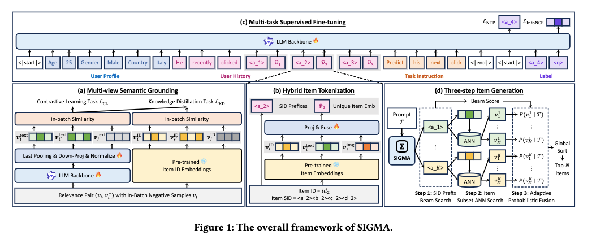

# 阿里，生成式推荐，GMV+8%

关注我，每天为你精挑细选最优质、最新鲜的推荐算法paper，陪你一起保持进步、不断精进！

### 论文：SIGMA: A Semantic-Grounded Instruction-Driven Generative Multi-Task Recommender at AliExpress
### 网址：https://arxiv.org/pdf/2602.22913
### 公司：阿里国际
### 思想：
### 方向：生成式推荐+SID

## 解读：
召回排序一体的生成式推荐模型。先通过对比学习、蒸馏学习微调模型，再通过NTP任务和预测最终物品任务训练一个生成式推荐模型，可以用于召回。特别的，考虑beam search和SID归一化概率，实现了进一步的ranking。

### （1）微调大模型
搜集搜索日志（text与item）、同风格视觉特征（item与item）、节日/趋势数据（text与item）、 同一会话内共现物品（item与item）等4种数据，并混合随机打乱成batch，通过对比学习和蒸馏，微调大模型qwen3.5。
* 对比学习：就是将一个batch里的所有文本（text）、item（metadata, 如title, category, brand等拼接成一个个文本）输入到大模型里，只请求表征，以获得text和item的表征。InfoNCE损失，优化模型。
* 蒸馏学习：线上运行的模型获得的item id的embedding，可以衡量2种样本数据里的（item，item）对的关系，将这种关系作为teacher；而用大模型获得的embedding的衡量同样的关系，作为student。将前者的知识蒸馏到后者上，从而提高大模型生成优质embed的能力。

### （2）Next Token Prediction任务
用推荐、搜索、节日促销、主题推荐、兴趣探索、品类页等场景的数据用来做ntp训练。所有任务共用同一套指令模板，只需改prompt指令就能切换任务，真正实现多任务统一。
每条样本由以下 5 部分拼接而成（输入到 LLM）：
* 用户静态画像（age, gender, location 等）
* 用户历史行为序列（后面讲）
* 任务专用指令（自然语言！）
    * 例：推荐：“为该用户推荐10件最感兴趣的商品”；节日促销：“按照圣诞节主题，推荐适合的节日礼物”
* 目标物品的SID前缀（后面讲，通过RQ-VAE获得的）
* q：特殊的token，就像bert里的[CLS]符号

特别的，NTP任务是预测SID，而SID是量化后模糊了item的具体信息，所以NTP任务是一个模糊的预测任务。所以，为了更加精确，除了NTP任务外，还有一个辅助任务——在该SID下计算一个预测最终物品ID。

#### 预测最终物品任务
在生成完target item的SID时候，模型同时输出特殊符号q的表征，这个q是看到了所有数据的，包括target item的SID信息的，它携带了用户精细个性化意图。
用它去匹配target item的融合embed（后面讲）。与上面的NTP任务一起联合优化模型。NTP是粗粒度的，本任务是细粒度的。

### （3）预估
* 召回，包括粗召回 + 细召回——把全站几亿商品瞬间缩小到几千个候选
    * Step 1 粗召回：Beam Search生成Top-K SID前缀。 
    * Step 2 细召回：ANN在每个SID子空间检索 Top-M。注意，ANN索引了该SID下所有item的融合embed。
* 精排
    * 最终给所有候选打分并排序，每个item的分数是beam search的分数，乘以一个归一化得分。
        * 归一化得分：该item找到对应的SID，而该SID包含很多具体的item，可能有几千个，q在这些item下，计算该选出来item的softmax概率。特别的，为了区分上面提到的搜索、推荐等任务，还在exp里增加了一个sigma，在此不展开了。

### 重要补充——item Tokenization：
提前训练RQ-VAE，用它获得了item SID。还生成了一个融合embed。两者拼接作为item的token。
* 融合embed：3种表征，拼接后，通过一个MLP之后，获得的表征。3种表征包括：
    * 线上模型获得的item表征
    * 用多模态模型，item的图像的表征
    * 上面对比学习那样，用大模型获得的item的表征。

在NTP预测的时候，序列元素是SID和融合embed的拼接；在预测最终物品任务里，匹配的是target的融合embed。

**AB**：2周，订单量+2.80%，转化率+3.84%，GMV+7.84%，购买品类广度+2.47%。

## 心得：
* 多个域的数据训练一个大模型，有互相促进作用。通过prompt调动模型，在特定域来推荐item。
* 微调大模型的方式，已经取代了双塔ebr模型的做法，成为了行业的标准操作。
* NTP粗粒度预测外，增加一个细粒度预测，这种粗细粒度的做法，有多篇这样的工作，这种做法也几乎成为了行业的标准操作。
* 现在GR项目都是一个庞大的项目，设计多个环节的创新，学习起来花的时间比普通文章要多。

## 愚见
公式11里有个小错误。

## 可信度：生产

## 推荐等级：有实践价值

**请帮忙点赞、转发，谢谢。欢迎干货投稿 \ 论文宣传\ 合作交流**

### 【铁粉】请入微信群，群内我会给出更深入的解读，还可以共同讨论技术方案、发招聘广告、内推和交友等。
* 铁粉标准：关注公众号一个月以上，且在公众号上累计15次互动（评论、爱心、转发）、或投稿1次、或打赏199，只欢迎技术同学。
* 入群方法：请您加个人微信lmxhappy，我拉您入群，请备注【公司】（只我个人看，不公开）。

## 推荐您继续阅读：

