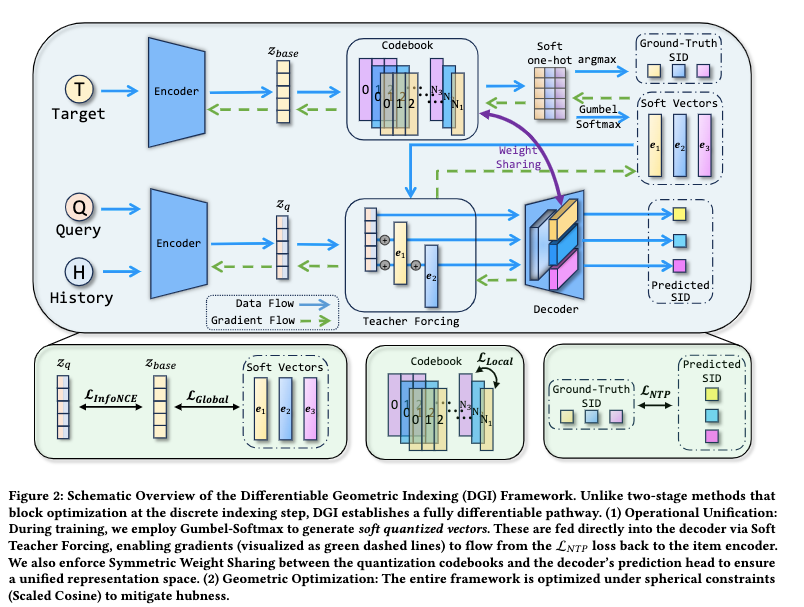

# 阿里，SID和GR联合训练，RPM +1.11%

关注我，每天为你精挑细选最优质、最新鲜的推荐算法paper，陪你一起保持进步、不断精进！

### 论文：Differentiable Geometric Indexing for End-to-End Generative Retrieval
### 网址：https://arxiv.org/pdf/2603.10409
### 公司：阿里
### 思想：端对端
### 方向：SID+GR+召回

## 解读：
本文将RQ-VAE与GR模型端到端联合训练。这样训练出来的codebook的质量更高，从而使GR生成的效果更好。
即在训练的时候，将codebook所有向量的加权和作为GR的输入。但是在预估的时候，仍然用SID作为GR的输入。

### （1）Soft Teacher Forcing
GR的输入token，不再使用“RQ-VAE获得离散SID → SID embedding layer → token embed” ，而是直接使用 codebook 所有向量的加权和（称为软向量）作为GR decoder的输入。
通过Gumbel-Softmax得到软向量的。即权重是VAE获得的向量h跟codebook里的code向量求得相似权重，再通过Gumbel-Softmax获得所有行向量的权重，从而对整个codebook向量计算加权和。
这样获得的软向量有两个好处：
* 相比硬argmax，梯度没有阻断，可以回传梯度到codebook及encoder，从而更新优化它们。
    * argmax梯度处处为0，不能将梯度会穿给codebook、encoder等。在之前的两阶段实现里，quantizer 中的硬 argmax 会把 L_NTP 的梯度彻底阻断，包括被选中的 codebook 向量也拿不到任何梯度。这正是 DGI 要用 Soft Teacher Forcing + Gumbel-Softmax 的根本原因。
* 相比普通的softmax，无偏、低方差，从而使训练稳定——梯度平滑稳定，loss稳定下降。
* codebook里的code的质量更高。一个样本就把整个 codebook的所有向量都拉动了一下！热门code拉得多，冷门code也拉一点，这叫全局重塑。简单理解，就是优化了一下全局的聚类。

### （2）Symmetric Weight Sharing
GR输入和输出都是在一个空间的，即索引空间和解码空间完全重合，传统上用的是SID embedding layer。
本文用的是codebook，即预估的logit从codebook里选择最相似的行向量作为输出。

### （3）Scaled Cosine
在Quantizer索引的时候和Decoder解码的时候，从codebook挑选最相似的行向量的时候，通过cosine，而不是内积。而且还加了一个可学习的scaler参数。
这样的好处是：存储时保留原始模长（可被梯度更新），但计算时完全忽略其模长，只使用它的方向（单位向量）。

### 推理：
* 离线计算：对所有 item 跑一遍硬 argmax 量化，得到完整的SID。把SID拆成多级前缀，建立层次倒排索引。同时缓存每个item的归一化 embedding。
* 在线查询：Decoder生成部分 SID（用 Beam Search）→ 直接查这个倒排索引 → 拿到候选商品集合→ 再用 Scaled Cosine 对候选集精排。

## 心得：
* GR的组件，特别是SID，有很大的提升空间，很多人在做研究，也说明这个方向被广泛认可是有效的。
* DGI 的核心技术理论上具有一定的通用性，可以扩展到其他模型（包括多模态接入普通 CTR 模型），但不是“直接即插即用”，需要做一定适配。

**AB**：速卖通，CTR +1.27%，RPM +1.11%。

## 愚见

## 可信度：生产

## 推荐等级：有实践价值

**请帮忙点赞、转发，谢谢。欢迎干货投稿 \ 论文宣传\ 合作交流**

### 【铁粉】请入微信群，群内我会给出更深入的解读，还可以共同讨论技术方案、发招聘广告、内推和交友等。
* 铁粉标准：关注公众号一个月以上，且在公众号上累计15次互动（评论、爱心、转发）、或投稿1次、或打赏199，只欢迎技术同学。
* 入群方法：请您加个人微信lmxhappy，我拉您入群，请备注【公司】（只我个人看，不公开）。

## 推荐您继续阅读：

