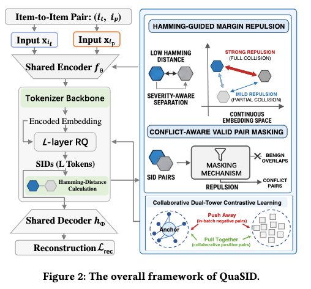

# 快手，SID新方法，GMV+2%

关注我，每天为你精挑细选最优质、最新鲜的推荐算法paper，陪你一起保持进步、不断精进！

### 论文：Stop Treating Collisions Equally: Qualification-Aware Semantic ID Learning for Recommendation at Industrial Scale
### 网址：https://arxiv.org/pdf/2603.00632
### 公司：快手
### 思想：对比学习
### 方向：SID

## 解读：
设计了一种减少SID碰撞，从而获得优质SID的方法。
除了已有RQ-VAE的学习任务，增加两个辅助学习任务：（1）对生成的SID碰撞进行惩罚，（2）对比学习提升多模态encoder编码效果。两者都是在量化前对连续编码空间进行对齐。具体的，

### （1）SID碰撞惩罚任务
(trigger, target) 是从用户真实行为日志里采样出来的“共现正样本对” ，在一个size是B的batch里，两两item之间，对比它们的SID，看是否碰撞，对碰撞进行惩罚，提升SID的建模效果。主动注入协同信号，让SID 学到行为相似性。

#### 构建惩罚掩码矩阵 
一个batch里，两两item之间可以，“共现正样本对”和同一物品，SID相同是正常的，不需要惩罚的，否则就需要惩罚。
一个batch，总共有2B个item，那么就可以形成shape（2B，2B）的掩码矩阵，需要惩罚的，设置为1，否则为0.

#### 构建Hamming距离矩阵
一个batch里，构建shape（2B，2B）的Hamming距离矩阵，就是item i的SID和item j的SID，做比较的结果。L长度的SID，包含L个token，两个token序列，一一对比，统计不相同的数量，作为该矩阵的元素值。

可以分成两类
* 完全碰撞：元素值为0
* 部分碰撞：元素值非0，且小于等于超参数R
* 正常：元素值大于超参数R

#### 碰撞惩罚
对完全碰撞和部分碰撞进行惩罚。（trigger-target）对通过encoder获得的它们的embedding，用hinge loss计算损失，对完全碰撞和部分碰撞，用不同的“强制推开的最小安全距离”，前者的大，后者的小。从而对不同的碰撞，做不同的惩罚，就是题目所说的conflict-Aware。

### （2）对比学习任务
SID碰撞惩罚是将多模态embed映射到合适的离散ID上，减少碰撞，那么同时如果就是提高encoder的建模效果，从而多模态的embed的效果，那就更好了。
具体的，构造好的协同正样本对（trigger-target），通过对比学习，对encoder获得的它们的embedding，使用InfoNCE对比损失，在连续空间把用户共现物品“拉近”，让 SID 同时具备多模态 + 协同行为语义。

**AB**：快手电商，推荐场景GMV提升2.38%，冷启动订单最高提升6.42%。

## 心得：
* 协同信息对齐已经是常规做法。之前的文献、本文已经体现了这点。
* 碰撞惩罚，也是一种对比学习。对比学习能够做好区分工作，获得优质SID。

## 愚见
* 惩罚掩码矩阵、 Hamming距离矩阵，有点理论化，特别是前者，后者还稍好一些，降低了可读性。

## 可信度：生产

## 推荐等级：有实践价值

**请帮忙点赞、转发，谢谢。欢迎干货投稿 \ 论文宣传\ 合作交流**

### 【铁粉】请入微信群，群内我会给出更深入的解读，还可以共同讨论技术方案、发招聘广告、内推和交友等。
* 铁粉标准：关注公众号一个月以上，且在公众号上累计15次互动（评论、爱心、转发）、或投稿1次、或打赏199，只欢迎技术同学。
* 入群方法：请您加个人微信lmxhappy，我拉您入群，请备注【公司】（只我个人看，不公开）。

## 推荐您继续阅读：

