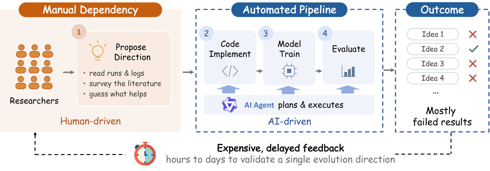
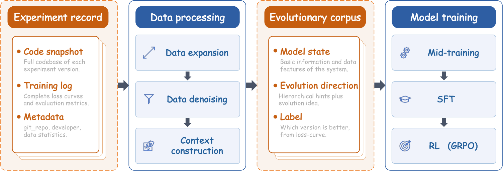
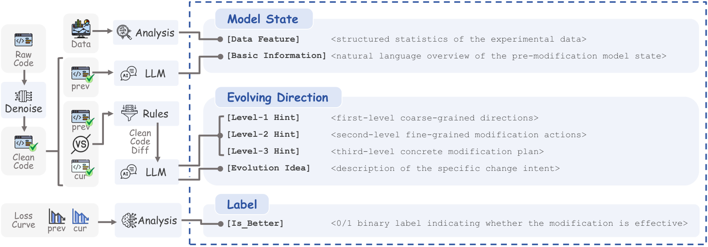
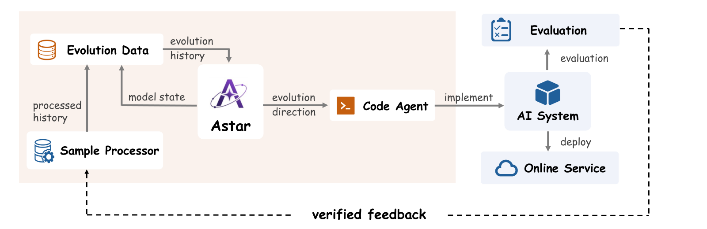

# 阿里模型进化机器人：两周 20 轮迭代，广告 GMV +4.86%

关注我，每天为你精挑细选最优质、最新鲜的推荐算法paper，陪你一起保持进步、不断精进！

### 论文：Astar: Learning to Propose Evolution Directions for Self-Evolving Industrial AI Systems
### 网址：https://arxiv.org/html/2608.27287
### 公司：阿里巴巴
### 思想：从迭代历史中学经验、层次化约束搜索空间、Reward Model做廉价代理验证
### 方向：AI自进化、算法迭代自动化

## 解读：

工业界AI系统的进步靠的是一个四步循环：**提优化方向 → 写代码 → 训模型 → 评估**。后三步已经被coding agent吃得差不多了，只有第一步"这次该改什么"还卡在资深专家手里，而且验证一个方向要走完整的实现-训练-评估流程，动辄几天，选错就是几天算力打水漂。



直接拿通用LLM提方向不行——它对你这个业务、这份数据、这个代码库一无所知，建议"听起来都对，但没一条对得上真实痛点"。想用prompt或skill把知识注进去也难，因为**这类经验是练出来的，不是写下来的**。所以阿里换了条路：**用系统自己的git commit历史训一个专用小模型**。每个commit都记录了"从什么状态出发、改了什么、结果变好还是变差"，这正是区分好方向和坏方向所需要的信号。



整篇工作就两块：**数据侧**把一堆脏commit熬成能训的进化语料，**模型侧**用这份语料走mid-training → SFT → RL。四个挑战也正好分在这两块里：

| 挑战 | 设计 | 归属 |
|---|---|---|
| C1 监督信号稀疏（一个repo通常只有几百个实验记录） | pairwise数据扩充 | 数据侧 |
| C2 有效样本埋在噪声里（日志、重构、改配置） | 两级去噪（规则 + LLM语义） | 数据侧 |
| C3 优化方向空间极大 | 三级层次化提示 | 数据侧标注 + 模型侧输出格式 |
| C4 验证一次要几小时到几天 | Reward Model当代理评估器 | 模型侧 |

## 1 数据侧：把脏commit熬成进化语料

原料是每个实验的完整快照：代码仓库、逐step的loss序列、以及git_repo/commit/dataset_uri这些元信息。要变成训练样本，得过三关：**样本太少 → 扩充**、**样本太脏 → 去噪**、**方向太散 → 打标**。

### （1.1）扩充：pairwise配对
只用相邻实验 `E_t → E_{t+1}` 出不了几条数据，且相邻commit多是零碎微调。作者**任意两个版本配对** `(E_prev, E_cur)`，样本量从线性变平方，label靠**直接比两个版本的完整loss曲线**自动得到，不需要人工标注（注意这里的loss是被优化的那个目标系统的训练loss，线上就是Lazada的召回模型，跟Astar这个LLM自己的loss没关系；原始实验记录里本来就存了逐step的loss序列）。副产品是模型能学到不同时间跨度的演进轨迹。

### （1.2）去噪：先规则后LLM的两级漏斗
先做规则级的 Execution Logic Filtering：**可达性分析**（构建调用图，死代码里的改动丢弃）、**AST归一化**（去print/assert/注释，归一化格式和import顺序，AST相同即无逻辑变更）、**配置白名单**（`output_dir`、`gpu_count` 这类工程变量丢弃，`learning_rate`、`optimizer`、`dnn_blocks` 这类算法参数保留）。

再上 Evolution Intent Filtering：用LLM对纯净diff做语义分析，映射到预定义的意图分类体系，**映射不上的整条丢弃**。

很多团队做类似事情的卡点不在模型而在"历史数据太脏"，这套"先规则后LLM"的漏斗可以直接抄。

### （1.3）打标：三级层次化提示
定义 **Level-1 粗粒度方向 → Level-2 细粒度修改动作 → Level-3 具体修改方案**。Level-1共7类：模型结构、损失设计、优化策略、训练工程、RL策略、数据处理、代码重构；Level-2是每类下的具体模块（attention机制、学习率调度、负样本生成…）；Level-3才是动作（换gated attention、调cosine annealing周期、难样本过采样）。另外让LLM生成一段 **Evolution Idea** 补上分类体系兜不住的细节。

训练时这给了多粒度密集监督，让同类方向天然聚类；推理时强制模型**先定大方向、再定模块、最后出方案**，逐级收窄空间。去掉层次提示，模型判断"这个方向会不会work"的AUC从0.8487掉到0.7910。

### （1.4）成品：一条样本长什么样



**Model State** = 数据集结构化统计 + **上一版代码库的自然语言概述**；**Evolving Direction** = 三级Hint + Evolution Idea；**Label** = `[Is_Better]` 0/1。

一个反直觉的消融：输入用**自然语言摘要**远好于直接喂**原始代码仓库**，单次提方向的命中率 67.9% vs 41.5%。让模型读几万行代码去悟，不如先让另一个LLM把代码库总结成一段话。

## 2 模型侧：Mid-training → SFT → RL

基座Qwen3，训了0.6B/4B/8B三个规模，max seq len 8192。三个阶段各管一件事：**学会怎么说 → 学会说对的 → 学会说没说过的**。

### （2.1）Mid-training：学会怎么说（112B tokens）
在全量演进历史上做next-token prediction，**不做任何正负样本过滤**。目的是领域适配 + 把带三级Hint的结构化输出格式刻进模型。这一步贡献了绝大部分增益：**单次提方向的命中率从 3.8% 直接拉到 60.4%**，后面SFT和RL加起来只再涨了11个点。符合直觉——领域知识注入是从0到1，后两阶段是从1到1.2。

### （2.2）SFT：学会说对的（81.1M tokens）
只喂正样本。怎么定义正样本？还是看目标系统的那条loss曲线，作者定义了一个综合指标

```
s = (1−α)·ℓ_T + α·ℓ̄_k + γ·σ̂_k
```

三项分别是最后一步loss（收敛结果）、最后k步均值（滤瞬时抖动）、这k步标准差（惩罚训练震荡），然后 `z = 1[s_cur < s_prev]`，只留 z=1 的做SFT。输出分布就从"历史上试过什么"偏向"历史上什么有用"。

### （2.3）RL：学会说没说过的（8.06M tokens）
SFT的天花板是拟合历史成功轨迹，探索不了新东西，所以上GRPO，从SFT checkpoint初始化，group size 16。但RL要即时reward，而真实验证一个方向要几天——这就是C4。

解法是**单独训一个Reward Model**：LLM backbone + mean pooling + MLP head，拿SFT阶段筛出的正负样本做二分类，预测这个方向会不会让loss下降。它一边给RL供reward，一边在推理时给候选方向排序，把几天的验证变成几秒的打分。

这里有个很扎心的数字：**资深算法专家判断一个方向能不能work，AUC只有0.6142**，比抛硬币好一点但不多；GPT-5.5、Claude-4.8-Opus这些通用模型全在0.53-0.60之间徘徊，基本等于随机。而Astar的reward model，**0.6B就能到0.8094，8B到0.8487**。这说明"哪个方向会work"这件事里，确实存在一批只能从这个系统自己的历史里学到、通用知识够不着的模式。

**边训边校准**：RL训着训着，Astar（RL的行话叫policy，就是正在被优化的那个生成模型）会越来越敢提新花样，提出来的方向逐渐偏离历史数据的分布。而reward model只见过历史，超出射程就打不准了——裁判看不懂选手的新动作。作者的办法是周期性抽检：每隔 `T_audit` 步，从最近生成的那批方向里采几条**真的跑一遍训练**，拿真实结果跟reward model的打分对一对；如果偏差连续多次超阈值，就把这几条实测样本加进校准集，先把reward model更新一遍再继续训。

## 3 落地：数据侧和模型侧接成闭环
线上workflow六步：Astar生成方向 → Code Agent（Qwen/Claude这类通用模型）翻译成可运行代码 → 训练+离线评估，成功的推上线 → 结果走一遍去噪流水线抽成结构化样本 → 回流继续训Astar。注意第四步走的就是数据侧那套去噪流水线——**每一轮线上迭代都在给自己造训练数据**。作者强调这个闭环是必须的：**静态的Astar会掉队**，系统一旦演进到训练数据没覆盖的状态，建议就过时了。

## 4 线上效果
先说命中率。判定方式是把方向真的实现出来跑一遍，看loss降没降：**Astar-8B 提一次就命中的概率是 67.9%，资深算法专家 32.3%，最强的通用模型GPT-5.5 30.7%**。连0.6B的Astar都有54.4%，碾压所有基线。

部署在Lazada广告平台的召回模型上，两周内连续指导了**20轮迭代**，离线Hitrate@200累计**+23.6%**。2026年7月1-5日的A/B：**GMV +4.86%、广告收入 +1.82%、点击 +0.84%、订单 +1.79%**，全部p<0.05显著。作者特别提到召回是整条链路的上界，这部分收益还会往下游复利。

比指标更值得看的是效率的量级变化：已验证方向的吞吐从 Θ(1)–Θ(10) 个/周提到 **Θ(100) 个/周**，单个方向的人力成本从**小时级降到分钟级**。这已经不是"提效"，是把迭代的经济账整个换了一套。

## 5 它到底提出了什么方向
**Decoder FFN按层级专家化**：Astar发现decoder共享一套FFN，同一组参数要同时拟合粗/细粒度codebook token分布，造成层级干扰；建议换成MoE，每个codebook level一个专属expert、按level index确定性路由，FLOPs不变但消除干扰。

**Muon优化器的谱去噪**：Astar识别出Newton-Schulz正交化把所有奇异值归一到1，等于把原本被小奇异值压制的噪声方向也放大了；建议正交化前插一步信号/噪声分离，用随机矩阵理论的 Marchenko-Pastur 边界做阈值，噪声方向衰减。无可学习参数。

这两个case的水平不像自动化脚本，更像熟悉这个codebase的资深同学提的。

## 心得：
* 组里该并行两件事：跟踪外部 idea，以及把内部试过的 idea 标成涨/不涨/没测干净。读论文是为了扩大可选项，翻自己实验账是为了排序可选项。只做前者，会变成追热点；只做后者，会在旧子空间里挤牙膏。
* 把成功/失败实验当成和特征、样本、监控同一级的资产来管。成功的告诉你往哪走，失败的告诉你别再付同样的 GPU。失败实验要当资产管，不要当羞耻清理掉。
* 这套东西的真实门槛是数据基建：完整代码快照、结构化训练日志、可解析的metric、统一commit规范。数据基建不到位的团队，第一步不是训Astar，是先把实验记录规范起来。

## 可信度：生产

## 推荐等级：强烈推荐



**请帮忙点赞、转发，谢谢。欢迎干货投稿 \ 论文宣传\ 合作交流**


### 【铁粉】请入微信群，群内我会给出更深入的解读，还可以共同讨论技术方案、发招聘广告、内推和交友等。
* 铁粉标准：关注公众号一个月以上，且在公众号上累计15次互动（评论、爱心、转发）、或投稿1次、或打赏199，只欢迎技术同学。
* 入群方法：请您加个人微信lmxhappy，我拉您入群，请备注【公司】（只我个人看，不公开）。

## 推荐您继续阅读：
* [GenRec — LLM直接当精排，一次前向给全目录打分 (Netflix)](../llm4rec/netflix-genrec.md)
