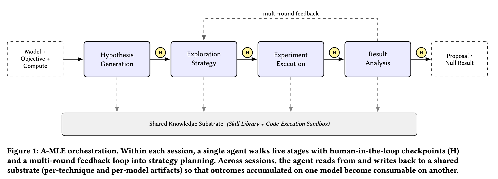

# Meta：广告排序模型调优交给Agent，人均迭代吞吐翻几倍

关注我，每天为你精挑细选最优质、最新鲜的推荐算法paper，陪你一起保持进步、不断精进！

### 论文：Agentic ML Exploration (A-MLE) for Ads Ranking
### 网址：https://arxiv.org/html/2609.08248
### 公司：Meta
### 思想：LLM agent
### 方向：auto-research

## 解读：

Meta这篇的出发点很直接：广告排序现在卡住的不是模型容量也不是算力，而是**人做一轮迭代的吞吐**。一个资深同学一周能跑完几轮"提想法—改代码—训模型—看指标—写结论"？个位数。而Meta内部有几十上百个排序模型，绝大部分长尾模型根本排不上专家的时间。

所以他们做了A-MLE：一个把这条循环端到端跑完的LLM agent系统，五个阶段串起来，每个阶段交界处留一个人工审核点。

注意这篇跟阿里的Astar是同一个赛道但打法相反：Astar认为"提方向"必须专门训个模型才行，A-MLE则认为**通用LLM够用了，缺的是它周围那套工程脚手架**——一套能真的读配置、改代码、提训练任务、跑评估的skill库，加一棵记录"什么技术在哪个模型上试过"的知识底座。

## 1 五个阶段

**提假设**：读模型最近的训练配置、当前baseline、以及这个模型**过去试过哪些技术、结果如何**的滚动历史，产出一小批候选（带理由），每条都要说清楚为什么值得试。除LLM自己想，还挂了模型内部状态分析器、训练效率分析器、文献检索器，最后再让另一个LLM当评委，按新颖性和可行性给这批候选打分排序。作者强调假设必须长在模型**当前的活状态**上——排序模型每天都在变，上周的诊断这周就不成立。

**定策略**：给定预算（几次训练、多少卡、多长时间）排实验序列，explore（隔离验证单个假设）和exploit（把跑赢的组合起来往深推）交替。"激进烧卡还是稳一点"属于价值判断，显式摆到审核点让人拍板。

**跑实验**：沙箱里改代码、跑变量类型检查和单测、提训练任务、轮询日志。最关键的能力是**区分基础设施故障和训练发散**——机器挂了该重试，loss炸了该改方案，判错就是几天算力。

**分析结果**：跟**滚动baseline**（不是冻结快照）算显著性、按分段拆出局部回退、单次训练内的指标方差超阈值时自动重跑。滚动baseline是被逼出来的：线上基线本身在持续刷新，拿三周前的快照比，离线赢的量很可能只是基线漂移。

**知识底座**：唯一跨session跨模型持久化的东西，一棵**存在代码仓库里、带版本的markdown树**，记录每个技术在哪些模型上试过、结果如何。开工时拿当前模型的情况去匹配底座里的适用性标注，捞出"在结构相似的模型上已经赢过的技术"；结束时把结果（含失败）写回，走代码review流程。

## 2 效果

**这篇没有线上A/B**，模型效果只有离线数字（最好的一档是架构+效率多源联合 **+2.56%**，QPS中性）。真正的卖点是效率：人均每周迭代轮数是人工基线的**数倍**，训练成功率和提案过review率也都更高。论文比了三档：纯人工、"人提假设+脚本跑执行"的半自动、以及全自动的A-MLE。值得注意的是中间档提升小得多，说明**杠杆不在单点工具，而在把整条编排链路接通**。另外作者明说，**收益最强的不是新技术，是迁移**：把A模型上验证过的东西系统性铺到结构相似的B、C、D上。这活人也会干，但人干不完。

## 心得：
* 这篇和Astar是一道题的两个答案，但**不矛盾，是阶段问题**。作者做了组对照：装了领域skill库的agent在基础能力测试上 **68%**，通用ML agent 只有 **16%**——先证明了"没有领域脚手架的agent完全不能用"，这一步所有人都得先做；做完再谈要不要训专用模型提假设。
* 收益最大的是**跨模型技术迁移**，前提是有一份"哪个技术在哪个模型上试过、结果如何"的结构化记录。大部分团队没有，都散在各人的实验平台、周报和聊天记录里。这份记录的价值不依赖agent，人查也有用，而且是整套自动化里唯一今天就能开始攒的东西。
* "半自动收益远小于全自动"反直觉但可信：循环里只要还有一处要人接手，人的排期就重新成为瓶颈，前面省的时间全还回去。

## 可信度：生产（在Meta真实排序模型上跑的，但模型收益只有离线，零A/B）

## 推荐等级：有时间看看

**请帮忙点赞、转发，谢谢。欢迎干货投稿 \ 论文宣传\ 合作交流**

### 【铁粉】请入微信群，群内我会给出更深入的解读，还可以共同讨论技术方案、发招聘广告、内推和交友等。
* 铁粉标准：关注公众号一个月以上，且在公众号上累计15次互动（评论、爱心、转发）、或投稿1次、或打赏199，只欢迎技术同学。
* 入群方法：请您加个人微信lmxhappy，我拉您入群，请备注【公司】（只我个人看，不公开）。

## 推荐您继续阅读：
* [Astar — 从迭代历史里训一个"提方向"的模型，两周20轮迭代，GMV +4.86%（阿里）](ali-astar.md)
