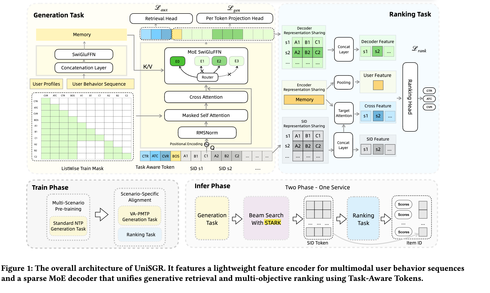

# 阿里，增加用户SID特征，GMV提升6%

关注我，每天为你精挑细选最优质、最新鲜的推荐算法paper，陪你一起保持进步、不断精进！

### 论文：UniSGR: Unified Framework for Semantic ID Generation and Ranking
### 网址：https://arxiv.org/pdf/2607.04068
### 公司：阿里
### 思想：生成式用户建模
### 方向：行为序列建模

## 解读：
本文是行为序列建模，核心目标是获得高质量的用户表征。用一个 Encoder-Decoder 模型，其中，encoder对用户行为序列获得hidden states，decoder借助这些states生成用户SID。 最终生成4个表征。接入主网络，提升建模效果。

### （1）生成网络
行为序列预测target item。一个session下，收集n个点击、n个加购、n个付款的item作为target。每个用户都用其序列预测生成3*n个target。其中，序列item和target都用SID表示。网络是encoder-decoder架构，包括：
* encoder：将user 特征和行为序列编码为一个hidden states。其中，user profile经过一个MLP获得一个token。行为序列每个item经过RQ-VAE获得SID token。两者拼接为一个完整序列，经过 encoder 得到最终的states。这里的 encoder 用的是 MemoryNet（线性复杂度 O(L)，非自注意力），其输出记为 Memory M。
* decoder：根据encoder输出的states，预测生成target item 的SID。decoder的输入不仅仅是特殊符号BOS和上轮预测生成的token（初始输入是空），还前缀了任务token（后面介绍）。输入先做self-attention，再跟states做cross attention，再经过稀疏MOE，最终输出相应的embed序列，这是内部的隐藏状态（→ Decoder Representation）。有两个下游的head：
    * head1: 一个head，处理任务token对应的embed序列，提取 Task Token 表示做对比学习。
    * head2: 另一个head，预测每个 token（生成 semantic ID）。注意，这里并行预测多个target item的SID。

decoder输出的target embed，用于计算生成损失。特别的，如上面所述，并行预测多个target item的SID，从而强化了生成的多样性。同时考虑了行为的信号强弱，点击、加购和付款，信号越来越强，在计算生成损失的时候，给予不同的权重，信号越强，权重越大。注意，在attention的时候，target item之间互相mask掉attention。

#### 辅助任务——任务token
如上所述，decoder的输入除了生成的target item的sid 的token，还增加了3个特殊的token——任务token。即为点击、加购、购买等任务设置专门的token，跟特殊标记——开头BOS拼接到一起，再接生成的target item的sid 的token。

任务token对应的decoder输出embed，代表预测的该任务相关的target embed。每个任务token embed与对应行为的target（正），通过对比学习辅助任务提升该embed。即3个任务embed，分别采样不同的负采样策略，采样一些负样本，计算一个target（所有样本target都是正向的）的辅助loss，提升生成模型的生成效果。

### （2）生成-排序联合训练
**预训练**
用各个场景的数据混合在一起作为样本训练生成模型，作为第一阶段。后面再在各个特定场景，跟其相应的ranking model联合训练。

在特定场景下，将生成网络和排序网络联合训练。此时，生成网络作为上游网络，有4个输入，接入到排序网络里。具体，包括：
* decoder内部的隐藏状态，是固定数量的，将其拼接成一个表征。
* encoder的输出隐藏状态，做两个操作，第一个操作是做pooling获得一个表征；同时与target item做target attention，获得一个兴趣表征。因此获得两个表征
* decoder生成的多个target SID，是固定数量的，将其拼接成一个表征。

### A/B：
Lazada 首页 猜你喜欢：IPV +3.36%，交易笔数 +2.17%，GMV +5.68%

## 相似文章对比
跟最近最新的一篇论文特别像，[tokenminds](./tokenminds.md)，都是 Encoder-Decoder 架构，用行为序列生成用户SID Token，然后注入排序模型。

核心相同点：都是用 Encoder-Decoder 把用户行为序列生成式地建模成 User SID，再把中间表征喂给排序模型。具体三点完全一致：
1. item 用 RQ-VAE 离散化成 SID 作为序列的基本单元
2. Encoder 编码行为序列 → hidden states，Decoder 自回归生成 target 的 SID
3. 并行预测多个 target（而非单个 next-item），用生成任务驱动用户表征学习

核心不同点（3个）
1. 生成目标怎么定义: TokenMinds：从未来24h窗口随机采样target，是"预测一段时间的兴趣分布";UniSGR：在session内按行为类型分别采样(点击/加购/付款)，是"预测多个业务信号的目标"
→ 一个学分布，一个学多任务信号
2. 业务信号怎么注入：TokenMinds：靠样本加权(engagement reward)，信号在 loss 权重里；UniSGR：靠 Task Token + 对比学习，信号在 decoder 输入里，还单独拉了辅助对比 loss
→ 一个是外部加权，一个是结构化条件+对比
3. 生成和排序怎么结合：TokenMinds：解耦。生成模型独立训练，产出表征后离线转换再喂排序（甚至异步后台服务）；UniSGR：联合。生成网络作为上游，和排序网络一起联合训练，L = L_gen + α·L_rank
→ 一个是pipeline，一个是端到端

## 心得：
* google和阿里的工作基本一致，证明通过生成模型获得用户SID，可以帮助提升网络模型效果。两个工作都是满满的工业风。

## 愚见
* 论文里虽然写的是 Task-Aware Tokens，但从功能上看，它本质上就是 Task Tokens —— 三个可学习的、代表不同业务目标（click / atc / pay）的 token，放在 decoder 输入的最前面。“Aware” 这个词确实有点多此一举。它并没有真正让 token 自己去“感知”什么，而是通过位置 + causal mask + 后续的对比学习（FACL），让整个 decoder 的计算过程从第一步开始就受到任务信号的条件化（conditioning）。
* Memory M 是一个序列（长度 ≈ 1 + L），而不是一个单一向量。名字起的不好，还以为做缓存呢，不如将它从图1中取消掉，更好理解。
* 图1中decoder输入是超过2个，但是mask是2个，两者不一致。

## 可信度：生产

## 推荐等级：有实践价值

**请帮忙点赞、转发，谢谢。欢迎干货投稿 \ 论文宣传\ 合作交流**

### 【铁粉】请入微信群，群内我会给出更深入的解读，还可以共同讨论技术方案、发招聘广告、内推和交友等。
* 铁粉标准：关注公众号一个月以上，且在公众号上累计15次互动（评论、爱心、转发）、或投稿1次、或打赏199，只欢迎技术同学。
* 入群方法：请您加个人微信lmxhappy，我拉您入群，请备注【公司】（只我个人看，不公开）。

## 推荐您继续阅读：

