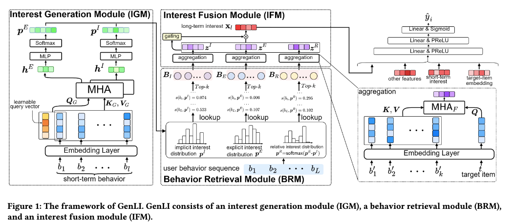

# 美团，长兴趣建模，RPM+1.6%

关注我，每天为你精挑细选最优质、最新鲜的推荐算法paper，陪你一起保持进步、不断精进！

### 论文：Generative Long-term User Interest Modeling for Click-Through Rate Prediction
### 网址：https://arxiv.org/pdf/2605.15905
### 公司：美团
### 思想：意图
### 方向：长行为序列建模

## 解读：
本文是长行为序列兴趣建模的一种新方法。即用短期行为序列获取用户意图（即时意图和短期意图），从长期行为序列里检索出相关行为，做target attention，并融合成兴趣表征，加入到主网络，提升模型效果。

### （1）兴趣生成模块
取用户最近的短期行为序列，做Multi-Head的target Attention，key和value自然是序列，query包括两个元素一个是target item，一个是$(对应一个可学习的embed，论文中并没有用$，只说是一个可学习的embed)。最终获得两个兴趣表征。

target item对应的兴趣表征是即时兴趣；就像bert里的cls，$对应的兴趣表征是最近行为的全局兴趣，可以认为是短期意图。两者的差作为一个兴趣表征。这样，就有3个兴趣表征。兴趣表征，另外一种说法，是一个意图向量（分布），就有3个分布。

### （2）行为检索模块
从长期行为序列里，三种意图分布分别检索出相关行为。比如对于即时意图分布，把所有历史行为按 ID 哈希到 4096 个桶，把维度取值top-k的那些桶里的行为优先挑出来。

这么做是把意图分布的每一个维度对应到一个哈希桶（由 ID % 4096 决定）。 所有落在这个桶里的 item，都会继承这个维度上的概率值作为它们的“意图相关性分数”。这是一种用简单哈希实现软分组 + 意图赋权的折中方案，牺牲了一点语义精确性，换来了极致的计算速度。

### （3）兴趣融合模块
把三种行为集合分别后进行 Multi-Head target Attention。Query是当前 target item，Key / Value = 从 BRM 检索到的行为嵌入序列，得到三个兴趣表示。将三者拼接输入到一个gate network获得三者的权重，对三个表征加权融合，获得一个兴趣表示。

### A/B：
美团广告，CTR提升0.776%，RPM（每千次展示收入）提升1.567%。

## 心得：
* 本文之所以work是因为将短期行为作为用户意图。target对应的意图和两者的差对应的意图，不是很关键。

## 愚见
* 意图建模已是推荐和广告领域高度成熟且流行的方向，近年来涌现了大量相关工作。本文，本质上是“用生成分布的方式实现高效长序列意图建模”。虽然论文将其称为“Generative”，但这一命名并不十分准确。它并非严格意义上的生成模型，与当前主流的“预测 next token”式生成推荐也关系不大。更准确的描述应该是：基于生成的意图分布建模。
* 在行为检索模块里，落入到一个桶里的item可能是风马牛不相及的，会被赋予完全相同的意图强度，即使它们在语义上毫无关系。不同类别的 item 被强行“绑在一起”，理论上会污染意图分布的纯度。如果用户对奶茶有强意图，会错误地给同桶的手机、酒店也较高的分数。与之相比，Meta的最近的工作[mos](./mos.md)，通过一个codebook将item映射到特定的topic，更加合理，
* 在 ranking 场景下，把短期行为 + target attention 的结果直接称为“即时意图”确实不太合适。它更准确的定位是“针对当前候选的条件兴趣表征”，而不是用户纯粹的即时意图。

## 可信度：生产

## 推荐等级：有实践价值

**请帮忙点赞、转发，谢谢。欢迎干货投稿 \ 论文宣传\ 合作交流**

### 【铁粉】请入微信群，群内我会给出更深入的解读，还可以共同讨论技术方案、发招聘广告、内推和交友等。
* 铁粉标准：关注公众号一个月以上，且在公众号上累计15次互动（评论、爱心、转发）、或投稿1次、或打赏199，只欢迎技术同学。
* 入群方法：请您加个人微信lmxhappy，我拉您入群，请备注【公司】（只我个人看，不公开）。

## 推荐您继续阅读：

