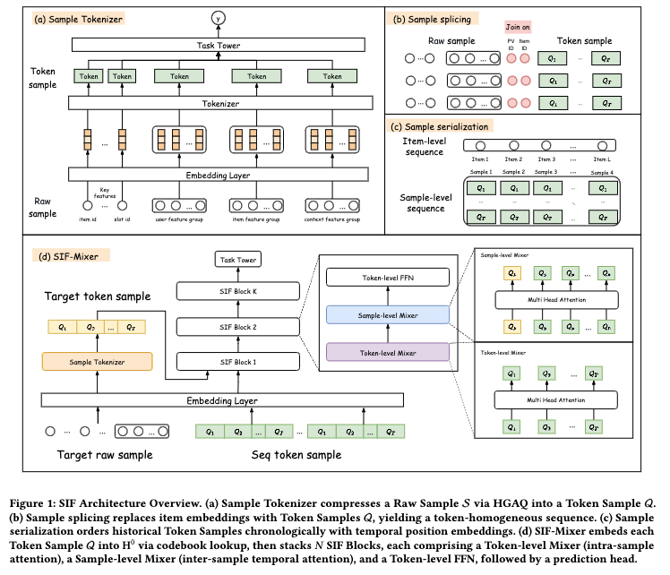

# 美团，序列样本分词，CTR 提升+2%。

关注我，每天为你精挑细选最优质、最新鲜的推荐算法paper，陪你一起保持进步、不断精进！

### 论文：Sample Is Feature: Beyond Item-Level, Toward Sample-Level Tokens for Unified Large Recommender Models
### 网址：https://arxiv.org/pdf/2604.15650
### 公司：美团
### 思想：更多数据
### 方向：序列建模

## 解读：
在序列建模的过程中，将序列item做分词——将尽可能多的特征利用起来，以提升建模效果。即将序列item做分词后，再做序列建模。分词，就是把原始的、高维的、异构的特征（尤其是多字段特征）转换成离散的、可被模型直接使用的 token（整数索引） 的模块。

SIF由两个关键组件组成：
### 1. 对序列item做分词
每个历史交互item是一个完整的特征元组（用户画像，物品，上下文，交叉特征），将所有这些特征都用起来，但是又不能是一个特长的拼接表征，所以对其做信息的压缩，那么就要做分词。

方法：先按语义把特征分成 G个组，每组再按粒度 B 把特征分成小组，每小组是一个sub-token，使用独立的线性投影，投影到固定维度d₀。对每个 sub-token 做 M 级 残差量化(RVQ)，得到离散码本索引。这样，一个序列item被压缩成T（T = G × B × M）个token，对应极少的 bits（如648 bits），却保留了几乎全部原始样本信息。

不像RQ-VAE，RVQ是做多级残差量化，没有完整的 Encoder-Decoder 重建结构，用多个 codebook 向量叠加来近似原始向量，精度更高。

在这个构建中，两个损失：
* 标准的 VQ commitment loss。
* 额外加辅助损失：对每个item的所有sub-token的表征融合在一起（如拼接），后接一个MLP，sigmoid后计算BCE。所有item的BCE加起来，作为该loss。它让码本按照“预测相关性”组织，而非单纯重建误差。

这样，历史序列里原来放“物品ID”的位置，现在换成了完整的 Token Sample（多个 sub-token 拼接），实现了样本级 token，彻底告别 item-level 的信息损失。

### 2. 序列建模
基于 MLP-Mixer 思想的分解设计，对序列（由历史item和target组成的）做建模，由 N 个 SIF Block 堆叠而成。之后，对target item的 T 个 sub-token 做 mean-pooling，再接两层 MLP 得到 CTR/CVR 分数。

其中，每个 Block 做三步分解（关键在于注意力方向的分离）：
* 行注意力：每个序列item内部的 T 个 sub-token 之间做 self-attention，捕捉 user-item-context 等组间相关性。这样，每个sub-token就融合了其它sub-token的信息。
* 列注意力：在同一 sub-token 位置上，所有历史序列item（包括target item）做 self-attention，建模时序动态，让当前请求能充分“看”历史样本。这样，每个sub-token就融合了其它历史序列item同位置的sub-token的信息。特别的，target item的每个sub-token融合了历史序列的同位置的sub-token。
* Token-level FFN：位置-wise 的非线性变换。

两个损失：
* target与序列对齐的相关损失：target item跟序列item一样划分和组织特征，以获得每个sub-token，通过线性投影映射到与历史 codebook 相同的维度空间。通过alignment loss， 对齐到同一个码本空间，保证与序列完全同构、在同一个空间。
* 主Loss：BCE。

### A/B：
美团外卖平台全量上线，CTR 提升约 +2.03%。

## 心得：
* 美团多篇论文专注将item的特征尽可能的用起来，提升模型效果，这是一种胖化。算是引领了一个方向。
* 更多特征大概率是有利于序列建模的，但是限于之前的技术的局限，无法将大量特征作为序列item的表征。但是，自从近年来残差量化技术成熟之后，用它可以将大量特征，设置是全量特征都融入其表征了。
* RVQ 通常用于压缩多模态大模型（如视频、文本编码器）输出的连续语义向量。本文则将 RVQ 用在普通的结构化特征组 embed 上，目的不是压缩语义，而是把几百个异构特征字段统一成相同格式的 token，方便接入 Transformer。这是对 RVQ 的一种非常规用法。

## 愚见
* 要大胆的创造术语，或者把口语化的说法直接写到论文里，在这方面Meta就很敢。本文对序列item做分词，其实就是胖化。

## 可信度：生产

## 推荐等级：有实践价值

**请帮忙点赞、转发，谢谢。欢迎干货投稿 \ 论文宣传\ 合作交流**

### 【铁粉】请入微信群，群内我会给出更深入的解读，还可以共同讨论技术方案、发招聘广告、内推和交友等。
* 铁粉标准：关注公众号一个月以上，且在公众号上累计15次互动（评论、爱心、转发）、或投稿1次、或打赏199，只欢迎技术同学。
* 入群方法：请您加个人微信lmxhappy，我拉您入群，请备注【公司】（只我个人看，不公开）。

## 推荐您继续阅读：

