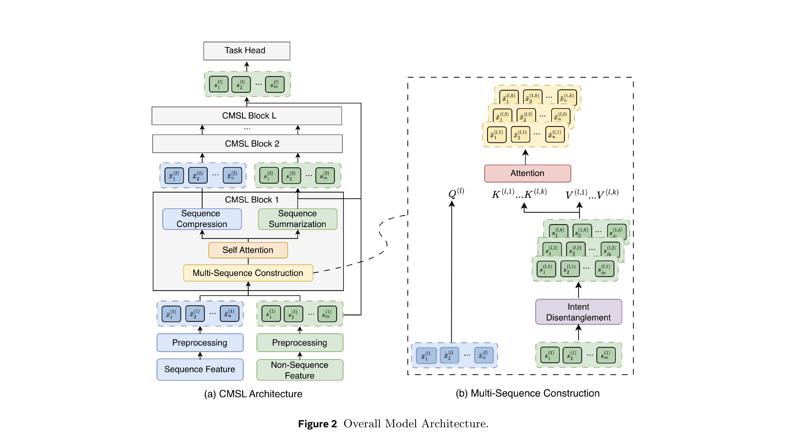

# Meta，用户行为序列转成纯净意图流

关注我，每天为你精挑细选最优质、最新鲜的推荐算法paper，陪你一起保持进步、不断精进！

### 论文：CMSL: Constructive Multi-Sequence Learning for Recommendation Systems
### 网址：https://arxiv.org/pdf/2606.28533
### 公司：Meta
### 思想：意图、去噪
### 方向：行为序列建模、意图建模

## 解读：
本文把用户历史从"被动读的一条序列"改成"主动构造的 K 条纯净意图序列"，是一种缓解上下文污染的序列建模新方法。

序列特征与非序列特征，双向交互——先用非序列意图把序列分流成 K 条纯净序列（构造）、各自做 self-attention，再用非序列意图去序列里摘取出 K 个向量 $h$（摘要），$h$ 回灌给下一层非序列。堆叠 L 层后，取最后一层的 K 个 $h$ 拼接，喂给任务头。

### （1）序列特征的处理
用户在各种模态（点击、点赞、评论等）上产生的行为历史数量巨大、格式各异，直接拼接会带来无法承受的计算开销，因此需要先分组、再压缩成一条长度可控的序列 $\bar X$。

用户 $u$ 的交互历史定义为一系列序列集合：
$$\mathcal{X} = \{X^{(1)}, X^{(2)}, \dots, X^{(B)}\}$$
每个 $X^{(b)} = \{x_1^{(b)}, \dots, x_n^{(b)}\}$ 代表一种交互模态（clicks、likes、comments 等），$x_i^{(b)}$ 是 item/action ID，通过共享嵌入层转为嵌入序列。

**1.分组**

$\mathcal{X}_g$ 是从原始的 $\mathcal{X}$（B个交互模态序列）中，按照某个共享属性_同一个曝光场景/页面，挑出/分组得到的子集：$\mathcal{X}_g = {X^{(1)}, \dots, X^{(M)}}$，M ≤ B。也就是说先按surface分组，组内的M个模态序列再一起做压缩（加权求和）。

那么一个$X$就获得了多个$\mathcal{X}_g$

**2.多序列归并**

平台上用户序列极多，直接处理开销巨大。所以要压缩一下。对$\mathcal{X}_g$每个元素（一个模态序列），补齐长度为n，通过特定 MLP 计算 token 权重：$$s_i^{(m)} = \sigma(\text{MLP}^{(m)}(x_i^{(m)}))$$（$  \sigma  $ 是 sigmoid）。

将token权重乘到token序列的对应元素上。多个$\mathcal{X}_g$，每个$\mathcal{X}_g$都是n长的token序列，求和得到压缩序列：$$\bar{X} = \sum_{m=1}^M (s^{(m)} \cdot X^{(m)}) \in \mathbb{R}^{n \times d}$$

### （2）非序列特征的处理
非序列特征除了要走常规的 dense/sparse 预处理，还要额外拆解出 K 组带有不同"意图"倾向的表示，各自转成一组 Key/Value，供后面序列侧做 cross attention 用。

**1.预处理**
* Dense Features（连续特征，如用户年龄、商品价格、视频观看时长等）：拼接成原始向量。归一化（Norm）后，加一层线形变换。
* Sparse Features（稀疏特征，如国家代码、用户语言、商品类别等，高基数）：每个特征对应一个嵌入表 。多值特征（如兴趣标签列表）采用 sum-pooling（嵌入求和）。最终也得到 d 维嵌入，与 dense 特征维度对齐。

**2.意图解耦**
1. m个非序列特征 → 长度为m的token序列 → 经过"Intent Disentanglement"（对应K个变换），得到K个序列（每个长度为m），即图中 $s^{(l,1)}, \dots, s^{(l,K)}$。
2. 这K个序列再各自经过线性变换，分别生成对应的key和value，最终得到K个Key序列和K个Value序列。

### （3）序列 attend非序列
 做cross-attention（Q 来自序列、K/V 来自非序列）。将行为序列的当前压缩序列 $  \bar{X}  $ 投影成 Query $  \mathbf{Q}^l  $，对非行为序列的每组 $  (\mathbf{K}^{l,k}, \mathbf{V}^{l,k})  $ 应用 multi-head attention。生成序列 $\tilde{X}^{(l,k)}$。
 
 本操作，获得了每个行为定制出来的一份非序列上下文摘要。实现了非序列帮序列去噪分流。

用非序列特征生成的 K 副"意图滤镜"，把同一条行为序列分别过滤成 K 条"以某一意图为主、其余被淡化"的序列视图。目的是在做 self-attention 之前，先把不同意图在表征层面隔开，这样后面每条序列内部做时序建模时，就不会有跨意图的互相干扰（污染）。

 对应的是下图的Multi-sequence construction。

 ### （4）序列内部自注意力
 
 对上节的序列 $\tilde{X}^{(l,k)}$，做线性注意力——近似 Meta 广泛使用的 HSTU 注意力，生成序列 $\tilde{X}^{(l,k)}$ （同名）。

对应的是下图的Self-attention。

### （5）非序列attend序列特征
序列特征与非序列特征做cross attention。非序列特征的序列 $s^{(l,1)}, \dots, s^{(l,K)}$ 作为Q，行为序列的 $\tilde{X}^{(l,k)}$ 作为Key和Value，做cross attention，获得了K个这样的序列。

$\mathbf{h}^{(l,k)} = \text{Cross-Attention}(Q = \mathbf{S}^{(l,k)}, K = \tilde{X}^{(l,k)}, V = \tilde{X}^{(l,k)})$

$h^{(l,k)}$ 的物理意义是——"站在第 $k$ 种意图（非序列）的视角，去这条行为序列里挑出跟这个意图最相关的行为，汇聚成一个定长摘要向量。
另外，本质上就是一次 target-attention（DIN 式）的 pooling，只不过"target"换成了"意图向量"。

对应的是下图的Sequence Summarization。

### （6）序列压缩 

K条长度为n的token序列，每个位置上的K个token，拼接输入到各自对应的mlp，获得一个长度为d的向量
：$$\bar{X}^{(l)} = \text{MLP}([\tilde{X}^{(l-1,1)} \parallel \cdots \parallel \tilde{X}^{(l-1,K)}])$$

获得了长度为n的token序列，每个token长度为d。

### （7）最终融合

注意，上面的（3）～（6）被打包成一个 CMSL Block，堆叠 L 层。最终融合只取**最后一层**的 K 个摘要向量 $h^{(L,k)}$ 拼接成 $H = [h^{(L,1)} \parallel \cdots \parallel h^{(L,K)}]$，输入多个任务特定头（CTR、CVR 等预测）。

也就是说，真正喂给 tower 的是（5）里"非序列查序列"产出的摘要向量 $h$——它属于非序列侧、承载了从行为序列提炼来的信息；**行为序列本身不直接进 tower**（只在层间通过（6）序列压缩往下传）。

为什么丢弃了序列特征对应的最终输出？是因为从（3）开始，获得的结果就是用非序列特征表示的意图表征，不再是行为表征了。到了（5），序列里的意图表征，已经很好的融合到了非序列特征。

### A/B：
在 Meta 五个 surface 部署，排序 NE 降 0.06%~0.62%、召回四项互动指标涨 0.09%~0.17%，均统计显著。

## 补充——综合对比：OneTrans / EST / CMSL

三篇工作都在解决"序列特征与非序列特征该如何交互"，但选择的路径完全不同。关系脉络大致是：**OneTrans**（ByteDance）最早提出"一个 Transformer 统一做序列建模+特征交叉"；**EST**（阿里，[ali-est.md](ali-est.md)）自称 OneTrans 2.0，把 OneTrans 因果 mask 隐含的方向性显式模块化，并引入多模态先验做稀疏化；**CMSL**（Meta）关注的是前两者都没提的问题——**一条序列里塞进多种不相关意图导致的"上下文污染"（Context Pollution）**，解法是先把一条行为序列"分流"成 K 条各自纯净的意图序列，再分别建模。

| 维度 | OneTrans | EST | CMSL |
|---|---|---|---|
| 核心问题 | 序列建模与特征交叉两条线各自优化，缺乏统一 backbone | 异构统一建模下，行为-行为自注意力冗余、方向不对会稀释高价值信号 | 单条序列里塞进多个不相关意图，互相干扰、稀释真实意图（Context Pollution） |
| 整体范式 | S/NS 拼成一条序列，单个共享 causal self-attn 统一处理全部交互 | 拆成两个专用模块（LCA + CSA），显式分工但仍逐层堆叠 | 每层先把 1 条序列构造成 K 条纯净意图序列，各自 self-attn，再压缩回 1 条 |
| 行为-行为（S-S）交互 | Dense causal self-attention，全历史可见，S 侧共享一套权重 | Content-based **稀疏**attention（CSA）：Q/K 用冻结多模态图文 embedding，top-K 稀疏化 | 每条纯净序列各自独立做**线性注意力**（近似 HSTU，多项式核+稀疏修正） |
| 多条异构序列的处理 | 时间戳交织 或 [SEP] 拼接成一条，长度不变 | 未特别处理多序列压缩，聚焦单一行为序列的稀疏化 | 先按 surface 分组门控压缩成一条，再在每层"构造"出 K 条并行序列 |
| 序列 ← 非序列 的方向怎么用 | 因果 mask 顺序决定：NS 排在后面，天然能看到全部 S（S 看不到 NS） | LCA：**NS 做 Q、S 做 K/V**，用于增强非序列表征 | Multi-sequence construction：**S 做 Q、NS 做 K/V**，用于"构造"K 条意图序列（中间步骤，非最终融合） |
| 非序列 ← 序列 的方向怎么用 | 同上（NS attends S 就是这一整个机制） | 同 LCA，二者是同一个模块 | Sequence Summarization（PMA）：**NS 做 Q、S 做 K/V**，产出摘要向量 $h^{(l,k)}$，这才是真正喂给下一层/tower 的东西 |
| 降复杂度手段 | Pyramid 查询截断（K/V 全量、Q 逐层收窄）+ 跨请求 KV Cache | 逐行 top-K 稀疏化 attention score | 门控压缩 + 线性注意力 + 层间 MLP 压缩防止 K 条序列数爆炸 |
| 额外先验 | 无（纯 ID/side-info embedding） | 多模态（图文）语义相似度做 attention 路由 | 无额外模态先验，重点在"意图路由"的结构设计 |
| 最终喂给 tower 的东西 | NS-token 状态（S 的信息已被 NS 吸收） | pooled 序列表征 + LCA 增强后的非序列表征，拼接 | 最后一层 K 个 PMA 摘要向量 $h^{(L,k)}$ 拼接（由"NS 查 S"产出，序列本身不直接进 tower） |

CMSL在于：它在做 self-attention **之前**多加了一步"序列做 Q 查非序列"的构造，用 K 个非序列意图分支把一条序列重新解读成 K 条并行的纯净序列——这是 OneTrans 和 EST 都没有的机制，也是三者里唯一显式应对"多意图互相干扰"问题的设计。换句话说，**EST 是在"一条序列内部"做减法（稀疏化 + 方向控制），CMSL 是在"要不要只有一条序列"这个更前置的问题上做改造（先分流再建模）**，两者是不同抽象层级上的创新。

## 心得：
* 本文在每层里让序列与非序列双向交换信息（构造阶段序列查非序列、摘要阶段非序列查序列），最后用非序列侧提炼出的摘要向量 $h$ 建模多个任务。
* CMSL 在融合前，序列已经过分组、门控压缩、线性注意力、全局压缩四道加工，$\bar{X}$ 已经是被反复筛选加权的紧凑表征，未必再符合"低密度冗余"的假设，EST 担心的"稀释"风险不一定成立。

## 愚见
* 在CMSL Attention的结果的记号，在paper里，没有更新，跟前面的压缩后的结果$\bar{X}^{(l,k)}$，是相同的。
* 行文有提升的空间，可以组织的更好，可读性更高。
* 公式6（以及公式5 里做 K/V 的 $\bar X^{(l,k)}$）里那批"K条序列"，按图2 的记号应该是波浪，不该是横杠。

## 可信度：生产

## 推荐等级：有实践价值

**请帮忙点赞、转发，谢谢。欢迎干货投稿 \ 论文宣传\ 合作交流**

### 【铁粉】请入微信群，群内我会给出更深入的解读，还可以共同讨论技术方案、发招聘广告、内推和交友等。
* 铁粉标准：关注公众号一个月以上，且在公众号上累计15次互动（评论、爱心、转发）、或投稿1次、或打赏199，只欢迎技术同学。
* 入群方法：请您加个人微信lmxhappy，我拉您入群，请备注【公司】（只我个人看，不公开）。

## 推荐您继续阅读：

