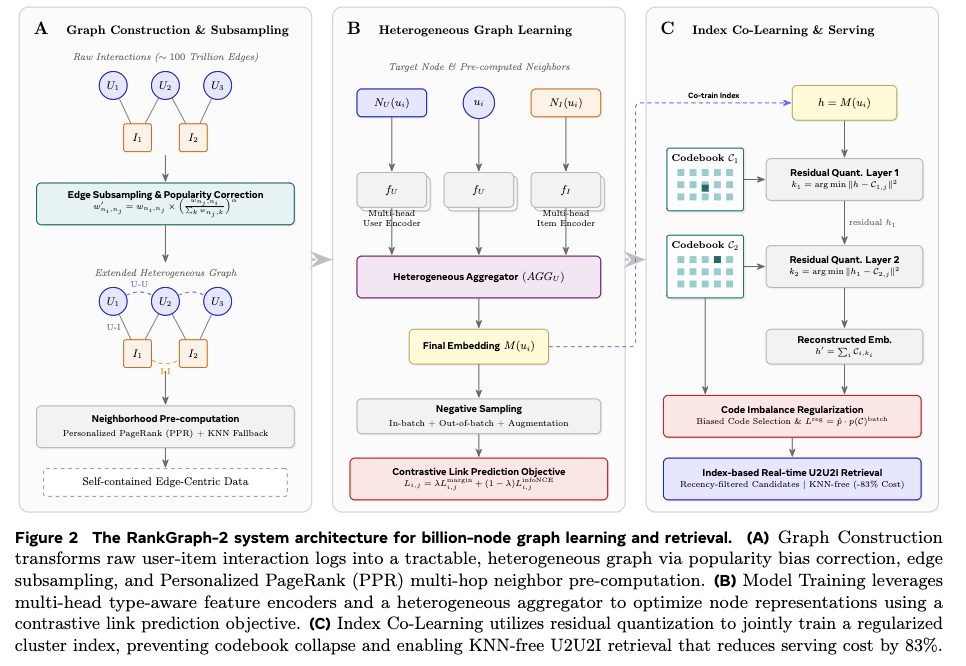

# Meta，聚类用于图召回，降本又增效

关注我，每天为你精挑细选最优质、最新鲜的推荐算法paper，陪你一起保持进步、不断精进！

### 论文：RankGraph-2: Lifecycle Co-Design for Billion-Node Graph Learning in Recommendation
### 网址：https://arxiv.org/html/2606.18379
### 公司：Meta
### 思想：聚类、端对端
### 方向：图学习+召回+语义SID

## 解读：
本文，在图构建中大幅简化图结构并预计算邻居，在训练中采用轻量级异构 GNN 并联合学习 serving 索引，将用户表征量化为 Cluster ID，实现了低成本、高质量的 U2U2I 召回，同时保持了 U2I2I 的效果。

### 1 图构建
#### （1）图初步创建
图只包含两种节点（用户 、物品）和三种边（U-I、U-U、I-I），全部来自 engagement 数据（点击、点赞、分享、购买），不使用任何外部社交图或知识图。
* U-I 边（有向）：过去 $T$ 小时内有交互即建边，权重根据业务价值预定义。
* U-U 边（无向共看边）：是两个用户过去 T小时共同交互的物品集合。只有当共同交互物品数 $\geq C_U$ 时才建边。两个user对某个item的权重的乘积，累加这些乘积。取 log 是为了让高频用户和低频用户的边权重尺度一致。
* I-I 边（无向共被看边）：类似U-U边。是两个item过去 T小时共看用户的集合。只有当共看用户数 $\geq C_I$ 时才建边。一个user对两个item的权重的乘积，累加这些乘积。取 log 是为了让高频用户和低频用户的边权重尺度一致。

#### （2）流行度偏置修正
在I-I边里，如果一个item节点是一个热门物品，那么累加会导致从它出发的I-I边的权重太大。从而热门物品这会让 各个节点的embedding 过度偏向热门。修正的方法，就是对这个权重做归一化。

只针对 I-I 边 做修正。为什么只对 I-I 做？ 因为 U-U 边的 popularity bias 相对温和，而 I-I 边对长尾物品覆盖影响最大。

#### (3) 极致抽样：保留高价值节点 + 每节点 top-K 边，把边数压缩三个数量级。
第一步：节点筛选：先对用户节点做筛选：只保留业务价值最高的大约 1 亿用户（~0.1B nodes）。只有这些被选中的用户之间，才会去构建 U-U 边。其他低价值用户不参与 U-U 边的构建（但他们依然保留在 U-I 边里）。这个“高业务价值用户名单”是每日刷新的（根据业务指标动态调整）。

第二步：边剪枝：在上面选出的这 1 亿高价值用户（以及其他节点）中，每个节点只保留权重最高的 K_CAP 条边。
这是按节点维度做的局部 top-K，而不是全局对所有边排序。

在做完 边 subsampling（尤其是 U-U 边只保留 ~0.1B 高价值用户）之后，这意味着：大量普通用户 在这次 subsampling 后，没有了任何 U-U 边（即没有同类型邻居）。同样，部分物品在 I-I 边 subsampling 后，也可能失去所有同类型邻居。即分成两类节点
* Group 1：有同类型邻居的节点。
* Group 2：没有同类型邻居的节点。

抽样之后的图，叫extended graph。其中，Group 1构成的图叫backbone graph。

### 2 训练样本准备阶段
从构建好的图获得训练样本，包括以下两步：
#### （1）邻居预计算
受 PinSage 启发，使用 Personalized PageRank (PPR) 在 backbone graph 上为每个节点预计算 $K= 50$ 个最重要的同类型邻居 + 异类型邻居。具体做法：对每个节点，从它出发进行 R 条长度为 L 的随机游走。每一步有 restart probability = 0.15 的概率回到起始节点（这就是 Personalized 的来源）。统计每个节点被访问的频率，作为重要性分数。

#### （2）输出数据格式
数据数据的每条记录包含边 $  (n_i, n_j, w)  $、两个端点的特征、以及预计算好的邻居列表，按边类型分区存储。这使得训练时可以直接顺序读取，无需在线图查询。
这是图构建阶段的最后一步，也是整个 Lifecycle Co-Design 中非常关键的工程落地环节。它的核心目标是：把前面所有复杂处理（subsampling、流行度修正、PPR 预计算邻居、Group 1/Group 2 处理）的结果，打包成一种“自包含（self-contained）”的数据格式，让训练阶段完全不需要在线图基础设施。自包含的意思是每条记录已经包含了训练所需的所有信息（边 + 特征 + 邻居）。

### 3 训练
链接关系预测的图学习，与图中User节点的表征embed离散化成语义SID，端对端学习。注意，前者，item和user都参与，但是后者，只有user节点参与。
量化的目的，就让U2U不需要做user embed的ANN搜索，只需要离线将所有user的embed，获得其SID，那么反过来每个SID的user集合是确定的，就方便后续做召回。

#### （1）主任务——链接关系预测的图学习
每个User节点固定有 K 个用户邻居 + K 个物品邻居。训练时实际使用的是从预计算的 50 个邻居中随机采样出的 10 个。这种固定大小的设计极大简化了训练流程。
每个节点的表征，由3部分组组成：当前节点自身、K 个用户邻居 和K 个物品邻居。分别用3个encoder获得表征，并通过一个聚合器聚合成一个表征。
通过多种不同难度的负样本，做链接预测的对比学习。这个预测任务，实现了图上节点表征的学习。

采样了Margin Ranking Loss 和 InfoNCE等损失函数。设计理由：Margin Loss 对难负样本更鲁棒，InfoNCE 提供更好的全局对比信号，两者结合在工业大规模训练中效果稳定。

#### （2）量化成SID
将节点的表征embed，通过残差量化索引，将其离散化成两级SID。通过正常的量化过程的重建损失和两个正则化相关的损失，保证了SID的高质量。

**辅助任务1——重建**
用两级的codebook，选择的code的embed的加和作为预测，用原始embed作为监督信号，L2距离作为重建损失。

**辅助任务2——正则化1**
当前 batch 的codebook的code的使用概率分布，跟过去 1000 个 batch 的codebook的code的历史平均使用概率，做内积，作为一个Loss，联同主Loss一起训练。其中，前者计算方法：定制的softmax概率值。

为什么这样？这个正则化的真正目的不是让当前分布接近历史分布，而是主动打破历史已经形成的偏斜（collapse），使当前分布表现不同，从而防止部分 code 完全不被使用，让 codebook 在长期训练中保持健康状态。
具体的，在持续训练过程中，某些 code 可能已经被过度使用（高概率），而另一些 code 长期被忽略（接近 0）。最小化这两个分布内积的效果是：让当前 batch 减少使用那些历史上被大量使用的 code，相对地，增加使用历史上使用较少的 code。这其实是一种主动的去偏（debias） 和 探索（exploration） 机制。

**辅助任务3——正则化2**
修改量化时候，选择codebook里的code的选择方法。正常是选择L2最小的code，改为“正则化1”里的两个概率的比值中选择最大的。
这样，如果一个 code 历史上用得很少，即使它不是最近的，只要当前 embedding 和它还算接近，就更倾向于选它。这就像一种负载均衡机制，主动把流量分配给使用较少的 code。

### Serving
* U2U2I召回：通过上面的流程获得用户表征和获得其语义SID，实现了将用户被分配到一个 Cluster。每个 Cluster 维护一个队列，里面是该 Cluster 中最近活跃用户（例如过去 15 分钟）交互过的物品。Serving 时，读取目标用户所在 Cluster 的队列。
* U2I2I召回：获取用户已交互的 Item，从用户最近的行为中取出种子物品（Seed Items）。使用 Item Embedding 通过ANN 索引，快速找到与种子物品相似的其他物品。会对多个物品的相似结果进行融合（加权、去重、打散等），最终生成 U2I2I 的候选集。

### A/B：
* U2I2I：最高 +0.96% CTR、+2.75% CVR
* U2U2I：+0.40% CTR、+1.01% CVR
* Serving 成本降低 83%

## 心得：
* 最近时间、采样、top-k等方法简化了图，只做一层GNN简化了图学习，只用两层codebook简化了语义SID的学习，将很大的精力花在了code质量的提升上。这样，节省了昂贵的在线图基础设施（图存储 + 分布式采样）的成本。

## 愚见
* 图2B中，ui用fU处理应改为ft。

## 可信度：生产

## 推荐等级：有实践价值

**请帮忙点赞、转发，谢谢。欢迎干货投稿 \ 论文宣传\ 合作交流**

### 【铁粉】请入微信群，群内我会给出更深入的解读，还可以共同讨论技术方案、发招聘广告、内推和交友等。
* 铁粉标准：关注公众号一个月以上，且在公众号上累计15次互动（评论、爱心、转发）、或投稿1次、或打赏199，只欢迎技术同学。
* 入群方法：请您加个人微信lmxhappy，我拉您入群，请备注【公司】（只我个人看，不公开）。

## 推荐您继续阅读：

