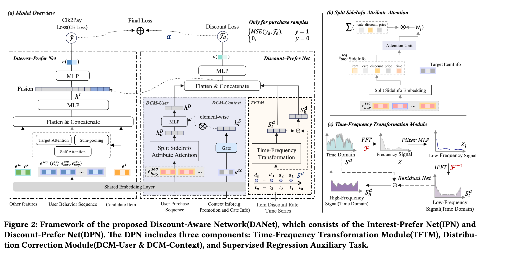

# 阿里，专门建模商品折扣率，GMV提高2%

关注我，每天为你精挑细选最优质、最新鲜的推荐算法paper，陪你一起保持进步、不断精进！

### 论文：Cheaper is Better: A Discount-Aware Network for Conversion Rate Prediction in E-commerce Recommendation System
### 网址：https://arxiv.org/pdf/2607.12578
### 公司：阿里
### 思想：显式建模
### 方向：特征交叉

## 解读：
本文通过增加一个建模折扣率的辅助网络(含商品侧趋势 + 用户侧偏好)，提升CVR建模能力。即增加了一个商品item折扣信息处理的辅助网络（与之对应的辅助任务，称呼为DPN），中间生成的3个表征 $h_D$、$S^d_h$、$S^d_l$，拼接接入主网络（IPN）后半段，从而增强主网络建模CVR的能力。

折扣对转化影响显著，但以往工作要么只当普通特征，要么直接建模价格（难度大）。本文用折扣率替代价格，并用专用网络从「商品长期/短期折扣趋势」和「用户个性化折扣偏好」两个角度系统建模。

辅助网络的基本架构是两个基本并行模块——商品侧折扣序列时频拆解和用户侧的折扣偏好建模，获得了商品的折扣趋势表征和用户的折扣偏好表示，拼接到一起，在经过一个MLP，预测用户购买该商品真实成交时刻的折扣率，获得 MSE Loss（正样本，负样本设置为0），作为辅助任务与主任务，联合训练优化。

### 商品侧的折扣序列时频拆解
target商品过去400天的每日折扣率时间序列，通过时频分解，模型能同时感知“长期折扣水平”和“短期折扣变化”，比直接把原始折扣序列喂进去更有效。
处理流程：

1. 对时间序列做 FFT（快速傅里叶变换），得到频谱：$$Z = \text{FFT}(S^d)$$
2. 用一个 MLP $  f_t(\cdot)  $ 对频谱进行滤波（学习不同频率分量的重要性，重点保留稳定的低频信息）：$$Z_l = f_t(Z)$$
3. 做 IFFT 变回时间域，得到低频趋势信号：$$S^d_l = \text{IFFT}(Z_l)$$
4. 用残差方式提取高频成分：$$S^d_h = S^d - S^d_l$$

两个折扣趋势表征$S^d_h$、$S^d_l$将输入到下游模型里。

### 用户侧的折扣偏好建模
计算过程：
* DCM-User: 对用户的历史购买序列，做target attention，获得用户折扣表示$h^u_D$，它代表了“这个用户在类似商品上的折扣偏好”。其中，target attention的时候，序列item：用item本身embed、类目、折扣、价格和购买时间表征；attention：用一个小的MLP计算序列item与target的attention。
* DCM-Context:用促销相关的上下文特征，通过一个MLP实现的GateNet，生成一个门控向量。
* 两者聚合：把用户折扣偏好和场景门控向量相乘，实现动态调节，最终得到的 $h^D$，就是经过用户个性化 + 场景校正后的用户折扣偏好表示。

**DCM-User的逻辑**

不同用户对同一个商品的折扣反应差异很大。有人必须等到大促才买，有人只要便宜一点就下单。历史购买序列建模就是专门用来刻画这种个性化折扣偏好的。这个模块的核心目标是回答一个问题：这个用户对折扣到底有多敏感？他平时习惯在什么折扣力度下才会下单？**为什么只用「购买序列」，不用点击序列？** 点击行为太多、太噪，很多只是随便看看，不能真实反映用户对价格的接受度。购买行为发生在决策的最终环节，用户真正掏钱时，才最能体现他愿意接受的折扣水平。所以 DCM-User 只使用用户的历史购买序列（buy sequence）。

**DCM-Context的逻辑**

促销相关的上下文特征，包括当前是否处于大促、具体活动类型（满减、秒杀、跨店等）、时间特征（是否周末、是否节假日等）、其他平台活动信号等。作者借鉴了 PEPNet 等模型中的门控思想，用一个 GateNet 根据当前的促销上下文，动态生成一个“场景偏差向量”，去调节前面学到的用户折扣偏好。它的作用是告诉模型：“在当前这个促销环境下，应该如何调整用户的折扣偏好表示”。这个模块解决的问题是：同样的折扣率，在“平时”和“大促”时，含义是不一样的。比如平时打8折可能已经很吸引人，但在双11、618这种大促期间，8折可能只是起步价，用户期望更高。如果不区分场景，模型就会把“大促时的高折扣”错误地当成用户本身的偏好，产生偏差。DCM-Context 就是专门来纠正这种周期性、场景性的系统性偏差。

### A/B：
天猫首页，pCVR：+3.63%，GMV：+2.23%，折扣商品曝光占比（PVR）从7.56%提升到11.14%（+47.32%）。

## 心得：
* 显式建模：把一个被隐式淹没的关键特征,提升为由专属网络显式、深度建模的对象。
* 以前的模型可能更偏向推“用户兴趣匹配”的商品，对价格/折扣不够敏感。DANet 上线后，模型在兴趣匹配的基础上，额外学会了“这个折扣值不值得推”，因此主动提高了高折扣商品的曝光权重。

## 可信度：生产

## 推荐等级：有实践价值

**请帮忙点赞、转发，谢谢。欢迎干货投稿 \ 论文宣传\ 合作交流**

### 【铁粉】请入微信群，群内我会给出更深入的解读，还可以共同讨论技术方案、发招聘广告、内推和交友等。
* 铁粉标准：关注公众号一个月以上，且在公众号上累计15次互动（评论、爱心、转发）、或投稿1次、或打赏199，只欢迎技术同学。
* 入群方法：请您加个人微信lmxhappy，我拉您入群，请备注【公司】（只我个人看，不公开）。

## 推荐您继续阅读：

