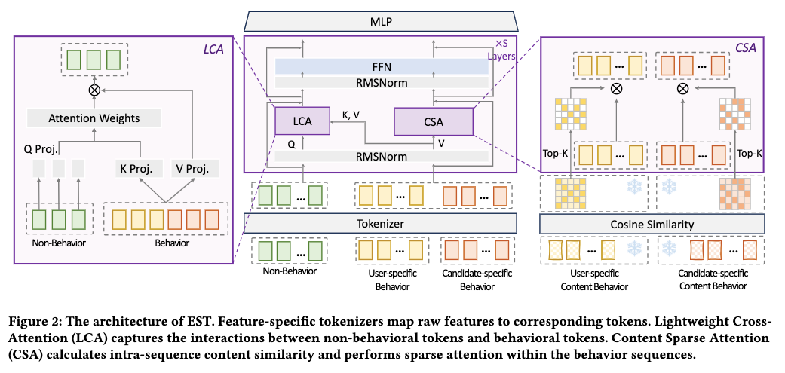

# 阿里淘宝：异构特征统一建模，RPM 提升3%的工业级 CTR 新方案

关注我，每天为你精挑细选最优质、最新鲜的推荐算法paper，陪你一起保持进步、不断精进！

### 论文：EST: Towards Efficient Scaling Laws in Click-Through Rate Prediction via Unified Modeling
### 网址：https://arxiv.org/pdf/2602.10811v1
### 公司：阿里
### 思想：精准控制注意力范围
### 方向：行为序列建模 + 特征交叉

## 解读：
本文提出了一种替代self-attention的特征交叉模型。

该模型把所有异构特征统一成一个token序列，通过堆叠多层特征交叉模块，分别提炼序列特征与非序列特征的高质量表征，最终将精炼后的表征输入上层MLP网络，实现点击率（CTR）的精准预测。

替换self-attn的原因有两个：
* **没必要**：发现没必要做全局的attention，行为与行为之间的自交互式冗余的。注意，这里的背景是在做异构序列的时候是如此的，但是不代表这个说法在同构序列的建模也成立，按照meta论文HSTU 2.0的说法，序列self-attn是重要的，两者并不矛盾。
* **有害**：行为序列特征的信息流量非序列特征是有利的，但是反过来是有害的。因为用户画像、候选属性等非序列特征是高密度信息，是决策核心，应该主动去拉低密度（比如序列特征）的信息。如果让低密度（必须序列特征）也去聚合高密度（比如非序列特征）的信息，相当于把强信号“稀释”到大量冗余的行为token上，高价值信号（非序列特征）被污染。

每一交叉层的具体做法如下：
### （1）非序列特征
增加了一个模块——LCA（轻量cross-attention），非序列特征通过LCA机制，从序列特征中主动聚合高价值信息。

#### 1）特征处理：
* 非序列特征：每个特征经过embedding layer，再经过不同的MLP获得特征embed。
* 序列特征：id经过embed layer，再经过序列元素共享的同一个MLP获得特征embed。

#### 2）网络：
每个非序列特征的embed经过RMSNorm、不同的线性变换，作为Query；序列特征经过RMSNorm，作为Key和Value，做cross-attention，接着做一次线性转换，不同的非序列特征用不同的矩阵。再RMSNorm、**PerToken-FFN**和残差和。

在LCA里，序列特征是个配角，主角是非序列特征的建模，将序列信息增强了非序列特征。

### （2）序列特征
既然从序列特征迁移到非序列特征，那么序列特征也需要做更新。因此，增加一个模块——CSA（内容稀疏self-attention），CSA负责序列里内部提炼。

#### 网络：
做self-attention。Key和Query是通过item的多模态表征（文本和图的归一化embed，freeze权重），而Value是（1）里用到的序列embed。
为了降低复杂度，逐行 top-K 稀疏化，即只取top-K的attention score，其它的attention score为0。从而算得序列item的新表征。

之后，经过RMSNorm、**共享的FFN**和残差和。

多模态相似度直接捕捉图片/文本语义相似性（视觉/文本先验），相比ID-based token学到的相似度主要是“共现统计”，而两者互补，信息密度更高。所以，这算是一个优化点。

### （3）后续处理
经过LCA和CSA组成模块EST，经过多层EST层的堆叠，获得了同shape的序列特征和非序列特征。
对序列的表征，做mean pooling，获得一个精炼版行为表征，跟非序列特征的表征拼接成一个向量，直接喂给 MLP 预测头，最后一层输出1维logit，建模CTR。损失函数是二元交叉熵。

### A/B：
淘宝展示广告，猜你喜欢：CTR +1%，RPM +3%；详情页购物：CTR +2%，RPM +2.7%

## 心得：
* 最近，发现很多论文，把特征/交互的信息密度当作核心设计依据，来设计相关的网络架构了，不再是拍脑袋加attention，而是先量化哪些交互/特征“信息丰富”、哪些“冗余/低密度”，再据此剪枝、稀疏化或重构架构。这已经从“经验归纳偏置”变成了“可量化、可验证的工程洞见”，和LLM scaling laws的思路高度一致。
* 最近一两年，很多paper其实干的是一件事情，在做attention的时候，将注意力范围设置的更加精准，从而拿到了更好的结果。

## 愚见
论文第 4 节“behavior-to-behavior interactions are largely redundant”这句话虽然在异构统一建模的前提下成立，但表述过于绝对，缺少明确限定条件，容易让读者误以为在所有推荐场景下行为-行为自交互都无价值。

## 可信度：生产

## 推荐等级：有实践价值

**请帮忙点赞、转发，谢谢。欢迎干货投稿 \ 论文宣传\ 合作交流**

### 【铁粉】请入微信群，群内我会给出更深入的解读，还可以共同讨论技术方案、发招聘广告、内推和交友等。
* 铁粉标准：关注公众号一个月以上，且在公众号上累计15次互动（评论、爱心、转发）、或投稿1次、或打赏199，只欢迎技术同学。
* 入群方法：请您加个人微信lmxhappy，我拉您入群，请备注【公司】（只我个人看，不公开）。

## 推荐您继续阅读：

