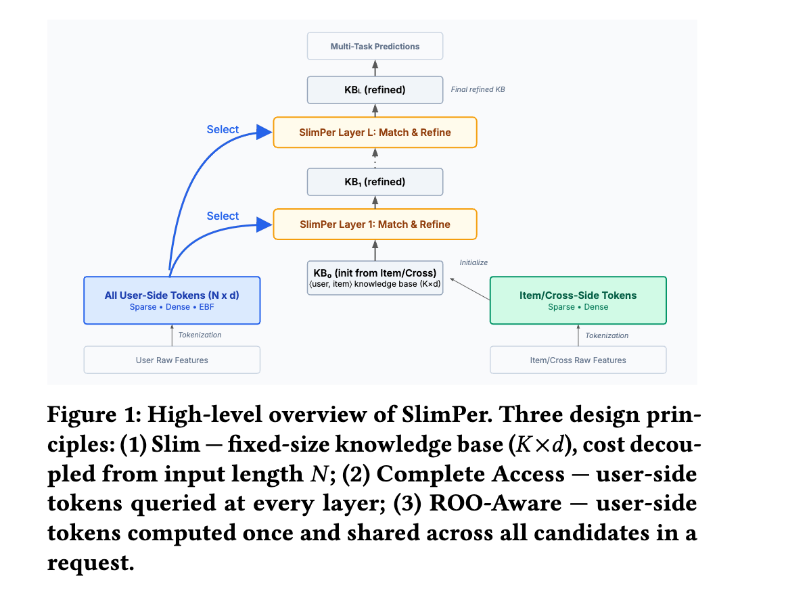

# Meta，多层、多槽位的Target Attention增强版，业务指标大涨

关注我，每天为你精挑细选最优质、最新鲜的推荐算法paper，陪你一起保持进步、不断精进！

### 论文：SlimPer: Make Personalization Model Slim and Smart
### 网址：https://arxiv.org/pdf/2607.12281
### 公司：Meta
### 思想：堆叠
### 方向：特征交叉

## 解读：
本文提出一种行为序列建模新方法：将用户特征 token 化后，通过一种增强的 Target Attention 在当前 item 条件下检索用户证据，再以"显式匹配 + 审慎精炼"的方式逐层积累这些证据，最终由积累结果输出预测。

在介绍后面的内容前，需要先引入一个概念**Knowledge base**：将非用户特征（即item特征、context特征和交叉特征），拼接后，经过一个线性变换，获得了shape（K，d）的矩阵，这个矩阵本文称之为Knowledge base（简称KB）。

### 用户特征的token化
模型先把所有特征（包括长序列）变成 tokens。
* sparse特征：通过pooling，最终压缩成 1 个（或很少几个）固定维度的向量。
* dense特征：拼接通过一个MLP获得一个token。
* sequence特征：每个序列item，融合其多方面的信息，获得对应的token。特别的，在这个过程中，融合了序列前后的序列item的信息。

### 增强的Target Attention层
非用户特征组织为Query，用户sparse特征token、序列token分别作为Key/Value，做Target Attention。分别获得两个证据。

其中，将KB经过一个线性变换，获得了shape（q，d）的矩阵，即Query。Query分别与sparse特征token、序列token做计算，计算方法稍有不同。如下：
* 用户sparse token：就是sparse token（1个或者多个）作为Key/Value。处理方法：Query向量分别与每个sparse token，通过MLP获得attention，并做加权求和，获得R𝑠。
* 行为序列：用户行为序列作为Key/Value。处理方法：Query向量分别与每个序列item token，通过内积获得attention，并通过Softmax，再做加权求和。获得R𝑒。

本层获得的R𝑠和R𝑒是在当前 item 条件下检索到的用户证据。

### 更新KB层

将上层获得的R𝑠和R𝑒，分别与target，显式点积得到相似度𝝀𝑠和𝝀𝑒。注意，计算之前，target做一次线性变换。

将相似度𝝀𝑠/𝝀𝑒、KB、dense token拼接，再通过 MLP 变换后，以残差形式加回原 Knowledge Base，从而得到更新后的 Knowledge Base。注意，拼接前，相似度做RMSNorm，KB做线形投影。

Refine 用 $\lambda$ 而不是 $R$，是为了让 Knowledge Base 的更新建立在“新证据与当前理解有多匹配”这个评估结果上，而不是直接把检索到的证据向量吸收进去。这体现了论文想强调的“显式匹配 + 审慎精炼”的设计哲学。

堆叠增强的Target Attention层和更新KB层，每次都更新KB。注意，每层都共享上面所说的user同一份3种特征，不做更新。

最终 prediction head 从 refined KB 得到多任务 logits。不再把原始的 user 特征或 item 特征重新拼接进上层网络。这是它们已经在以上过程中，充分融入到了KB的计算过程中了。

### A/B：
在 Reels（5k 事件）和 Feed（4k 事件）全流量上线，多个主要 engagement 指标 获得统计显著的正向提升，聚合 topline （业务最顶层的核心指标）影响约为 典型显著上线效果的 10 倍（大约就是 1% ~ 3% 这个量级）。

## 心得：
* 通过本文，对target attention有了更深的理解和认识。
* 历史上很多人都想尝试突破target attention，实现堆叠以获得scaling law的增益，本文做的最为接近。
* Knowledge Base 采用了多槽位的设计，具备类似 multi-head 的“多视角表达能力”，但机制不同。

## 愚见
* 本文尝试以Knowledge base展现一种全新的认识角度。坏处是增加了阅读的难度。如果说想实现对target attention的堆叠，可能更容易阅读。

## 可信度：生产

## 推荐等级：有实践价值

**请帮忙点赞、转发，谢谢。欢迎干货投稿 \ 论文宣传\ 合作交流**

### 【铁粉】请入微信群，群内我会给出更深入的解读，还可以共同讨论技术方案、发招聘广告、内推和交友等。
* 铁粉标准：关注公众号一个月以上，且在公众号上累计15次互动（评论、爱心、转发）、或投稿1次、或打赏199，只欢迎技术同学。
* 入群方法：请您加个人微信lmxhappy，我拉您入群，请备注【公司】（只我个人看，不公开）。

## 推荐您继续阅读：

