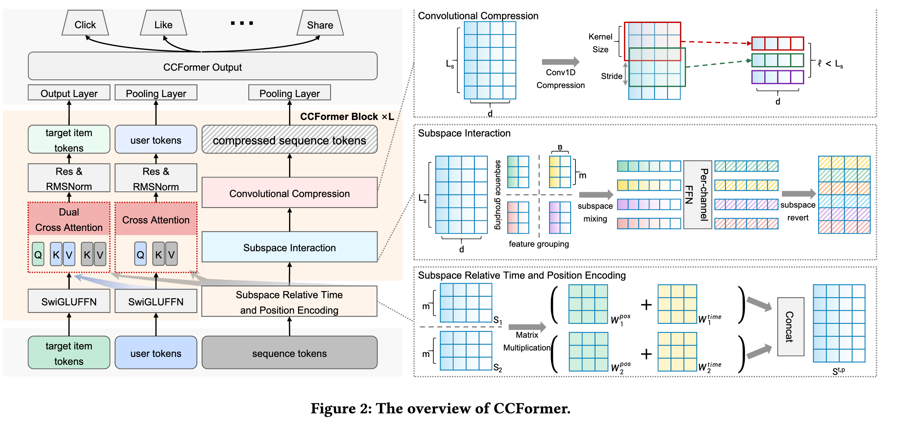

# 腾讯，长序列层次化压缩➕三字段定向交叉，广告收入最高+1.71%

关注我，每天为你精挑细选最优质、最新鲜的推荐算法paper，陪你一起保持进步、不断精进！

### 论文：CCFormer: Efficient Cross-Field Interaction and Hierarchical Sequence Compression for Industrial Recommendation at Tencent
### 网址：https://arxiv.org/pdf/2607.28070
### 公司：腾讯
### 思想：分而治之、注入先验、层次化压缩、MLP替代注意力
### 方向：特征交叉、长序列建模

## 解读：
本文提出了一种对长序列建模的方法，以及一种将user token、item token和行为序列token等3种字段做特征交叉的方法。

先讲解行为序列建模的方法：即先将局部的相对时间和相对位置信息encode到序列item上，再做局部的内容相关的依赖关系建模，最后对序列做全局的信息压缩。

### 序列局部的相对时空感知
对每个序列item做局部感知。用的是固定、非重叠的窗口，而不是滑动窗口。
具体来说：
* 把整个行为序列按固定长度 m 切成互不重叠的多个group。
* 每个group内部独立计算相对时间 + 相对位置矩阵，作为group内部之间的“attention score”，对组内item做线性混合。
* 块与块之间没有重叠，也没有滑动。

时间位置编码是内容无关的（只看时间和位置）。

### 序列局部Token Mixing 
在局部序列窗口内部建模依赖关系。本文不使用全序列 self-attention，而是采用子空间 Token Mixing。即将上面时空感知获得的序列Reshape 成子空间，对每个 channel 独立应用门控 FFN，最后，Restore 回原始形状，得到 $\hat{\mathbf{S}}$。Token Mixing 是内容相关的（根据 token 本身的特征做非线性混合）。

这种方法在局部子空间内同时混合 token 维度和特征维度，表达能力接近 self-attention，但复杂度大幅降低。输入输出的shape保持不变。

其中，**Reshape：**

把相邻的 $m$ 个 token 和 $n$ 个特征维度「打包」成一个长向量，方便后面用一个小的 FFN 对它们一起做非线性混合。可以拆成两个维度上的「分组 + 展平」：

1. 序列维度分组
把长度为 $  L_s  $ 的序列，每 $  m  $ 个相邻 token 分成一组。
一共得到 $  \frac{L_s}{m}  $ 个组。
2. 特征维度分组
把 $  d  $ 维特征，每 $  n  $ 个维度分成一组。
一共得到 $  \frac{d}{n}  $ 个 channel group。
3. 展平
对每一个「序列组 + 特征组」的组合，把里面的 $  m  $ 个 token × $  n  $ 个特征，直接拉平成一个长度为 $  m \times n  $ 的长向量。最终每个 $  \mathbf{X}_{b, p, c}  $ 就是一个 $  \mathbb{R}^{mn}  $ 的向量，它同时包含了：
    * 第 $  p  $ 个序列窗口里的 $  m  $ 个行为
    * 第 $  c  $ 个特征通道组里的 $  n  $ 个维度

### 层次化压缩
用带步长的 1D 卷积，逐层把行为序列变短，同时让每个 token 看到越来越长的历史，实现「计算量下降 + 感受野上升」的双重目标。

堆叠上面3步，完成了对序列的建模，获得了一个较短的token序列，经过pool层接入上层网络，做多目标建模。

### 特征交叉
把用户画像、历史行为、目标物品显式分成三个独立字段，用有向的 Cross-Attention 让它们进行针对性的早期交互，而不是把所有特征混在一起做全局 Self-Attention。

将user的特征、item的特征按照语义分组，每组经过一个FFN获得一个token，那么分别获得了user token序列，和item的token序列。
做如下的特征交叉：
* User token生成 Query 去 attend Behavior Sequence。
* Target item token分别生成 Query 去 attend Behavior Sequence 和 User 字段。

注意力形式为标准带 mask 的 scaled-dot-product attention。

经过特征交叉，分别获得了交叉后的user token和item token。前者经过一个线性投影层；后者经过一个pool层。分别获得了两个表征，也接入上层网络，做多目标建模。

### A/B：
* 视频推荐场景：CTR +3.57%，UCTR +1.93%，广告收入 +1.64%
* 广告排序场景：广告收入 +1.71%

## 心得：
* 特征交叉的工作，不会因为LLM的出现而变得多余，反而变得更加必要，可以做的工作更多。这两年，多类型特征的特征交叉工作很多。
* 分而治之 — 全篇最贯穿的一条。序列按固定长度 m 切成互不重叠的 group；d 维特征按 n 切成 channel group；用户画像 / 历史行为 / 目标物品显式拆成三个独立字段。每一处都是"先切块，块内各自处理"，而不是丢进一个全局算子。

## 可信度：生产

## 推荐等级：有实践价值

**请帮忙点赞、转发，谢谢。欢迎干货投稿 \ 论文宣传\ 合作交流**

### 【铁粉】请入微信群，群内我会给出更深入的解读，还可以共同讨论技术方案、发招聘广告、内推和交友等。
* 铁粉标准：关注公众号一个月以上，且在公众号上累计15次互动（评论、爱心、转发）、或投稿1次、或打赏199，只欢迎技术同学。
* 入群方法：请您加个人微信lmxhappy，我拉您入群，请备注【公司】（只我个人看，不公开）。

## 推荐您继续阅读：

