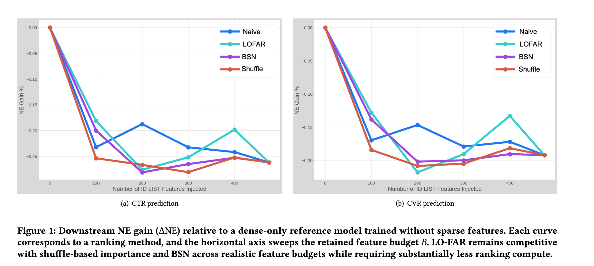

# Meta，低成本特征筛选方法，不用GPU筛特征，稀疏参数最多砍掉75%

关注我，每天为你精挑细选最优质、最新鲜的推荐算法paper，陪你一起保持进步、不断精进！

### 论文：LO-FAR: A Cost-Aware Local Filter for Sparse Feature Ranking in Industrial Ad Recommendation
### 网址：https://arxiv.org/pdf/2607.20873
### 公司：Meta
### 思想：分而治之、统计替代学习
### 方向：特征选择

## 解读：
本文提出了一种对ID list类型特征作出重要性评估的低成本方法，以保留重要的，舍弃不重要的特征。即通过独立地用特征自己的“先验/经验概率”当预测值，去算 log loss。log loss 越小，说明这个特征单独拿出来时，对 label 的预测能力越强，因此越重要。

**背景**：工业广告 CTR/CVR 模型中，稀疏 ID-list 特征（用户历史、上下文 ID 列表等）几乎主导一切，如参数量通常占 97% 以上（每个特征独立 embedding table）。当候选特征数量达到数百、需要频繁重排时，现有主流的特征选择方法的边际精度提升往往被“重跑成本 + 决策滞后”抵消。

### Stage 1: 采样
从全量日志中，按照正负样本分层采样约1M条交互数据，保证正负样本比例与真实分布接近。工业场景不需要在全量数据上做精确排序，只需要一个“足够稳定、可快速重跑”的排序结果。1M 样本量在精度与时间之间做了务实折中。

### Stage 2: Train / Test Split
对采样数据再做一次按 label 分层的 train/test 划分。这保证了后续评估是 held-out 的，避免了用同一数据既建表又打分带来的乐观偏差。

### Stage 3: 特征展开
对训练集和测试集，把变长 ID 列表$  x_i^{(j)} = [id_{i,1}^{(j)}, id_{i,2}^{(j)}, \dots, id_{i,k_i}^{(j)}]  $
展开成“每出现一个 ID 就生成一行”，并复制原样本的 label $  y_i  $。空列表用占位符 $  -1  $ 填充。
形式上：
$$\mathcal{D}^{(j)}_{\text{train,exp}} = \bigl\{(id_{i,t}^{(j)}, y_i) : t=1,\dots,k_i,\ i\in I_{\text{train}}\bigr\}$$
为什么要展开？
因为原始 ID-list 是变长的，直接建模很难。展开后，问题退化成一个标准的“ID → 标签”映射问题，可以用极简单的频率统计来解决。

### Stage 4: 预估正例概率
在训练集上，为每一个稀疏 ID-list 特征，单独学习一个“ID → 点击/转化概率”的简单映射，完全不依赖其他特征，也不需要神经网络。对当前这个特征的词汇表里的每一个 ID，估计它的正例概率 $  s_j(id) \in [0,1]  $。分两种情况处理：

1）高频 ID（出现次数 ≥ $  K  $）

直接计算经验正例率（Empirical Positive Rate）：
$$s_j(id) = \frac{\text{该 ID 出现时 label=1 的次数}}{\text{该 ID 总出现次数}}$$
这是最朴素、也最稳定的估计。高频 ID 样本够多，这个频率已经很可靠。

（2）低频 / 未见过的 ID（出现次数 < $  K  $）

样本太少，直接算频率会严重过拟合（甚至是 0 或 1）。这时使用 k-Nearest Neighbor 回退：在该特征的词汇表中，找到与当前 ID“最相似”的 $  K  $ 个高频 ID，用这些邻居的经验正例率，做加权平均，作为当前稀有 ID 的估计值。注意，加权的时候，考虑邻居们的出现频率。

### Stage 5: 聚合测试样本的正例概率
在测试集上，把 ID 级别的分数mean聚合回原始样本：
$$\hat{y}_i^{(j)} = \frac{1}{k_i} \sum_{t=1}^{k_i} s_j(id_{i,t}^{(j)})$$
直观理解：把列表里每个 ID 的“预估点击/转化概率”取平均，作为这个特征对当前样本的整体预测值。

### Stage 6: 打分与排序
在测试集上，用预测值和label，计算每个特征的 log loss：
$$\text{LogLoss}_j = -\frac{1}{N_{\text{test}}} \sum_i \Bigl[ y_i \log \hat{y}_i^{(j)} + (1-y_i)\log(1-\hat{y}_i^{(j)}) \Bigr]$$
按 log loss 从小到大（即预测能力从强到弱）进行排序。AUC 和 Average Precision 只作为辅助诊断指标。
最终输出就是一个按预测价值降序排列的特征列表。

为什么主指标必须是 log loss 而不是 AUC：下游线上指标 NE（Normalized Entropy）本身就是 log loss 的归一化版本，用 log loss 排序等于让筛选标尺与下游目标同构。AUC 只看排序、不看标定，对「砍掉这个特征后 NE 会退化多少」不敏感。

### 效果：
475 个特征排序只需要用CPU，不需要GPU，仅需要约2个小时，下游 NE 与 Shuffle / BSN （本文对标的两种baseline方法，看下面补充）基本持平。可带来 40%–75% 的稀疏 embedding 参数的削减。

### 补充1 Shuffle-based permutation importance
经典的模型无关（model-agnostic）特征重要性方法，源自随机森林里的 permutation importance（Breiman），后来被广泛用于深度学习。
做法：
1. 先训练一个完整的下游模型（包含所有候选稀疏特征）。
2. 在 held-out 验证集上，把某个特征的值随机打乱（shuffle），其他特征保持不变。
3. 观察模型性能下降了多少（论文里用 Normalized Entropy 的恶化程度）。
4. 性能下降越多，说明这个特征越重要。
5. 对每个特征都重复上述过程，得到重要性排序。

### 补充2:BSN（Binary Stochastic Neurons，二进制随机神经元
核心思想（来自 Louizos et al. 2018 的 L0  正则化，以及后续在推荐系统中的应用）：
* 给每个特征（或每个 embedding）前面加一个可学习的门控（gate）。
* 这个门控是随机的、近似离散的（通过 Binary Concrete / Hard Concrete 分布等技术实现），训练时可以反向传播。
* 通过 L0 范数惩罚（鼓励门控为 0），让模型自动把不重要的特征“关掉”。
* 训练结束后，根据门控的开启概率对特征排序或直接剪枝。

## 心得：
* 这是一篇非常典型的工业界特征工程/系统论文，聚焦广告推荐中高基数稀疏 ID-list 特征的排序与剪枝问题。它不是追求 SOTA 的交互感知方法，而是把“成本与迭代速度”作为一等公民，提出一个轻量、可频繁重跑的 CPU-only 第一阶段过滤器。定位为第一阶段轻量过滤器：快速砍掉明显低信号的长尾特征，而不是替代 BSN 等交互感知方法。
* 作者很清醒地承认自己的方法看不到特征交互。因此明确把它设计成：粗筛工具：快速砍掉明显没信号的长尾特征；留下真正需要精细判断的边界特征，再交给更贵的交互感知方法。
* 分而治之：把「N 个特征联合评估」拆成「N 次单特征独立评估」，用可分解性换掉组合复杂度；
统计替代学习：用频率统计量顶替模型训练；一阶近似：边际相关性作为真实重要性的一阶项，主动放弃高阶交互项。

## 可信度：生产

## 推荐等级：有实践价值

**请帮忙点赞、转发，谢谢。欢迎干货投稿 \ 论文宣传\ 合作交流**

### 【铁粉】请入微信群，群内我会给出更深入的解读，还可以共同讨论技术方案、发招聘广告、内推和交友等。
* 铁粉标准：关注公众号一个月以上，且在公众号上累计15次互动（评论、爱心、转发）、或投稿1次、或打赏199，只欢迎技术同学。
* 入群方法：请您加个人微信lmxhappy，我拉您入群，请备注【公司】（只我个人看，不公开）。

## 推荐您继续阅读：

