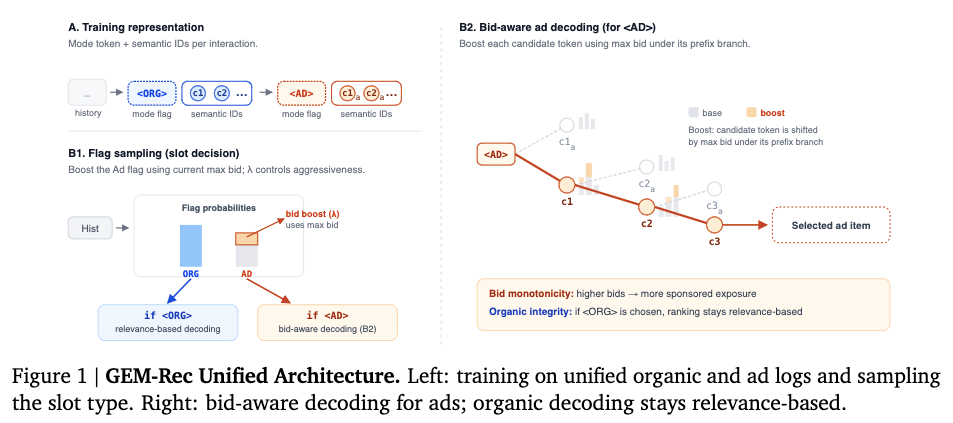

# 谷歌，统一推荐和广告的生成式推荐

关注我，每天为你精挑细选最优质、最新鲜的推荐算法paper，陪你一起保持进步、不断精进！

### 论文：One Model, Two Markets: Bid-Aware Generative Recommendation
### 网址：https://arxiv.org/pdf/2603.22231
### 公司：Google
### 思想：
### 方向：推荐广告一体+GR

## 解读：
本文提出了一个可以同时推荐广告item和推荐item的生成式推荐模型。next token prediction，除了预测下一个item，还预测是插入推荐item还是广告item；在推理的时候，考虑了竞价情况，偏向广告场景、高竞价的广告。

### （1）序列构建
用户行为序列里的item通过RQ-VAE获得SID，作为GR模型的输入。序列里的item是用户正向互动的item，不光包括推荐的item，还包括广告的item。以往的GR，会将这个信息当作是item表征的一部分。本文将item的类型前缀到其SID前面，分别用<AD>和<ORG>表示广告和推荐。如果SID有d个token，那么此时就有d+1个token组成了。
换句话说，序列里包括了SID的token和这样的标志位token。标志位token只是加入token集合中的普通token。

### （2）训练
就是标准的ntp预测token，计算loss更并更新网络。并不会区分什么token。
这样，这个GR模型就能学习到何时插入广告，插入什么样的广告了。

### （3）推理
先预测是推送广告item还是推荐item，再预测具体的item SID。

#### 1） 预测标志位：
正常计算出标志位里广告和推荐的logit。为了提高AD的概率，在AD的logit上加一个bias值—— $\lambda \cdot log(1 + b_{\max})$。其中，$b_{\max}$：在当前这个用户（user）当前这个槽位上，所有“有资格参与竞价”的广告主里，出价最高的那个竞价金额。

确定标记位：并不会选取概率最大的标记位，而是以概率做sampling的方式确定。

#### 2） 预测SID的token：
如果标志位是ORG，就正常预测SID。否则，就要对预测的token的时候，对每个token的logit加上一个bias值——$\lambda \cdot log(1 + B(c))$。其中，$B(c)$是c前缀下面（即该语义簇的整个 subtree）所有有效候选物品中，当前实时的最大竞价。
再进行Beam Search生成Semantic ID。

## 心得：
* 标志位调整 → 把“大方向”稍微往广告那边推一点（当市场竞价高时，更容易开广告槽）。物品级调制 → 把“小方向”稍微往高出价物品那边偏一点（在同一语义簇里，优先高 bid 的分支）整个过程就像在原来学好的航线上，临时加一个“货币风力助推器”，风力大小由 λ 控制，想赚多少钱就调多大。倾斜是单调、可控、平滑的（不会突然翻船）。

## 可信度：离线

## 推荐等级：有实践价值

**请帮忙点赞、转发，谢谢。欢迎干货投稿 \ 论文宣传\ 合作交流**

### 【铁粉】请入微信群，群内我会给出更深入的解读，还可以共同讨论技术方案、发招聘广告、内推和交友等。
* 铁粉标准：关注公众号一个月以上，且在公众号上累计15次互动（评论、爱心、转发）、或投稿1次、或打赏199，只欢迎技术同学。
* 入群方法：请您加个人微信lmxhappy，我拉您入群，请备注【公司】（只我个人看，不公开）。

## 推荐您继续阅读：

