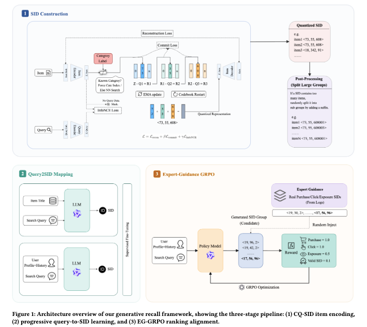

# 阿里，搜索LLM召回，GMV+1%且贡献七成成交

关注我，每天为你精挑细选最优质、最新鲜的推荐算法paper，陪你一起保持进步、不断精进！

### 论文：Efficient Generative Retrieval for E-commerce Search with Semantic Cluster IDs and Expert-Guided RL
### 网址：https://arxiv.org/pdf/2605.14434
### 公司：阿里
### 思想：课程学习、聚类、注入先验
### 方向：生成式召回

## 解读：
本文提出了一种面向电商搜索召回阶段的生成式检索框架，主要包含 **Item 侧语义聚类 ID 编码** 和 **Query 侧 LLM 生成式映射** 两部分。

**1. Item 侧编码（CQ-SID）**  
使用类别引导的 Residual Quantized VAE（RQ-VAE）将商品编码为层次化的语义聚类 ID（Semantic ID，简称 SID）。
和普通 RQ-VAE 的区别在于**第一级量化**：
- 对于已知类目的商品，**第一层不需要在 codebook 中做最近邻搜索**。
- 直接将商品所属的 **CategoryID 作为第一级 codebook 的 index**，查出对应的 code vector（embedding）。
- 然后计算残差，并继续进行第二层和第三层的残差量化。
- 最终得到三级层次化的 Semantic ID（SID）。

注意：论文未明确说明 Item Encoder 的具体输入。最可能的输入是 **Item Title（文本）**。Category 并非 encoder 的输入特征，而是在量化阶段通过强制绑定第一级 code 的方式注入的。

Codebook 更新使用 EMA + restart 防止 collapse。
另外，在 RQ-VAE 训练时加入 Bi-InfoNCE，让 item embedding 和 query embedding 对齐。同时，对超大 cluster（item 数量 > T_max=50）进行分裂，控制 cluster 大小，保证召回精度和多样性。

**2. Query 侧生成模型训练**  
采用 Qwen2.5-0.5B 模型，通过**四阶段渐进式训练**实现从 query 到语义聚类 SID 的映射。其中，前三阶段使用 SFT 逐步构建基础映射和个性化能力，第4阶段GRPO的改进方法做 RL，使生成式召回，显式对齐下游 ranking 目标。具体如下：

### Stage 1: Item-to-SID Mapping (I2SID) —— 让模型先学会“说 SID 这种语言”
核心目标：让模型建立 item 文本描述 ↔ SID 之间的强对应关系，为后续阶段打基础。

具体的，从 CQ-SID 编码好的 item 中，取出 (item_title, SID) 对。SID 被表示为一个 token 序列（例如 <s1_2048> <s2_1024> <s3_1024> 或类似特殊 token 形式，论文没给精确 tokenization 细节，但一定是把三级 ID 序列化后让模型自回归生成）。
训练方式：标准的 Supervised Fine-Tuning (SFT)，用交叉熵损失让模型自回归生成正确的 SID 序列。

### Stage 2: Query-to-SID Mapping (Q2SID) —— 学习意图到语义簇的映射
核心目标：让模型学会 用户 query 的意图 → 对应的语义聚类 SID。

具体的，对每个 query，从真实点击或成交的 item 中采样 N=3 个 SID 作为正样本，构造 (query, target_SID) 对。这样模型学到的是“这个 query 应该召回哪些语义簇”。
训练方式：继续 SFT，自回归生成目标 SID 序列。

### Stage 3: Personalized User+Query-to-SID (UQ2SID) —— 加入个性化
核心目标：让模型在 query 的基础上，结合用户个性化信息 生成更精准的 SID。

在 query 前面/后面 拼接用户特征：基础画像：gender、age 等；行为特征：近期在相关类目下点击过的 SID（作为历史 context）。目标仍然是用户真实点击/成交对应的 SID。

### Stage 4: Ranking-aligned Refinement via EG-GRPO
前3个stage都是监督学习的微调。本阶段，发明了一个GRPO的改进方法EG-GRPO，通过它对模型做强化学习微调，实现了生成式召回与下游ranking目标的显式对齐，从而让召回的语义簇在点击率、曝光覆盖和最终成交上都更符合 ranking 的偏好，最终带来更好的端到端业务效果。
EG-GRPO 是本文针对生成式召回稀疏奖励场景做的改进：它在标准 GRPO 的基础上，加了一个非常关键的 trick：在每一组 rollout 里，强制塞进 K 个“专家样本”（ground-truth SID）。在每组 rollout 里强行塞进真实专家样本，让模型在奖励几乎全为 0 的情况下，依然能稳定地学到好的策略，最终实现召回结果与下游 ranking 的更好对齐。

具体流程：
对一个 query x：
1. 用当前策略模型采样 G 个 SID          →  𝒢_sampled
2. 从真实点击/曝光数据里随机抽 K 个 SID   →  𝒢_expert（专家样本）
3. 把两部分合并成一个大 group：𝒢 = 𝒢_sampled ∪ 𝒢_expert
4. 给 𝒢 里的所有 SID 打 reward
5. 在这个大 group 内部做 advantage 标准化
6. 用 GRPO 的 clipped loss 更新模型

**3. 在线 Serving 流程**  
线上 serving 时，将 query 连同 user profile 和近期行为特征一起输入 LLM，通过 beam search 生成 top-K 个候选 SID，再通过预先构建的 `SID → Items` 查找表，将 SID 映射为候选商品集合，进入后续粗排和精排阶段。

### A/B：
GMV +1.15%，UCTCVR +0.40%。此召回通道最终在生产中贡献了超过一半的曝光和点击、超七成的成交，成为核心召回来源。

## 心得：
* 特殊的token，如SID，作为新的语言的“词汇”，在正确的训练的情况下，LLM也是可以学会并且学的很好。LLM4Rec有前途，各位做recsys的同仁要在这个方面多花时间研究。

## 可信度：生产

## 推荐等级：有实践价值

**请帮忙点赞、转发，谢谢。欢迎干货投稿 \ 论文宣传\ 合作交流**

### 【铁粉】请入微信群，群内我会给出更深入的解读，还可以共同讨论技术方案、发招聘广告、内推和交友等。
* 铁粉标准：关注公众号一个月以上，且在公众号上累计15次互动（评论、爱心、转发）、或投稿1次、或打赏199，只欢迎技术同学。
* 入群方法：请您加个人微信lmxhappy，我拉您入群，请备注【公司】（只我个人看，不公开）。

## 推荐您继续阅读：

