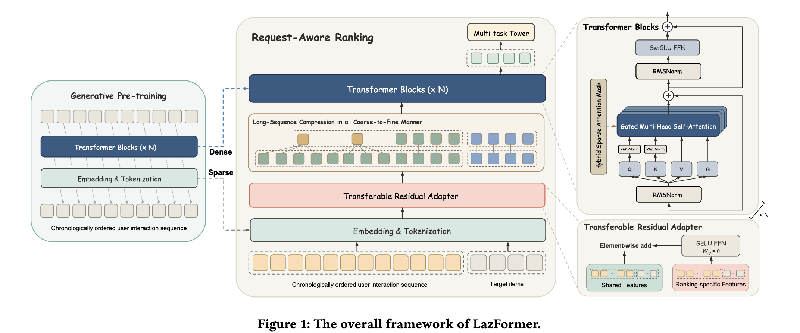

# 阿里国际：精排模型先做生成式预训练，再迁移到排序，GMV +9.85%

关注我，每天为你精挑细选最优质、最新鲜的推荐算法paper，陪你一起保持进步、不断精进！

### 论文：LazFormer: Scaling Transformers for Industrial Recommendation via Transferable Generative Pre-training
### 网址：https://arxiv.org/abs/2609.14978
### 公司：阿里
### 思想：模型迁移
### 方向：生成式推荐

## 解读：

精排模型想做大，卡在两件事上。一是稀疏参数（各种 ID 的 embedding）和稠密参数（网络本身）全都得从零开始训，几十亿参数烧算力还收敛慢。二是想借预训练省这个钱，又会撞上负迁移——预训练阶段能看到的特征，和精排阶段的特征根本对不齐，硬接上去反而更差。

LazFormer 的做法是把预训练和精排拆成两段，中间用一个初始时刻完全不起作用的适配器缝起来。部署在Lazada首页推荐的精排环节。

## 1 预训练：先把 embedding 和网络都训出来

预训练任务是 next-item prediction：按时间排好用户的交互序列，让模型预测下一个交互的 item，用温度缩放的余弦相似度算匹配。数据是一年的历史，1600 万用户、110 亿 token。

关键不在任务本身，而在**迁移的是两套参数**。Embedding & Tokenization 那层的稀疏参数、Transformer Blocks 的稠密参数，都会作为精排模型的初始化——不是只拿个序列表征当特征喂进去，是整个底座搬过去接着训。

网络结构直接用了现在大模型那一套：RMSNorm、SwiGLU FFN、带门控的多头自注意力，堆 N 层。

## 2 精排：三个让迁移真的跑得通的设计

**零初始化的残差适配器**，解决负迁移。特征被切成两类：共享特征是预训练时就有的，item ID 加上类目、店铺、品牌、停留时长、场景这些；精排特有特征是**加购、下单、时间间隔**这类多行为信号，预训练阶段根本不存在。后者单独走一个 GELU FFN，然后和共享特征逐元素相加。

要害在这个 FFN 的升维矩阵 `W_up` **初始化为 0**。也就是训练第一步，适配器输出恒等于 0，整个模型和预训练出来的那个完全等价，精排特有特征一点都注不进去；之后再由梯度决定往里加多少。和 LoRA 把 B 矩阵初始化成 0 是同一个思路——先保证不破坏已有能力，再谈增量。

**由粗到细的长序列压缩**。近期的 1024 个 token 原样保留，更早的行为每 8 个一组做 sum pooling 压成一个。2048 长度的序列压完剩 1152 左右。理由很朴素：近期兴趣要细粒度，久远的兴趣本来就是粗的。

**混合稀疏注意力**。局部用 W=128 的因果滑动窗口，另外留一批全局 token 负责远距离传递信息；候选 item 能看到所有历史，但候选之间互相不看。稀疏度 88.04%，配 flex attention 的 CUDA kernel，拿到 3.7 倍加速。

## 3 非对称多轮训练

精排数据一共训 3 轮，但两类参数的处理方式不一样：**每轮开始时，稀疏参数重置回预训练的状态，稠密参数则继承上一轮的结果**。

原因是几十亿的 embedding 在同一批数据上反复更新几轮，会过拟合，而且会把预训练学到的、本来可迁移的表示给冲掉。稠密参数没这个问题，多训几轮是纯赚。这条改动很小，是全篇最容易直接抄回自己系统的一个点。

## 线上效果

两周 A/B，对照组是 3 层的 SORT-like 精排模型：**GMV +9.85%**，商品详情页浏览（IPV）+5.21%，订单数 +3.38%，买家数 +3.70%。

耗时这块，A10 单机 QPS 只降了 12.1%——模型明显变大但还能上线，靠的就是上面那套压缩加稀疏注意力。离线指标这里不展开，CTR 的 AUC 比最好的基线高 0.74 个点、GAUC 高 1.28 个点。

## 心得：
* 预训练和下游特征对不齐，常见解法要么削足适履去对齐特征，要么干脆放弃预训练；零初始化适配器给了第三条路——**让新特征从「完全不参与」开始，由训练自己决定注入多少**，这个模式可以搬到任何两阶段迁移的场景。
* 稀疏参数重置、稠密参数累积，这个非对称处理把「embedding 容易过拟合、网络不容易」这个大家都有体感的经验，落成了一条能直接照搬的训练流程。
* 非对称多轮训练，这个 trick 不是 LazFormer 凭空发明的，背后是工业 CTR 里已经谈了很多年的 one-epoch overfitting：大 embedding 表在同一批精排日志上进第 2 个 epoch，验证 AUC 往往直接掉。经验先来自各家生产线的默认做法——大 ID 表几乎只训 1 轮——后来才被写成可重复的训练策略。

## 愚见

* Figure 1 画得容易引起有点歧义。Transferable Residual Adapter 那个红色长条横跨在整层 Embedding & Tokenization 上面，看上去历史行为和候选 item 都要过这个模块。但精排特有特征是加购、下单、时间间隔——候选 item 是待打分的、用户还没产生任何行为，这些特征天然为空，**真正非零的只有历史 item**。候选过不过这个模块其实无所谓，输出都是 0。论文正文一句"applies to each item"把两边混在一起说，图又照着这么画，读者很容易在这里卡住。
* GMV +9.85% 要打个折看：对照组是 3 层的模型，基线本身不强，涨幅里有多少来自「终于把模型堆大了」、多少来自预训练迁移，论文没拆开。
* global token 这个叫法也容易误导。通常说的 global 是双向的——既能看所有人，也被所有人看，像挂在场中央的公共黑板。这里只有前半句：这 128 个 token 能看到全部历史，但受因果约束，更早的历史反过来看不见它们。与其叫全局 token，不如理解成「最近 128 个拥有全历史视野的 query」。叫 full-history tokens 或 long-range queries 更准。

## 可信度：生产

## 推荐等级：有实践价值

**请帮忙点赞、转发，谢谢。欢迎干货投稿 \ 论文宣传\ 合作交流**

### 【铁粉】请入微信群，群内我会给出更深入的解读，还可以共同讨论技术方案、发招聘广告、内推和交友等。
* 铁粉标准：关注公众号一个月以上，且在公众号上累计15次互动（评论、爱心、转发）、或投稿1次、或打赏199，只欢迎技术同学。
* 入群方法：请您加个人微信lmxhappy，我拉您入群，请备注【公司】（只我个人看，不公开）。

## 推荐您继续阅读：
* [Sigma — 生成式推荐，GMV+8% (阿里)](ali-sigma.md)
* [RCLRec — 稀疏目标的生成式推荐，广告收入+2% (阿里国际)](ali-rclrec.md)
