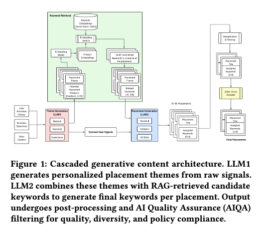

# 北美零售商：级联生成式LLM实现首页全面个性化，加购+3%

关注我，每天为你精挑细选最优质、最新鲜的推荐算法paper，陪你一起保持进步、不断精进！

### 论文：A Cascaded Generative Approach for e-Commerce Recommendations
### 网址：https://arxiv.org/pdf/2605.11118
### 公司：Instacart（北美零售商）
### 思想：LLM的理解能力
### 方向：LLM-as-ranker+排版+召回
## 解读：
借助 LLM 实现首页的板块级与板块内个性化：首先生成用户个性化的 Top-K 语义主题，再为每个主题生成检索关键词，利用关键词召回对应商品，通过质量过滤剔除主题-商品匹配度差的板块，最后接入传统排序系统完成最终呈现。

包括以下4个步骤：
### （1）版面主题生成
用llm，输入用户上下文​（购买历史、互动信号、饮食偏好、家庭结构、季节/时间因素等），希望输出 m 个有序的语义主题。从传统系统给所有人展示相同的主题，变成更细粒度、更个性化的千人千面主题，构成用户专属的首页。每个主题代表一个连贯的购物意图，直接作为推荐板块的标题使用。这些主题不再是传统静态的“Dairy”、“Snacks”，而是高度个性化、上下文感知的语义描述。

不只输出主题，还同时生成以下内容，供后续阶段使用（避免重复输入原始上下文，提高 token 效率）：
* 用户画像：如“忙碌的年轻家庭主厨，偏好快速健康餐食”
* 商品概念：如“低糖功能饮料、周中快手晚餐食材”等

具体的，使用GPT-5，用约束解码和结构化输出保证输出格式可控。
* 约束解码：就是通过gpt的api的schema进行约束输出。
* 结构化输出：以JSON 结构化输出，确保输出格式严格符合下游要求

### （2）关键词生成+初步召回
用一个小模型，把第一阶段生成的抽象、高级主题转化为检索系统能直接使用的关键词，用于从商品目录中检索商品。这些 Keywords 会被立即用于调用现有生产检索系统，初步召回商品候选集。每个session只跑一次第一、二阶段，这些结果都会按照session缓存下来。

用小模型Llama-3.2-3B 生成 Keywords 时，它的 Prompt 大致包含以下内容：
* System Prompt：任务指令（生成 retrieval-compatible keywords，优先 taxonomy nodes 等）
* 第一阶段的输出：当前板块主题 + 用户画像 + 商品概念
* RAG 检索结果：第1阶段产出的商品概念被embedding化，从30万term的keyword corpus中检索最近邻，只把这个缩小后的candidate set（通常是 Top-20 ~ Top-50 条，最相关的近邻）给LLM做约束生成。好处是减少15-20%推理成本（不需要把整个keyword corpus塞进context），同时减少幻觉，保证生成的keyword保证在物料库里。

小模型的微调训练：用GPT-5作为teacher生成高质量标注数据，然后用LoRA fine-tune一个小模型作为student。用 Llama-3.2-3B 而不是 GPT-5，核心是为了成本和延迟的可控性。蒸馏的目的就是让小模型能接近大模型的效果，同时具备生产环境大规模部署的能力。

补充知识——RAG：
* 传统 LLM 生成过程：用户问题 → LLM 直接生成答案（容易编造）
* RAG 生成过程：用户问题 → 先检索 相关资料 → 把资料 + 问题一起喂给 LLM → LLM 基于资料生成答案

### （3）过滤
对第二阶段生成的关键词和召回的商品，进行两层过滤。
* 语义重复：做embedding去重，防止给同一用户生成多个语义重复的主题。
* 相关性判断：用微调的Cross-Encoder，对（主题，召回商品）做相关性判断，过滤掉整体质量差的主题。这里召回的商品的作用，不是用作最终的推荐，是为了验证主题的质量。

### （4）召回、排序
用过滤后的关键词正式召回商品。之所以这样，是因为第一、二阶段是按照session级别缓存的，item可能发生了变化，得重新召回一遍。
做两种排序：
* 商品级精排：用过滤后的关键词再次/正式召回商品，对每个板块内的商品进行排序。
* 页面级排序：决定多个板块话题在首页的展示顺序和权重。

### A/B：
每页面浏览加购数，相对强基线提升2.7%。

## 心得：
* LLM4Rec的重要方向LLM-as-ranker很有前途，特别是随着llm的不断增强，推荐可以吃到红利，快快行动。
* RAG在LLM-as-ranker的作用举足轻重。

## 可信度：生产

## 推荐等级：有实践价值

**请帮忙点赞、转发，谢谢。欢迎干货投稿 \ 论文宣传\ 合作交流**

### 【铁粉】请入微信群，群内我会给出更深入的解读，还可以共同讨论技术方案、发招聘广告、内推和交友等。
* 铁粉标准：关注公众号一个月以上，且在公众号上累计15次互动（评论、爱心、转发）、或投稿1次、或打赏199，只欢迎技术同学。
* 入群方法：请您加个人微信lmxhappy，我拉您入群，请备注【公司】（只我个人看，不公开）。

## 推荐您继续阅读：

