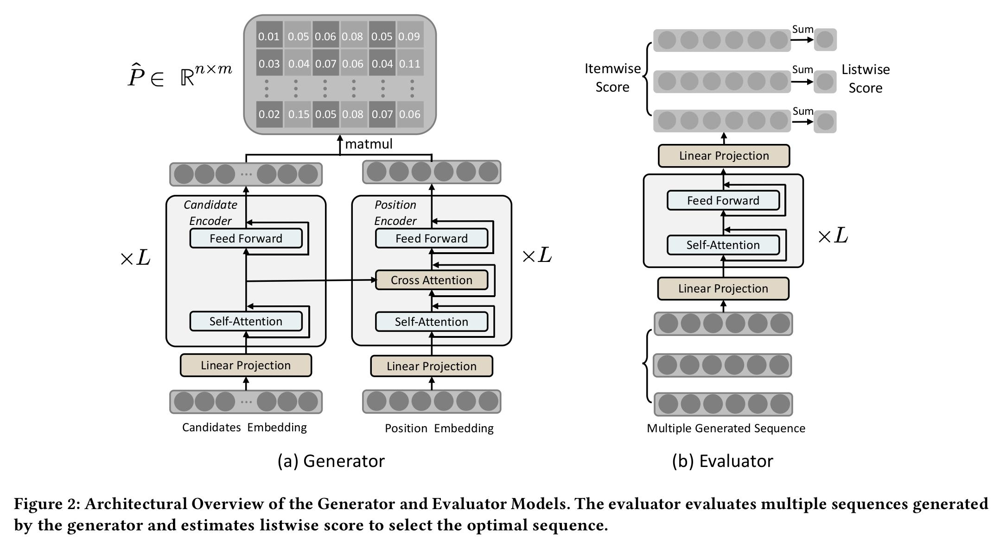
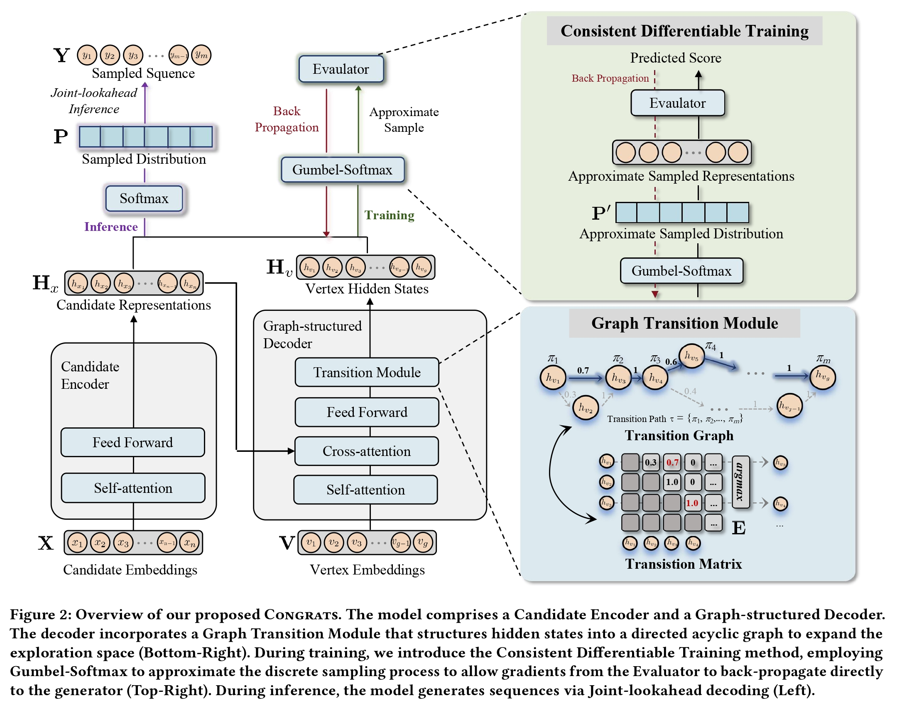

# KDD 2026 \| 快手生成式推荐：从 NAR4Rec 到 CONGRATS

> 论文：[Non\-autoregressive Generative Models for Reranking Recommendation](https://arxiv.org/pdf/2402.06871)（NAR4Rec，KDD 2024）
> 
> 论文：[Breaking the Likelihood Trap: Consistent Generative Recommendation with Graph\-structured Model](https://arxiv.org/abs/2510.10127) （CONGRATS，KDD 2026）
> 
> 原文：[知乎文章](https://zhuanlan.zhihu.com/p/2079338162246137426)、[知乎文章](https://zhuanlan.zhihu.com/p/2078936687367951729)
> 
> 

本文介绍我们团队在生成式推荐上的思考与实践，欢迎大家讨论。

之前 KDD 2024 的论文 [NAR4Rec](http://link.zhihu.com/?target=https%3A//arxiv.org/pdf/2402.06871) 介绍了我们在生成式推荐上落地的工作，之后业内各大公司有不少将生成式重排落地到业务场景，并取得了一定的效果。

由于 KDD 推荐的受众比较多，所以我们当时写论文的时候面向推荐背景的读者做了一定的兼容，这次也在这篇文章中讲讲背后的设计原则。

## 什么是生成式重排

**首先，生成式和判别式的区别是什么？**之前和盖坤老师汇报时，他最先问的也是这个问题。很多搜广推同学第一次接触生成式推荐时，比较容易在这里产生困惑。

判别式模型预估的是给定样本后各种 label 的后验概率，也就是 $p(y\mid x)$。推荐中常见的点击率、转化率和时长预估都属于这一类：给定用户和候选 item，预测用户发生某种行为的概率。

生成式模型学习的是样本与标签的联合分布 $p(x,y)$。在文本生成中，显式的 label $y$ 逐渐被弱化，更多是在建模样本分布 $p(x)$。以一段文本 $x=(x_1,\ldots,x_T)$ 为例：

$$p(x)=\prod_{t=1}^{T}p(x_t \mid x_{\lt t})$$

模型根据前面的 token 预测下一个 token，通过最大似然学习不同文本序列出现的概率。弱化 label 之后，生成式模型预估的就是样本本身出现的概率。

**那么生成式用在重排里有什么意义？**

重排里要生成的样本不是单个 item，而是一条完整的曝光序列。把一次请求的候选集合记作 $C=\{c_1,\ldots,c_n\}$，最终曝光序列记作 $x=(x_1,\ldots,x_m)$。从 $n$ 个候选中选择 $m$ 个 item 并决定顺序，一共有：

$|\Omega(C,m)|=A_n^m=\frac{n!}{(n-m)!}$

种可能，目标是找到用户收益最高的序列：

$x^*=\arg\max_{x\in\Omega(C,m)}R(u,x)$

如果精排给出 60 个候选，重排最后展示 6 个视频，那么 $A_{60}^{6}=36{,}045{,}979{,}200$，大约有 360 亿种排列。

判别式模型可以评价一条序列，但是要根据这个分数找到全局最优解，还是得把这 360 亿种排列全部算一遍，线上显然做不了。

生成式模型直接学习完整曝光序列的分布 $p_\theta(x\mid u,C)$，训练时把曝光序列中的选择模式、位置关系和 item 关系学到模型里，推理时直接解码，不再显式穷举所有组合。

所以生成式模型并没有消除 $A_n^m$ 的组合空间，只是把原来每次请求都要做的组合优化放到了模型训练中。这也是**生成式重排和传统序列打分最大的区别**。

但是最大似然会带来另外一个问题：

$\arg\max_x p_\theta(x\mid u,C)\overset{?}{=}\arg\max_x R(u,x)$

**训练日志里出现概率最高的序列，不一定是用户反馈最好的序列。**热门 item 历史曝光多，日志中的频率也高，模型继续做最大似然，很容易把更多概率集中到这些 item 上。

最后生成的序列概率很高，但是内容越来越重复，用户并不一定喜欢。我们在论文里把这个问题称为 **Likelihood Trap（似然陷阱）**。

## 从 NAR4Rec 到 CONGRATS

[之前的解读](https://zhuanlan.zhihu.com/p/717760596)已经比较完整地介绍过 [NAR4Rec](https://arxiv.org/pdf/2402.06871)。这里不再复述整篇论文，只说一下当时几个主要设计，以及为什么后面还需要继续做 CONGRATS。

先是 **Matching Model**。文本生成的词表是固定的，重排每次请求的候选集合却不一样，并且最终生成的 item 必须来自当前候选。

NAR4Rec 先用 **Candidate Encoder **编码候选 item，再用 **Position Encoder **得到输出状态，最后计算 candidate 与 position 之间的匹配概率。如果按照 LLM 的 encoder–decoder 框架来命名，Candidate Encoder 更接近 encoder，Position Encoder 则更接近 decoder。当时把模型画成双塔结构，主要是为了兼容推荐背景读者的理解习惯。

从机制上看，它也可以理解为 **Pointer Network **在 Transformer 上的一种适配：模型不是从全局词表里生成一个新 token，而是指向输入候选集合中的 item。Matching Model 解决的是动态词表问题，这个结构可以用于自回归，也可以用于非自回归；线上版本采用并行生成，主要是因为重排的延迟比较紧。

并行预测整条序列之后，不同位置之间缺少直接的 item 关系。训练数据里又可能同时存在多种合理的序列模式，各位置分别取概率最高的 item，最后不一定能拼成一条合理序列。

所以我们在解码时加入了 **Contrastive Search**，选 item 时除了看当前位置的生成概率，也考虑它与前面已选 item 的 embedding 关系，用点积近似 item 之间的转移概率。当时为了方便推荐背景的同学理解，我们把它解释成多样性先验。训练时还加入了 Contrastive Loss，一方面和解码保持一致，另一方面也可以缓解 weight tying 下的 embedding 塌缩。

另外，线上曝光日志并不都是正样本。有些序列曝光后用户反馈很好，也有些序列反馈很差。如果全部做最大似然，负向序列的概率同样会被提高。NAR4Rec 因此加入 **Unlikelihood Training**，根据后验反馈区分正负序列，降低负向序列的生成概率。

这几个设计解决了 NAR4Rec 当时落地遇到的问题，**但还有两点可以继续往下做：**

- 一方面，线上版本仍然用 $m$ 个固定的 position hidden states 生成长度为 $m$ 的序列。所有合理序列共享同一组位置分布，能够表达的生成路径比较有限。Contrastive Search 是在解码阶段额外加 item 关系，模型内部并没有显式学习 item 依赖。

- 另一方面，Unlikelihood Training 还是要根据后验反馈和阈值划分正负样本。**Generator 学习序列概率，Evaluator 学习用户反馈**，两边依旧分开训练。Evaluator 发现某条序列更好，也无法把这个信息直接传回 Generator。

因此 CONGRATS 继续改了两个地方。一个是把固定 position 扩展成图，增加模型可以生成的路径；另一个是把 Evaluator 接入 Generator 的训练，让用户反馈直接影响生成模型：

## Graph\-structured Model

NAR4Rec 原来用 $m$ 个固定的 position hidden states 生成长度为 $m$ 的序列。

问题不只是可选路径少，更重要的是，多种可能的内容组合都要挤在同一组位置分布里。不同序列模式之间容易互相干扰，模型最后也更容易集中到少数高概率 item 上。

CONGRATS 把这 $m$ 个固定位置扩展成 $g=\lambda m$ 个顶点组成的有向无环图。线上 $m=6$、$\lambda=4$，也就是解码器内部有 24 个顶点，最终从中选择一条长度为 6 的路径。不同的内容组合可以由不同路径承载，模型因此有了更大的 hidden states 和路径组合空间。

具体来说，模型会同时学习两个矩阵：预测矩阵 $P$ 表示每个候选 item 在各个顶点上的生成概率，转移矩阵 $E$ 表示顶点之间的转移概率。对于路径 $\tau=(\pi_1,\ldots,\pi_m)$ 和曝光序列 $x$，联合概率由两部分组成：

$p_\theta(x,\tau\mid u,C)=\prod_{t=1}^{m-1}E_{\pi_t,\pi_{t+1}}\prod_{t=1}^{m}P_{x_t,\pi_t}$

前一项判断路径是否合理，后一项判断这条路径上的顶点能否生成目标 item。相比只计算候选 item 与固定位置的匹配关系，图上的转移也显式补上了生成位置之间的依赖。

训练时的关键是，真实日志只记录了最终曝光序列 $x$，并没有记录它对应图中的哪条路径。路径不是监督信息，也没必要人为指定。因此训练时把路径 $\tau$ 当作隐变量，对所有合法路径的联合概率做边缘化：

$p_\theta(x\mid u,C)=\sum_{\tau\in\Gamma}p_\theta(x,\tau\mid u,C)$

模型在拟合曝光序列的同时，自行学习面对不同用户、候选集合和目标序列时，哪些顶点组合与转移路径更合适。这个求和可以通过动态规划完成，不需要把所有路径逐条枚举出来。

推理时则必须真正选出一条路径。如果先只按照转移矩阵 $E$ 选路径，再沿着这条路径从 $P$ 中选 item，可能得到次优结果：某个顶点的转移概率很高，但这个顶点上并没有高置信度的候选 item。

所以 CONGRATS 使用 **Joint\-lookahead**。选择下一个顶点时，不只看从当前顶点转过去的概率，还提前看这个顶点能够生成的最佳候选：

$\begin{aligned}(\pi_t^*,x_t^*)=\arg\max_{\pi_t,x_t}\;&P_\theta(\pi_t\mid\pi_{t-1},u,C)\\&P_\theta(x_t\mid\pi_t,u,C)\end{aligned}$

也就是把“往哪里走”和“在那里选什么”放在一起判断。转移矩阵和预测矩阵都可以并行算好，线上只需要依次选择 $m$ 个顶点，而重排的 $m$ 通常很小，因此增加的延迟有限。

图结构带来的并不是无约束的随机采样，而是由路径转移和 item 预测共同约束的结构化探索：一边扩大模型可以表达的序列空间，一边守住生成结果的相关性。

## Consistent Differentiable Training

图结构回答的是 Generator 能够探索哪些序列，但没有改变 Generator 在学什么。只要训练目标仍然是最大化日志序列的似然，模型学习的仍然是哪些序列在历史数据里出现得多，而不是哪些序列能带来更好的用户反馈。Likelihood Trap 并不会因为解码空间变大就自然消失。

传统的 Generator–Evaluator 框架看起来已经使用了用户价值：Generator 先产生若干序列，Evaluator 预估每条序列的收益，再选出其中最好的一条。但这只是推理阶段的串联。训练时，Generator 拟合日志似然，Evaluator 学习点击、观看等用户反馈，两边的目标仍然是分开的。

这里的限制在于，Evaluator 只能在 Generator 已经生成的序列里做选择。如果真正高价值的序列根本没有被 Generator 生成，Evaluator 打分再准也选不到。换句话说，Evaluator 知道什么序列更好，但这个信息并没有改变 Generator 的概率分布。

所以我们的思路很直接：先用真实用户反馈训练 Evaluator，再把 Generator 产生的序列送给 Evaluator，希望 Evaluator 在各个正向反馈目标上都给出更高的概率，并把这个信号反向传给 Generator。这样 Evaluator 就不再只负责最后选哪条序列，也开始影响 Generator 愿意生成什么。

真正的技术障碍出现在两者之间。Generator 需要通过 argmax 或者采样选出具体 item，得到一条离散序列；离散选择不可导，Evaluator 的梯度走到这里就断了。

**Gumbel\-Softmax **可以理解成一个可导的采样近似。它在每个候选 item 的 logit 上加入 Gumbel 噪声，再通过带温度参数的 Softmax 得到新的选择概率：

$\begin{aligned}\mathbf{P}^{\prime}&=\operatorname{Softmax}\left(\frac{\mathbf{Z}+\mathbf{r}}{T}\right),\\\mathbf{r}&\sim\operatorname{Gumbel}(0,1)\end{aligned}$

其中 $\mathbf{Z}$ 是 Generator 输出的 item logits，Gumbel 噪声用来模拟离散采样，温度 $T$ 控制分布的尖锐程度。$T$ 越小，结果越接近真正的 one\-hot 选择；但整个计算仍然由连续函数组成，因此可以反向传播。

简单来说，它让模型在前向计算中近似“选出一个 item”，同时在反向计算中保留梯度。这样 Evaluator 学到的多目标用户反馈才能穿过生成过程，传回 Generator。

最终的训练目标是：

$\mathcal{L}_{\mathrm{total}}=\mathcal{L}_{\mathrm{con}}+\alpha\mathcal{L}_{\mathrm{gen}}$

$\mathcal{L}_{\mathrm{gen}}$ 让 Generator 继续拟合真实曝光序列，保留日志分布提供的相关性约束；$\mathcal{L}_{\mathrm{con}}$ 则推动它生成 Evaluator 认为更可能获得正向反馈的序列。只用前者，容易继续追逐高频模式；只看后者，又缺少真实序列分布的约束。两项损失放在一起，才是这里 Consistent 的含义：Generator 的生成方向开始与 Evaluator 所代表的用户价值保持一致。

这样一来，CONGRATS 的两个改动也正好接上了：**Graph\-structured Model 扩大 Generator 能够表达和探索的序列空间，Consistent Differentiable Training **再利用用户反馈决定这些概率应该往哪个方向移动。

## 实验结果

实验比较多，这里主要看几组和 motivation 直接相关的结果。

首先是准确率。Kuaishou 数据上，CONGRATS 相对 NAR4Rec 的 Recall@6 从 65\.05% 提高到 72\.84%，提升 **7\.79 **个百分点；Recall@10 从 73\.16% 提高到 81\.83%。Avito 数据上的 AUC 从 0\.7234 提高到 0\.7541，NDCG 从 0\.7409 提高到 0\.7553。

再看多样性：

|方法|Repetition Rate ↓|Item Coverage ↑|Distinct\-2 ↑|
|---|---|---|---|
|NAR4Rec|33\.43%|64\.33%|11\.80%|
|CONGRATS|23\.25%|72\.57%|65\.52%|

Repetition Rate 从 33\.43% 降到 23\.25%，Item Coverage 和 Distinct\-2 都有提升，Recall 也同时上涨。如果只是通过随机采样增加多样性，通常会损失相关性，这里的结果不是这样。

在相同的一致性训练下，把图结构换回 vanilla decoder，Recall@6 会从 72\.84% 降到 68\.41%，图结构本身也带来了比较明显的收益。

一致性训练的线上消融更能说明 Likelihood Trap：

|训练目标|Views|Watch Time|
|---|---|---|
|仅生成似然损失|\+0\.979%|\-0\.150%|
|加入一致性训练|\+0\.780%|\+0\.109%|

只优化生成似然时，Views 提升 0\.979%，但 Watch Time 下降 0\.150%。模型让用户更容易产生一次播放，却没有带来更长的消费。加入 Evaluator 之后，Views 提升 0\.780%，Watch Time 则变为 \+0\.109%。生成概率更高，并不代表用户价值更高。

最后是整体线上结果。以 NAR4Rec 为基线，CONGRATS 在快手 5% 的流量上连续实验 5 天：

|Views|Effective Views|Long Views|Complete Views|Likes|
|---|---|---|---|---|
|\+0\.780%|\+1\.301%|\+2\.180%|\+3\.016%|\+0\.515%|

从 Views 到 Long Views 和 Complete Views，消费越深，提升幅度反而越大。图结构增加的耗时比较小，在 Tesla T4、batch size 为 1024 的离线测试中，推理耗时从 NAR4Rec 的 0\.043 秒增加到 0\.045 秒，这是因为 CONGRATS 的大部分计算仍然是并行的。

整体来看，Graph\-structured Model 主要改了**模型可以生成哪些序列**，Consistent Differentiable Training 主要改了**模型更愿意生成哪些序列**。这也是这篇论文想讨论的两个问题。

从 NAR4Rec 到 CONGRATS，主线其实是同一个问题的两个层次：NAR4Rec 用非自回归的并行生成将生成式重排在工业场景落地；CONGRATS 则进一步回答“生成什么更好”——用图结构解码器扩大序列探索空间并补上 item 间的依赖建模，用一致性训练让生成目标对齐用户价值，打破 Likelihood Trap。

希望这篇文章能给大家带来一些 insight，也欢迎大家多提意见，一起把生成式推荐/重排做得更好。
