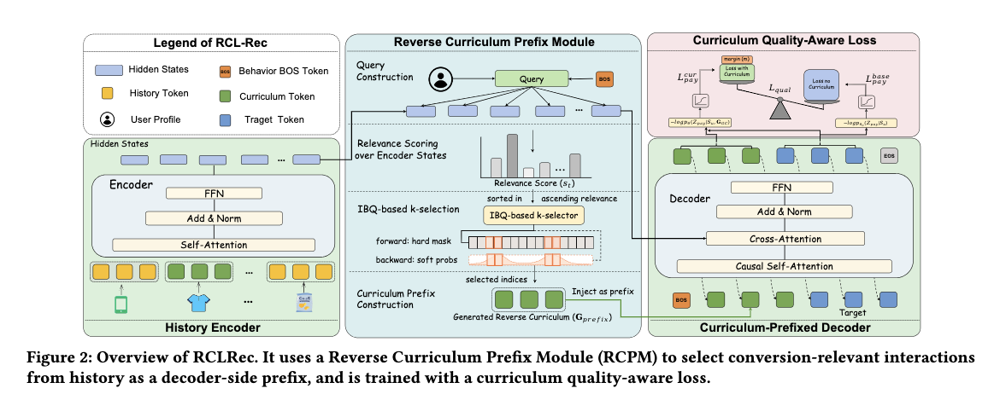

# 阿里国际，稀疏目标任务的生成式推荐，广告收入提升+2%

关注我，每天为你精挑细选最优质、最新鲜的推荐算法paper，陪你一起保持进步、不断精进！

### 论文：RCLRec: Reverse Curriculum Learning for Modeling Sparse Conversions in Generative Recommendation
### 网址：https://arxiv.org/pdf/2603.28124
### 公司：阿里国际
### 思想：迁移学习——用丰富信号补偿稀疏目标
### 方向：生成式推荐+行为序列建模

## 解读：
本文训练了一个基于Transformer模型的GR模型，由用户行为序列预测target，最终用于广告支付行为item预测。简单来说，就是从用户历史行为里计算出top-k相似的item，输入到decoder，以提升预测质量。

用于广告位广告排序，但是支付行为极度稀疏，样本少、信号弱。论文的思路是：通过两个阶段训练，先用全量多行为数据（点击、加购等丰富信号）做预训练，让模型充分理解用户行为语义
再用稀疏目标行为（支付）做 SFT 微调。这是一种从"广泛认知"到"精准任务"的迁移学习范式。

具体的，
### （1）预训练
在全量多行为数据上该模型。输入是用户行为序列和target的已知行为，序列元素通过RQ-VAE获得语义token。序列是作为encoder的输入，target行为是decoder的输入前缀。encoder能双向、充分建模长序列上下文；decoder只负责生成target的token序列。在全量多行为数据上做预训练。

### （2）SFT
将上面训练的Transformer作为骨干网络，只用支付行为的target的样本做微调，也是做target的预测。
用户特征向量，经过一个MLP获得一个向量，作为query。与encoder的输出序列，计算cross-attention的attention，top-k attention值的item对应的语义token平铺成一个序列，作为decoder的输入前缀，在teacher forcing下进行训练。另外记得，将固定的target行为（支付）放在输入前缀最前面。

为什么用item的语义ID，而不是encoder的输出向量呢？是因为预训练时decoder只见过语义token序列。

#### 辅助任务——对比学习，用"差异"作为训练信号

除了正常的next item预测损失外，增加了一个辅助任务，以提高效果。背后的动机是给decoder加了更多的料，总比不加的效果要好，损失要小。
即维护两个网络——一个是完全冻结的骨干网络做baseline ，只推理和计算参考损失，另一个是可训练的网络，做正常SFT，计算next item的损失。同一个样本，前者decoder不输入最相似item序列，后者输入，分别获得损失loss。两个损失，经过hinge形式的margin loss函数，获得一个比较损失，与next item预测损失加和，最终梯度只会更新后者，不会更新前者。

虽然它确实在对比两个模型的损失值，但本质上不是对比学习。不是对比正负样本的表征距离（传统对比学习），而是比较"增强输入"和"基础输入"的损失差，用 margin loss 强制增强版必须比基础版更好。

#### 架构出发点
本文选择encoder-decoder而不是decoder-only，不是随意之举，是有意为之：
* encoder 负责双向理解历史，获得双向、高质量的上下文表征，提取与 pay target 最相关的 top-k item，并把它作为前缀注入decoder。这正是解决转化稀疏问题的关键一招。
* decoder 只负责条件生成
两个组件分工明确，把"检索相关历史"和"生成预测"解耦，架构本身就编码了业务逻辑。

### **A/B**
相比强基线TIGER，广告收入提升2.09%，订单量提升1.86%。

## 心得：
* 本文做了修改就要比原本方案好的对比学习，十分新颖有趣，值得学习。
* 本文通过encoder-decoder的encoder理解了历史，挖掘高质量相关历史行为提升decoder的预测效果。说明对encoder-decoder的Transformer的组件的作用和价值有深入的理解和认识。
* Reverse Curriculum Learning，看上去高大上，但其实就是从历史中选择top-k相似的item，输入到decoder，以提升预测质量。

## 愚见

## 可信度：生产

## 推荐等级：有实践价值

**请帮忙点赞、转发，谢谢。欢迎干货投稿 \ 论文宣传\ 合作交流**

### 【铁粉】请入微信群，群内我会给出更深入的解读，还可以共同讨论技术方案、发招聘广告、内推和交友等。
* 铁粉标准：关注公众号一个月以上，且在公众号上累计15次互动（评论、爱心、转发）、或投稿1次、或打赏199，只欢迎技术同学。
* 入群方法：请您加个人微信lmxhappy，我拉您入群，请备注【公司】（只我个人看，不公开）。

## 推荐您继续阅读：

