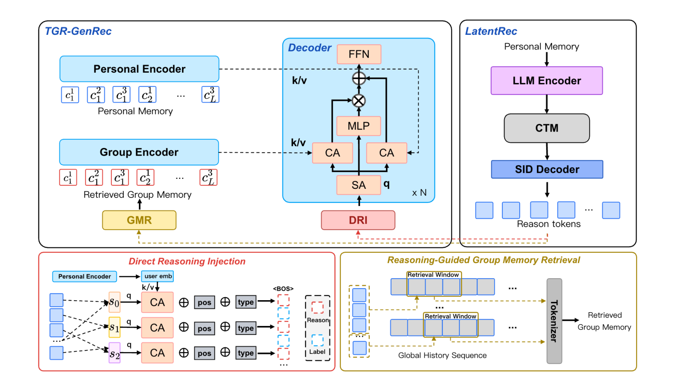
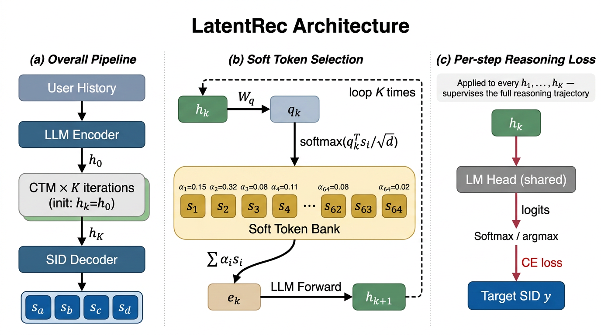

# 腾讯：LLM 推理引入召回，新用户曝光转化+13%

关注我，每天为你精挑细选最优质、最新鲜的推荐算法paper，陪你一起保持进步、不断精进！

### 论文：TGR: Advancing Industrial Recommendation from Generative-Paradigm Ranking toward Unified Generation and Reasoning
### 网址：https://arxiv.org/abs/2609.00986
### 公司：腾讯
### 思想：“离线大模型，在线小模型”
### 方向：生成式推荐的reasoning、召回

## 解读：
LLM 的 reason 在推荐上效果虽好，但是延迟吃不消，所以将其挪到线下，生成少量 SID，为在线的小生成器提供更多信息，从而生成更理想的推荐结果。

本文的流程分三步：

1. **线下训一个会思考的大模型**。这个模型叫 Think，是 Qwen3-1.7B 加 LoRA，训练方法叫 LatentRec。名字里的 Latent 就是「隐」：普通思维链要把每一步想法写成文字，慢；LatentRec 把上一步输出的隐向量直接压回输入端、当作下一步的输入，这样连滚 \($K$\) 步（生产只滚 2 步），全程不产生一个字。每滚一步都要求它猜一次用户接下来会看的 item，逼这几步真的在推理，而不是空转。
2. **线下把「想的结果」批量存起来**。给每个用户产出 \($K_r$\) 个 SID（Semantic ID，item 的语义编号，一串由粗到细的数字，逐层定位到一个具体 item），写进 Reason Store。这几个 SID 就是模型替这个用户想出来的「推理结论」，称为**reason token**。
3. **线上只查表**。请求来了直接读出这几个 SID，灌进线上小生成器的 decoder 当提示，帮它把最终要推荐的 SID 生成得更准。

右上角 LatentRec 就是第 1 步的 Think，出口标着 Reason tokens；左边红色的 DRI 是第 3 步，把这些 token 灌进 decoder。（图里黄色的 GMR / Group Encoder 是同一篇里的另一个模块，尚未上线，本文不展开。）

### Think 是怎么训的（第 1 步的展开）

下面把第 1 步拆开：Think 到底怎么「想」，以及为什么想完之后线上可以一步都不想。

三块正好对应下面三段：(a) 整条链路，(b) STS 怎么把隐向量按回词表里，(c) PRL 怎么逐步监督。

**默想的那几步长什么样。** 起点是用户历史最后一个 token 在最后一层的隐向量。之后每一步都做同一件事：把上一步的隐向量转成一个「假 token」喂回模型，跑一次前向，拿到新的隐向量。一共滚 \(K\) 步，生产只滚 2 步。KV cache 接着用户历史往下续，所以每步只多算一个 token，很便宜。这里没有新加任何推理专用模块，多出来的可训参数只有下面要说的 STS，约 2.5M，不到 backbone 的 0.2%。\(K=0\) 就是完全跳过这段，直接从起点出答案。

**STS：隐向量不能原样喂回去。** Qwen3-1.7B 末层隐向量的模长大约是输入 embedding 的 14 倍，直接当输入喂回去尺度对不上，SID 的 logits 会飞出词表。STS 的办法是准备 64 个「软 token」（拿真实词表的 embedding 初始化），把隐向量表示成这 64 个的加权平均，权重非负、和为 1——结果必然落在正常输入的范围里。这样才能共用同一个 LM head 逐步打分。作者说不加 STS，逐步监督第一个 epoch 就散了。

**PRL：逼每一步都往答案上走。** 这是增益主力。每滚一步就用同一个 LM head 让它猜一次目标 item 的 **SID 第一层**，算交叉熵。前面的步骤用高温（分布更软，允许犹豫），越接近最后一步温度越低：\(T_k=T_b+T_s(1-k/K)\)，生产 \(T_b=1, T_s=5\)。这项加到主损失上，权重 0.1。只盯 SID 第一层、不管更深的层，是为了避免训练时逐步 teacher-force 前缀，跟线上自回归的方式打架。

**最关键的一条**：PRL 带来的增益，在推理时把 \(K\) 设成 0（一步都不滚）依然在。也就是说推理能力被训进了 LoRA 权重里，不在生成时多走的那几步计算里。所以训完可以把整个 Thought 模块扔掉——这才是「线下想、线上不想」能成立的原因。

**训练分三阶段，共用一个 backbone**：先扩词表把 SID 塞进去；再做 content-alignment，让语义对齐到平台上真实的 item；最后冻住 backbone，只训 LoRA 和 Thought。

**导出物**：给每个用户刷出 top-\(K_r\) 个完整的 \(L\) 层 SID。注意 \(K_r\)（存几条结论）和 \(K\)（默想几步）不是一回事。

### 如何把结果集成到线上（第 3 步的展开）

下面把第 3 步拆开：线上小生成器读到那 \($K_r$\) 个 SID 之后，具体怎么用。这个模块叫 DRI。

不当有序思维链，当无序证据集。第 \(l\) 层把 \($K_r$\) 个 codeword embedding 排成一组。Personal Memory mask 均值 pooling 得 \(\mathbf{q}_u\)，各层独立 cross-attention，按当前用户历史挑相容证据。无候选名次 embedding，打乱顺序不变；不是抄 Think top-1。粗层细层参数分开。全缺则 mask。

\(\mathbf{z}_u^l\) 插在 \(y^l\) 前。该位置预测 \(y^l\)，看不到该层目标；更深的层走普通自回归。decoder 仍 attend 历史。Beam 前算一次 \(\mathbf{Z}_u\)，SID 步数和 beam 宽度不变。

缺 Reason 记录走原生成路径，服务不堵。

### 部署
**线上什么都不算**，只从 Reason Store 里读一次。所有的写和算都在请求链路外面。

刷新分两层：

* **近线**：发起重算之后不等结果，当前这次请求照常走，算完了留给后面的请求用。要不要重算由一个控制器决定，它看五件事——这个用户有没有记录、行为有没有明显变化、重算的预期收益、距上次刷新够不够久、当前 GPU 还有没有预算。
* **离线**：兜底批量补，把缺失的、过期的、版本对不上的刷一遍。

Think 模型周更，用户的 reason token 日更。日更能进预算靠的是一处工程改动：离线产 token 不跑 beam search，改成固定轮次的 batched 单 token 解码，8×A100 上刷千万用户从约 2.9 天压到 1.3 天。

日更的代价是**会话内的意图变化接不住**：用户这次刷手机中途兴趣变了，读到的还是昨天那份推理结论。

### A/B效果
**有效消费率 +1.75%，新用户曝光转化 +13.09%**，都显著。

注意，涨的是新**用户**，不是新 **item**——新 item 仍然卡在 tokenizer 上。

## 心得：
* TGR-Reason，就是把 LLM 的多步意图推断，训练成 LoRA 里的归纳偏置，离线编译成 SID，在线只当条件用。
* TGR-Reason，就是离线意图推断器，产品却是「几条完整商品 SID」，喂给在线生成推荐器。它不是传统那种意图分析器 不会输出「体育 / 搞笑 / 言情」这种标签。输出的就是商品编号。意图被编码进这些 SID 里：粗层码更像品类/主题，细层码更像具体物料。后续生成器看到的是“可能想看的货”，不是一句意图说明。
* 本论文将他们团队的其它工作，检阅军队似的罗列出来，以framework的方式展示出来了，本解读文章只截取了它的新的内容。

## 可信度：生产

## 推荐等级：有实践价值

**请帮忙点赞、转发，谢谢。欢迎干货投稿 \ 论文宣传\ 合作交流**

### 【铁粉】请入微信群，群内我会给出更深入的解读，还可以共同讨论技术方案、发招聘广告、内推和交友等。
* 铁粉标准：关注公众号一个月以上，且在公众号上累计15次互动（评论、爱心、转发）、或投稿1次、或打赏199，只欢迎技术同学。
* 入群方法：请您加个人微信lmxhappy，我拉您入群，请备注【公司】（只我个人看，不公开）。

## 推荐您继续阅读：
* [OneLive — 生成式推荐落地直播场景 (快手)](./kuaishou-onelive.md)
