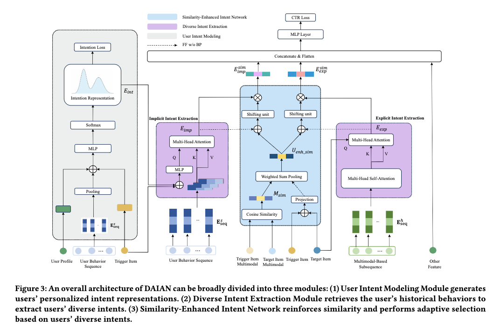

# 阿里，详情页推荐，成交额+2%

关注我，每天为你精挑细选最优质、最新鲜的推荐算法paper，陪你一起保持进步、不断精进！

### 论文：DAIAN: Deep Adaptive Intent-Aware Network for CTR Predictionin Trigger-Induced Recommendation
### 网址：https://arxiv.org/pdf/2602.13971v1
### 公司：阿里
### 思想：意图
### 方向：i2i

## 解读：
本文是提出了一种基于意图建模的item to item模型。也叫触发式推荐，通俗的叫法有详情页推荐、后推荐等。
首先得明确本文的所谓的意图是真正的含义，用户点击trigger之后，在当前请求内，对“target与trigger不同相似度层级”的偏好概率分布。相似度，例如强相关商品、弱相关商品、无关商品。
实现方面，将隐式意图表征和trigger-target相似度，经过PepNet的门控网络 +多层MLP，获得隐式权重，跟隐式意图表征做hadmard积，获得加权隐式意图表征。相似的，将显式意图表征和trigger-target相似度，经过同样的网络，获得加权显式意图表征。
最后，这两个表征会和用户、Trigger、target等特征一起拼接，喂给CTR预测头（基模型DIN的MLP）。

下面用户的隐式意图表征和显式意图表征、trigger-target相似度的计算逻辑：
### （1） 用户隐式意图建模
把trigger和消费该trigger后的用户意图分布（一个n维的向量，计算逻辑后面讲到），拼接后通过一个MLP融合成“意图增强向量”。它作为Query，通过Multi-Head Target Attention ，获得一个用户的隐式意图表征。
### （2）用户显式意图建模
用trigger筛选行为序列，只保留序列里多模态相似度大于某一个阈值的行为，获得一个子序列。先通过Multi-Head Self-Attention（MHSA） ，再用 Multi-Head Target Attention 对齐到target item，获得一个显式意图表征。
### （3）trigger-target相似度
target ID表征和trigger ID表征经过一个多层MLP，获得一个高维的ID相似度。target和trigger的多模态表征计算cosine，再把标量相似度分桶，再经过embed layer，获得一个向量——多模态相似度。
将这两个同维度的相似度，按照模长归一化，作为权重，对两者做加权求和，获得最终的两者的相似度。注意，对ID相似度截断梯度回传。

### 预测在消费某trigger后的**用户意图分布**
输入包括：（1）user_id、性别、城市等用户画像；（2）长度为50的用户历史行为序列，经过Target Attention或者其它pooling方法，获得兴趣表征；（3）Trigger商品特征。
将这三方面的特征embed拼接，再经过一个MLP，softmax获得预测用户个性化意图分布。用KL散度损失训练。
标签：使用Qwen-VL多模态预训练模型（视觉+文本），计算trigger与用户本次请求内所有点击商品的余弦相似度，把相似度等宽分桶成 n个等级，统计每个桶的点击比例，得到n维意图分布，这是该trigger下的请求下的意图分布，作为监督信号。

### **训练技巧**：先独立训练“预测在消费某trigger后的用户意图分布”相关网络UIM。再训练其它部分的网络，但是注意不用UIM的预测意图，用真实意图标签作为“教师信号”。最后，再整个网络一起训练。

### **A/B**：闲鱼，CTR+1.59%，推荐多样性+1.73%，成交额+2.37%

## 心得：
* 意图建模是近年来后推荐的主流做法。
* 意图建模应该与LLM结合，LLM在意图上有很大的优势。

## 愚见
论文串行讲解网络模块，缺乏层次感，降低了可读性。

## 可信度：生产

## 推荐等级：有实践价值

**请帮忙点赞、转发，谢谢。欢迎干货投稿 \ 论文宣传\ 合作交流**

### 【铁粉】请入微信群，群内我会给出更深入的解读，还可以共同讨论技术方案、发招聘广告、内推和交友等。
* 铁粉标准：关注公众号一个月以上，且在公众号上累计15次互动（评论、爱心、转发）、或投稿1次、或打赏199，只欢迎技术同学。
* 入群方法：请您加个人微信lmxhappy，我拉您入群，请备注【公司】（只我个人看，不公开）。

## 推荐您继续阅读：

