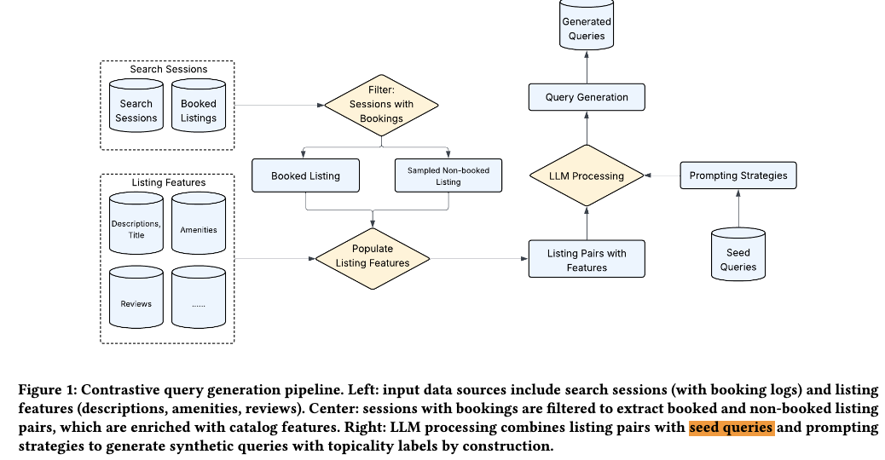

# Airbnb，上线“自然语言搜索”，合成数据立大功

关注我，每天为你精挑细选最优质、最新鲜的推荐算法paper，陪你一起保持进步、不断精进！

### 论文：Bridging the Cold-Start Gap: LLM-Powered Synthetic Data Generation for Natural Language Search at Airbnb
### 网址：https://arxiv.org/pdf/2605.21812
### 公司：Airbnb
### 思想：LLM强大的理解能力
### 方向：冷启动+LLM4rec

## 解读：
想在Airbnb上线自然语言搜索功能，那么就要训练相关模型以支撑这个功能，但是苦于没有数据，所以想到了一个生成合成数据的方法——LLM生成查询，以训练模型。

利用用户之前的搜索session，包含真实用户的浏览、互动、预订行为。筛选出下订单的session，这样的session里，下订单的房源就是正样本，只点击的房源就是负样本。将这两个样本，在prompt里告诉LLM，让它生成合成查询。对生成的查询，还要做一些后处理，保留合格的查询。这样就形成了三元组（query，正样本，负样本）。这个三元组用于训练排序模型：教会模型给正样本评分高，给负样本评分低，学到真实的相关性。

后处理包括：
- 去重（避免生成重复查询）
- 风险词过滤（移除平台内部术语如"Superhost"、"整套房源"等）
- 一致性检查（查询提及的属性必须与房源实际相符）

为了让合成查询更接近人类输入，构造prompt时，注意：
### （1）对比
如上面所说，除了将下订单的样本告知llm，还要将其硬负样本告知，这样，生成的查询必须能区分两个真实房源（一个用户喜欢、一个用户不喜欢）。但是不能将太容易的负样本告知，那么模型学习的东西就会变少。

特殊的，如果session里，除了下订单的房源，用户对其它房源都没有点击，那么就random sampling一个作为负样本。除了这种特殊情况外，可以将其它为未订单的、但是有其它行为（如点击）的房源作为负样本。

### （2）模版
在这个过程中，为了生成的更好，在prompt还要给一些查询样例，就是一些种子查询。种子查询最初来自上线前的用户调研问卷，随着自然语言搜索上线后，逐步替换为真实用户输入的查询，从而实现从冷启动到温启动的平滑过渡。三种由严到松的要求：
* 把种子查询当作严格模板，要求 LLM 严格模仿结构。如“请严格按照下面这个句式生成查询：{种子查询}。只替换房源相关内容。” 
* 把种子查询当作风格参考，让 LLM 学习说话方式。如“以下是真实用户的查询风格示例：{种子1}、{种子2}。请用类似风格生成新查询。” 
* 完全不限制结构，只给高层指导，鼓励创新，不给具体种子查询。如“请生成一个自然、多样、可能包含多重需求的查询。可以大胆尝试不同表达方式。” 

生产中的实际做法：
* 每天生成数据时，会随机或按比例使用这三种策略
* 目前比例大约是：60-70% 严 + 20-30% 中 + 10-20% 松。
    - 严格模板保证了现实性（贴近真实用户查询）， 但过度严格会导致多样性不足；
    - 松散模式增加多样性，但风险是生成不真实的查询。
    - 这个比例是经过A/B测试验证的最优平衡点。

### （3）房源的特征
正样本、负样本都是房源，那么就要把房源的特征（如标题、描述、设施列表、评论摘要、房型、位置、价格等）充分利用起来，放入到prompt里，这样llm在生成的查询的过程中才能将这些特征利用起来，生成的查询才能包含这些信息，更符合用户的自然语言输入。
给 LLM 提供极详细的结构化特征，是希望它不要自由发挥，防止 LLM 幻觉。

上线后，逐步替换为真实用户输入的查询：
* 初期：用 500 条用户调研问卷作种子 → 生成百万级合成数据训练
* 上线后：实时收集真实用户查询 → 替换种子集 → 每天重新生成 → 闭环改进。

## 效果验证

论文通过对比验证了方法的有效性：
* 查询长度对比：真实用户(4词) vs 基线方法(13.6词) vs 本方法(6词)
  - 使用种子模板后，KL散度从4.95降低到0.66，**提升7.5倍**
* 评估难度：基线方法准确率87-99%（太简单），本方法76-79%（更具区分度）

## 心得：
* LLM增大的理解能力能够用于合成数据，不仅可以用于冷启动，还可以用于进一步的模型增强。
* 结构化特征是LLM不幻觉的关键
* 这个思想还能用于：
  * **Item to Item 推荐**：从用户交互历史生成 item 关系对，快速冷启动新品
  * **跨域推荐**：不同领域间的 item 关联学习
  * **多模态 embedding**：LLM 生成的文本关系描述作为 item 表示的补充

## 可信度：生产

## 推荐等级：有实践价值

**请帮忙点赞、转发，谢谢。欢迎干货投稿 \ 论文宣传\ 合作交流**

### 【铁粉】请入微信群，群内我会给出更深入的解读，还可以共同讨论技术方案、发招聘广告、内推和交友等。
* 铁粉标准：关注公众号一个月以上，且在公众号上累计15次互动（评论、爱心、转发）、或投稿1次、或打赏199，只欢迎技术同学。
* 入群方法：请您加个人微信lmxhappy，我拉您入群，请备注【公司】（只我个人看，不公开）。

## 推荐您继续阅读：

