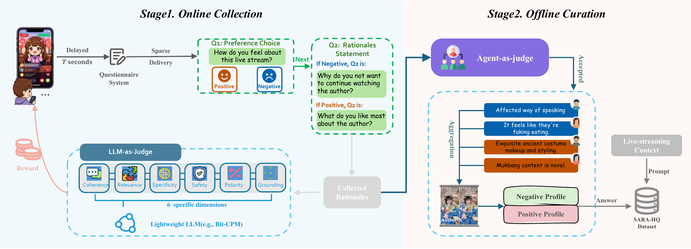
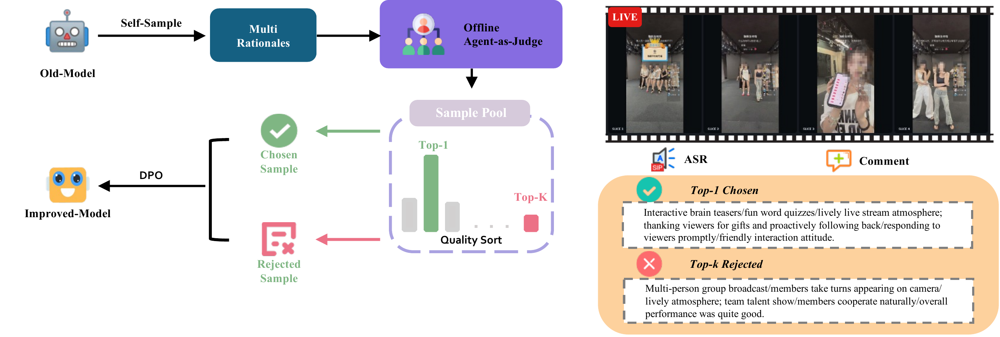
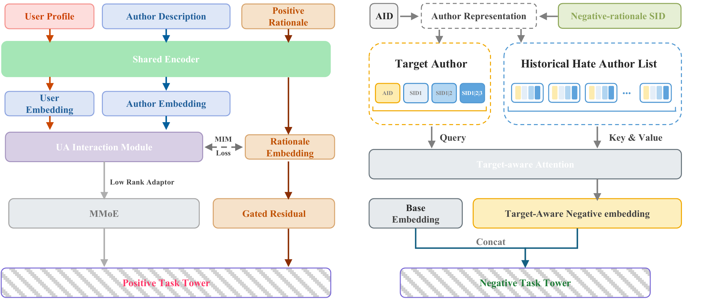

# 快手：把用户说出的「为什么喜欢」变成推荐特征，Hate 反馈降 8.16%

关注我，每天为你精挑细选最优质、最新鲜的推荐算法paper，陪你一起保持进步、不断精进！

### 论文：Scaling Articulated Rationales for MLLM-based Recommendation（SARA）
### 网址：暂未公开（Kuaishou Technology, Technical report, 2026）
### 公司：快手
### 思想：MLLM 造特征
### 方向：llm4rec

## 解读：

点击、观看时长、不喜欢，记录的都是用户**做了什么**。用户自己说出来的理由——对家乡的怀念、陪伴感、精彩的表演，或者对过度推销、不安全行为的反感——记录的是**为什么**。后者显然更有信息量，问题是拿不到量：原生反馈稀疏、表达质量参差、能覆盖的作者太少。

SARA 的思路是用大模型把这点稀缺的人类解释放大到全量。三个阶段：**采集**真实理由、**扩展**到千万作者、**融合**进排序模型。

## 1 采集：把问卷答案熬成监督信号

数据引擎先在线上发问卷，请直播用户选择偏好倾向、再用开放文本说明理由，按回答质量给激励。

光有原始回答不够用，所以离线挂了一个 Agent Judge 做筛选，六个维度：连贯性、相关性、具体性、安全性、极性一致性、依据充分性。**通过率只有 9.8%**——191 万条候选理由，最后留下 18.75 万条，正向 10.75 万、负向 8 万，覆盖 8.65 万位作者。这批数据叫 SARA-HQ。

留下来的回答还要按作者和正负极性聚合，归一化成简洁的语义标签。零散的个人吐槽由此变成以作者为中心的监督信号。

## 2 扩展：训一个专用 MLLM，覆盖从 8.6 万作者做到 1000 万

8.65 万作者对工业推荐来说还是杯水车薪，所以要靠模型外推。

SARA-7B 基于 Qwen2.5-VL-7B，输入是采样视频帧、直播元信息、语音转写、观众评论，加上一条指明要正向还是负向的任务指令。先用 SARA-HQ 做 SFT，学会从多模态上下文里生成偏好理由。

然后是 **QR-DPO（质量精炼偏好优化）**：对同一个输入采样多条候选理由，让离线 Agent Judge 打分排序，取最高分和最低分组成偏好对，再做 DPO。这一步把「具体性」和「依据充分性」明显提了上去——生成的理由会把具体活动、观众互动和观看兴趣串起来，而不是泛泛地说「主播很有趣」。

对齐后的模型把理由覆盖**从 8.65 万作者扩到 1000 万**。

这里有个容易误解的点：**生成的理由是作者级别的**，描述的是这个作者身上有哪些讨喜或讨厌的因素，不是「某个用户对某个作者」的理由。所以可以离线全量算好存下来，线上不跑 7B 模型，个性化那一层交给排序模型自己学。

## 3 融合：正向当对齐信号，负向编成 SID

理由文本生成出来了，怎么喂给排序模型？两条路径完全不同。

**正向理由：不是直接当特征灌，而是当对齐目标。** 用户画像、作者描述、正向理由三路过同一个 Shared Encoder，得到各自的 embedding。用户和作者的 embedding 进 UA Interaction Module 算出交互表征，这个交互表征和理由 embedding 之间挂一个 **MIM Loss（互信息最大化）**——把「这个用户和这个作者为什么匹配」往理由所描述的语义上拽。训练完，交互表征里就编码进了匹配的原因。出口有两条：交互表征经 Low Rank Adaptor 进 MMoE，理由 embedding 经 Gated Residual 直接进正向任务塔，门控让模型自己决定这路信号用多少。

**负向理由：编成层次化 SID，用来迁移负反馈。** 每个作者的负向理由被编码成 `[AID, SID1, SID1|2, SID1|2|3]` 这样的前缀序列，从粗到细，语义相近的「讨厌理由」共享前缀。然后做一次 target-aware attention：当前要打分的目标作者当 Query，这个用户历史上点过不喜欢的作者列表当 Key/Value，输出的负向 embedding 和基础 embedding 拼接后进负向任务塔。

这条路径解决的是**负反馈的冷启和长尾**：用户 hate 过作者 A，来了个没见过的作者 B，只要 B 的讨厌理由和 A 语义相近、SID 前缀重合，注意力就能把这份负反馈迁过来，不用等 B 攒够负样本。共享前缀同时意味着共享可训练参数，长尾作者也借得到信号。

## 4 线上效果

两条路径是**彼此独立的两组 A/B**，各用 1% 真实流量，基线是已经集成了 SARM 多模态特征的工业 MMoE 排序系统——不是拿个裸基线来比。

正向理由嵌入：观看时长 **+0.99%**，点击 +0.34%，有效观看 +0.37%，关注 +0.62%。

负向理由 SID：**不喜欢反馈 −8.16%**，举报 −0.44%，LT-7 留存 +0.03%。

已全量部署超过 30 天，支持每日更新，满足原有的线上服务时延预算。

## 心得：
* 这套东西真正的门槛不在模型，在**那条 9.8% 通过率的数据流水线**。191 万条原始回答筛到 18.75 万条，六维质检、线上激励、离线 Agent Judge 缺一不可。大部分团队卡住的地方是没有这个种子集，而不是不会训 MLLM。
* **理由做成作者级而不是 user-item 级**，是这套方案能上线的关键工程决策。作者级可以离线算好、每日更新，线上零额外推理开销；真要做成 pair 级，1000 万作者乘以用户数，怎么算都撑不住。
* 负向路径的收益（−8.16%）远大于正向（+0.99%），值得琢磨。负反馈本来就稀疏，而「讨厌的理由」恰恰高度可归类——吵闹、过度推销、不安全行为就那么几类，语义聚类后迁移效率很高。正向偏好则细碎得多，难以靠语义相近来迁移。

## 愚见

* 融合那一节是全篇技术含量最高的地方，但 README 只给了一个三行表格，MIM Loss、Gated Residual、层次化 SID 这些关键机制全靠图里的方框自己看出来。想复现的人得盯着 Figure 逐个模块猜。
* 用户画像、作者描述、正向理由三路共用一个 Shared Encoder，那这三者应该都是文本形态。但用户画像在工业系统里通常是结构化特征，是不是套模板转成了文本、编码器具体用的什么模型，文中都没交代。
* 论文本身没有公开，引用条目只写了 technical report，没有 arXiv 号。上面的机制细节都来自官方 README 和配图，具体实现以后续放出的正式版本为准。

## 可信度：生产（快手直播，两组独立 1% 流量 A/B，全量部署 30 天+）

## 推荐等级：有实践价值

**请帮忙点赞、转发，谢谢。欢迎干货投稿 \ 论文宣传\ 合作交流**

### 【铁粉】请入微信群，群内我会给出更深入的解读，还可以共同讨论技术方案、发招聘广告、内推和交友等。
* 铁粉标准：关注公众号一个月以上，且在公众号上累计15次互动（评论、爱心、转发）、或投稿1次、或打赏199，只欢迎技术同学。
* 入群方法：请您加个人微信lmxhappy，我拉您入群，请备注【公司】（只我个人看，不公开）。

## 推荐您继续阅读：
* [LLM语义召回 — LLM as annotator (Meta)](meta-llm-retrieval.md)
* [LLM合成查询生成 — 数据增强 (Airbnb)](airbnb-llm-synthetic-query.md)
