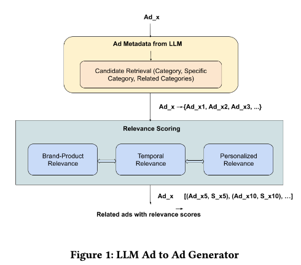

# Meta，LLM语义召回，解决广告"同款不同命"难题 

关注我，每天为你精挑细选最优质、最新鲜的推荐算法paper，陪你一起保持进步、不断精进！

### 论文：LLM Retrieval for Stable and Predictable Ad Recommendations
### 网址：https://arxiv.org/pdf/2605.21969
### 公司：Meta
### 思想：LLM的理解能力
### 方向：召回+LLM4rec+LLM as annotator

## 解读：
当前广告系统稳定性和可预测性不足，同一个广告的两个几乎完全一样的版本，两者的曝光和转化差别可能巨大。为了解决这个问题，设计了一个LLM 驱动的语义召回方法。简单来说，把不同版本归类到同一个语义等价类，事实证明这是必要且高效的做法，已经能实现显著接近的曝光和互动行为。
在这里，LLM 是离线"标注工具"，对广告提取语义属性 → 建图 → 图遍历召回。在线 serving 不调用 LLM，延迟友好。

### （1）广告语义表示学习
使用 Meta 内部已经针对广告场景微调过的 Llama3-8B Instruct 模型（基于 ads engagement data 微调），本次任务不做额外微调，仅通过精心设计的 Prompt 工程（零样本推理），将原始广告创意转化为结构化的分层语义属性。
让LLM输出分层语义属性：
* 一级属性：大类（鞋类、美容、汽车…）
* 二级属性：品牌、产品型号、风格、场景、受众、颜色、价格带等
* 额外输出：上下文描述

### （2）构建语义图
每个广告都获得了其分层语义属性，基于这些，构建一个节点为广告的图。如果两个广告共享足够多的语义属性，就连边。
边权重是广告之间的 Jaccard相似度，要么是语义属性的Jaccard相似度（大于等于0时），否则，就用原始广告创意的文本，先分词后的token，后计算Jaccard相似度，作为兜底。

语义图并不是完全连通的，只有语义属性高度重叠的广告之间才有边。整个图是由大量小连通分量组成的，而不是一个大网。

### （3）图遍历召回
流程（两阶段）：
* Stage 1 类别级粗筛：先用一级属性（大类）快速筛选出候选广告池，大幅减少计算量。
* Stage 2: 语义图遍历：从种子广告（用户当前看到的广告或查询广告）出发，在语义图上进行遍历（如BFS / 带权随机游走 / Personalized PageRank类等算法），找到所有语义相连的广告节点，把这些节点对应的广告作为候选集返回。

实际应用例子：
* u2i：用户搜索“跑鞋” → 系统用 LLM 语义属性召回 Nike、Adidas 等跑鞋广告
* i2i：用户正在看 Nike Air Max 这支广告 → 系统把它当成种子广告，召回语义等价类内的其他 Nike 跑鞋变体（包括广告主自己改过标题/图片的版本）

### 新提出的评估框架
为了评估系统的可预测性，定义了一套工业级可落地的可预测性指标，包括两个指标：

* StatSigDiff（统计显著差异）：对每个“主广告 + 影子广告”计算转化差异是否显著。请读者自行查看公式。StatSigDiff 的设计本质是：用统计显著性检验（高斯近似 + 90% CI）来过滤噪声，只对真正显著且高价值的差异进行惩罚，同时用业务价值加权让指标与实际商业目标对齐。
* MAD（中位绝对偏差）：衡量每天主/影版本曝光差异的波动幅度，越低越稳定。计算方法：对于每一个广告对（一个 Primary 广告 + 它的 Shadow 版本）：收集它在观测期内每天的相对曝光差异，计算这 T 个每天相对差异值的中位数，记为 m。每天的相对曝光差异减去m，这个集合的中值，就是MAD。

### A/B：
核心业务指标提升0.45%，StatSigDiff下降8.62%，MAD下降45%。

## 心得：
* 论文里讲述了一些工程支撑性工作，值得大家借鉴，大家在写论文的时候，也可以仿照。本文的idea很简单，落地的过程中有很多微创新，meta同学有很强大的总结能力，就能写成论文。没有这样能力的人，不能将自己的工作写成论文。
* 本文方法，召回阶段的一致性已经能带来很大改善，但要让最终曝光和转化行为非常接近，还需要排序、流量分配、特征工程等多环节配合。

## 愚见
本文与阿里 CQ-SID（生成式召回）代表了 LLM 在召回中的两种截然不同的范式：

## 可信度：生产

## 推荐等级：有实践价值

**请帮忙点赞、转发，谢谢。欢迎干货投稿 \ 论文宣传\ 合作交流**

### 【铁粉】请入微信群，群内我会给出更深入的解读，还可以共同讨论技术方案、发招聘广告、内推和交友等。
* 铁粉标准：关注公众号一个月以上，且在公众号上累计15次互动（评论、爱心、转发）、或投稿1次、或打赏199，只欢迎技术同学。
* 入群方法：请您加个人微信lmxhappy，我拉您入群，请备注【公司】（只我个人看，不公开）。

## 推荐您继续阅读：

