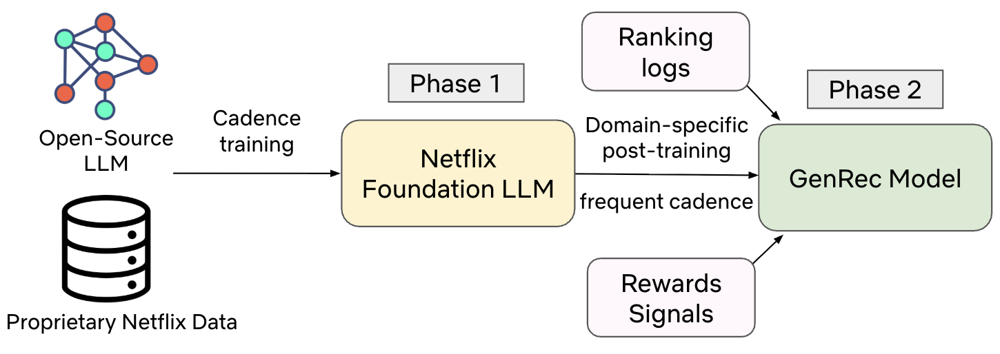
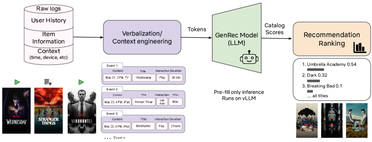

# Netflix，LLM直接当精排，标注数据少40倍仍打赢成熟生产模型

关注我，每天为你精挑细选最优质、最新鲜的推荐算法paper，陪你一起保持进步、不断精进！

### 论文：GenRec: An LLM-Backed Recommendation Ranker at Netflix
### 网址：https://arxiv.org/html/2608.10257
### 公司：Netflix
### 思想：LLM的理解能力、统一建模
### 方向：LLM-as-ranker

## 解读：
Netflix现有精排是几千个手工特征堆出来的，效果好但很难扩展，上新内容类型或新场景都要重做一遍特征工程。本文把精排整个换成自研LLM：用户历史和上下文全部转成自然语言喂进decoder-only模型，只做一次前向，拿池化后的隐状态跟全目录item embedding打分，一次输出整个物料库的排序。范式从特征工程变成上下文工程。

训练分两阶段。Phase 1拿开源LLM在Netflix数据上做领域适配，让模型看懂目录和会员，更新频率低；Phase 2在这个底座上做排序任务的后训练，喂ranking logs和reward信号，更新频繁。

### （1）Verbalize：把日志写成人话
不再做几千个手工特征，而是把用户历史、profile、上下文（设备、surface、locale、时间）、候选 item 元数据全部转成自然语言 prompt。

把结构化的行为日志、物品元数据转成自然语言描述。原始是`{item_id: 987, title: "Stranger Things", play_duration: 48min, action: "complete"}`这种JSON，verbalize后变成"用户周五晚上在电视上完整看完了Stranger Things（48分钟），之前看了12分钟The Crown就停了"。

训练数据组织成对话形式：user message是上下文（surface、时间、设备、locale）+ 用户画像与历史 + item元数据与热度 + 任务描述；assistant message是用户真实发生的行为（play、时长、abandon、thumb）作为ground truth。

token预算有限，上下文取舍有四条规则：高信号交互（长播放、点赞）完整保留并带更丰富元数据；近期低信号事件（极短播放、噪声点击）直接丢弃；重复行为（连刷一部剧）压缩汇总；重要item（新上线、冷启动）选择性展开更多细节。

### （2）用户-物品匹配打分
基于用户行为表示，对物品进行打分。即拿到上一步verbalize出的文本x后，LLM把x编码成d维隐状态h（取某个pooling位置），再过打分头`score_i = φ(h, e_i)`，最后对全物料库softmax。

这里的 $e_i$ 就是一张可学习的item Embedding Table，跟传统模型的ID embedding一样。为什么不让LLM直接生成item？三个原因：效率上LLM只跑一次，后续全目录打分只是embedding lookup加一次矩阵乘，这是full-catalog ranking能成立的前提；约束上独立的table天然把候选限制在真实catalog内，根本不可能幻觉；优化上ranking loss能直接对e_i和φ求梯度，让item表示专门服务排序目标。

softmax是训练时cross-entropy的一部分，推理时按score排序即可。

### （3）训练目标
`L = α·L_ranking + β·L_language + γ·L_misc`，三个系数和为1。L_ranking是全目录cross-entropy，正样本是高价值互动，按内容类型有不同去噪逻辑。

保留language modeling objective（next-token prediction）有两个作用：一是模型输入全是自然语言，只训排序会让它退化成只认embedding的打分器，磨掉文本理解能力；二是保住生成和可控能力，这样才能用prompt做recommendation steering，比如"多推新上线的游戏"。

另外引入了多路reward解决过度推热门、只顾短期互动的问题：跟回访率、目录探索广度相关的行为给更高reward，同时平衡电影/游戏/直播/播客的曝光。注意weighted ranking loss不是额外加一项loss，而是ranking loss本身改成加权版本，每条样本按reward算标量权重w乘上去。作者试过GRPO效果更好，但训练开销太大，暂时放弃。

misc损失，作者没有解释，应该是一些正则或者保密的业务相关的loss。

### 在线serving：Prefill-only
只做Prefill不做Decode。现代decoder-only推理分两步，Prefill把整个prompt并行编码产出hidden states和KV Cache，Decode逐token自回归生成。GenRec只跑第一步，拿到h后做`h·E^T`得到全目录分数，一个token都不生成。逐token生成在Netflix的QPS下成本不可接受。本质上就是把decoder当encoder用。

服务栈基于vLLM，关键杠杆是KV-caching、prefix caching、prefill-only。作者明确说推理成本大致正比于模型大小乘上下文长度，所以降本只有蒸馏和缩短上下文两条路。

### A/B：
线上10%流量跑4周，核心指标相对提升0.006%（Netflix体量下统计显著），短期和长期指标同时正向。

## 心得：
* LLM-as-ranker已经从"跑得通"走到"打赢调了很多年的强基线"。这种生成式外壳加判别式内核的设计，比纯生成式SID路线更容易上线。
* prefill-only加全目录内积这套组合，可以迁到任何候选集不太大的场景，其它更多物料的场景，如电商、短视频，召回后做ranker。

## 可信度：生产

## 推荐等级：有实践价值

**请帮忙点赞、转发，谢谢。欢迎干货投稿 \ 论文宣传\ 合作交流**

### 【铁粉】请入微信群，群内我会给出更深入的解读，还可以共同讨论技术方案、发招聘广告、内推和交友等。
* 铁粉标准：关注公众号一个月以上，且在公众号上累计15次互动（评论、爱心、转发）、或投稿1次、或打赏199，只欢迎技术同学。
* 入群方法：请您加个人微信lmxhappy，我拉您入群，请备注【公司】（只我个人看，不公开）。

## 推荐您继续阅读：
