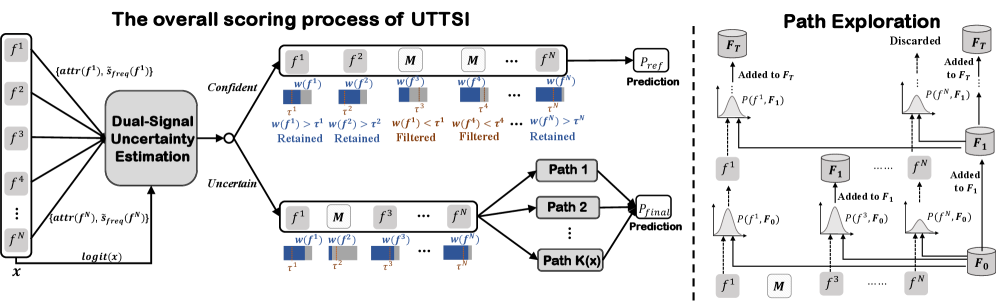

# 阿里，特征随机丢弃+集成解决稀疏样本预测不准，线上CTR+5.3%

关注我，每天为你精挑细选最优质、最新鲜的推荐算法paper，陪你一起保持进步、不断精进！

### 论文：Selective Test-Time Compute Scaling for Click-Through Rate Prediction via Uncertainty-Triggered Feature Path Exploration
### 网址：https://arxiv.org/html/2605.24989
### 公司：阿里
### 思想：测试时计算扩展
### 方向：长尾

## 解读：
本文针对 CTR 预测中稀疏/未见特征组合在推理时预测不可靠的问题，提出一个框架，在 serving 阶段通过不确定性估计，自适应地对高不确定样本进行多条特征路径探索，并通过一致性加权集成提升预测稳健性。

CTR预估有一个根本性的不对称：**训练时模型见过丰富的特征组合，但推理时大量组合稀疏甚至从未出现过**，导致模型对不同样本的预测可靠性差异显著。传统方案靠训练期的自适应门控来应对，但门控本身也被稀疏问题影响，且部署后无法针对每个实例动态调整。

整个框架分两个阶段：**离线预计算**（一次性）和**线上推理**（每个样本独立执行）。

---

### 离线预计算（一次性，随模型一起部署）

**① 特征频率表**
使用 Count-Min Sketch 扫描训练集，统计每个特征值的出现次数，归一化后得到频率先验 $\tilde{s}_{\text{freq}}(f^i) \in [0,1]$。频率越高，说明该特征值越常见，模型见过它的次数越多，预测时就越可靠。

**② 归一化基准 $\gamma$**
跑一遍验证集，取所有样本 $|\text{logit}|$ 的95%分位数作为 $\gamma$，用于后续模型信号的归一化。

这两个值固定后跟随模型一起上线，线上推理不再更新。

---

### 线上推理（每个样本独立执行）

**（1）不确定性评估 → 决定分配几条路径**

对每个请求样本，先走一次正常的前向传播，同时做一次反向传播，得到两个信号：

* **模型信号**：logit 绝对值大 = 自信，用离线 $\gamma$ 归一化：
$$s_{\text{model}}(x) = \min\left(\frac{|\text{logit}(x)|}{\gamma}, 1\right)$$

* **数据信号**：用反向传播得到的每个特征 embedding 的梯度范数（特征归因 $\text{attr}(f^i)$）作为权重，对**离线特征频率表**做加权平均——模型当前最依赖的那些特征，频率越低则越不可靠：
$$s_{\text{freq}}(x) = \frac{\sum_i \text{attr}(f^i) \cdot \tilde{s}_{\text{freq}}(f^i)}{\sum_i \text{attr}(f^i)}$$

融合两者得到不确定性分数（$\alpha=0.05$，几乎完全依赖数据信号）：

$$u(x) = 1 - \left[\alpha \cdot s_{\text{model}}(x) + (1-\alpha) \cdot s_{\text{freq}}(x)\right]$$

据此分配路径数：$K(x) = \lfloor K_{\max} \cdot u(x) \rfloor$，$K_{\max}=8$。

**（2）特征过滤（所有样本都做）**

综合**离线频率先验**和**当前样本的特征归因**给每个特征打分：

$$w(f^i) = \beta \cdot \tilde{s}_{\text{freq}}(f^i) + (1-\beta) \cdot \text{attr}(f^i), \quad \beta=0.4$$

对每个 field 设独立分位数阈值 $\tau^i$，双维度（频率+归因）都低才剔除，保守策略。用过滤后的特征集做一次前向传播，得到基础预测 $P_{\text{ref}}$。

**（3）高不确定样本的路径探索集成（仅 $K(x)>0$ 的样本）**

并行生成 $K(x)$ 条路径，每条路径按 $p_i \propto w(f^i)$ 概率随机采样特征子集，独立前向传播得到 $P_i$。对偏离均值越远的路径赋予越低权重，压制异常路径：

$$\bar{P} = \frac{1}{K}\sum_i P_i, \quad w_i = \exp(-\lambda \cdot |P_i - \bar{P}|), \quad \hat{P} = \frac{\sum_i w_i P_i}{\sum_i w_i}$$

$\hat{P}$ 替代 $P_{\text{ref}}$ 作为高不确定样本的最终预估值。

### A/B：
相比生产线上模型，CTR相对提升5.3%。

## 心得：
* 将LLM的"测试时计算扩展"范式迁移到CTR预估是这篇文章最大的亮点，思路新颖。
* 双信号（模型置信度 + 频率先验×归因）解决了单一logit无法区分认知不确定性和随机不确定性的问题，工程上用Count-Min Sketch也很实用。
* 62%的样本根本不触发多路径，只有真正"不确定"的样本才花额外算力，在延迟和效果之间找到了好的平衡点。

## 愚见
* 论文把"双信号融合"作为核心贡献，但 $\alpha=0.05$ 意味着模型信号权重只有 5%，实际上退化成了单信号（数据频率）。
* **梯度归因用在不确定样本上是循环论证**：用"当前模型的梯度"来判断哪些特征最关键，要求模型对这个样本有可靠判断。但对特征稀疏的高不确定样本，模型的梯度方向本身就不可信——用不可信的梯度去评估不可信性，逻辑上是循环的。

## 可信度：生产

## 推荐等级：有实践价值

**请帮忙点赞、转发，谢谢。欢迎干货投稿 \ 论文宣传\ 合作交流**

### 【铁粉】请入微信群，群内我会给出更深入的解读，还可以共同讨论技术方案、发招聘广告、内推和交友等。
* 铁粉标准：关注公众号一个月以上，且在公众号上累计15次互动（评论、爱心、转发）、或投稿1次、或打赏199，只欢迎技术同学。
* 入群方法：请您加个人微信lmxhappy，我拉您入群，请备注【公司】（只我个人看，不公开）。

## 推荐您继续阅读：
