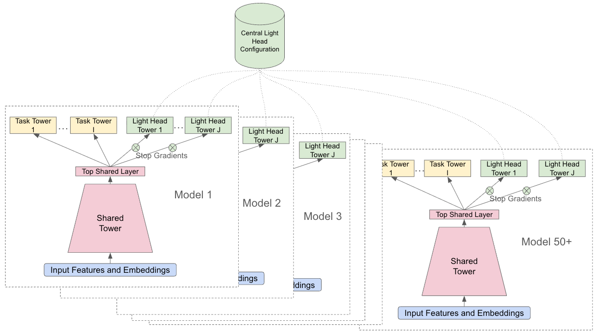
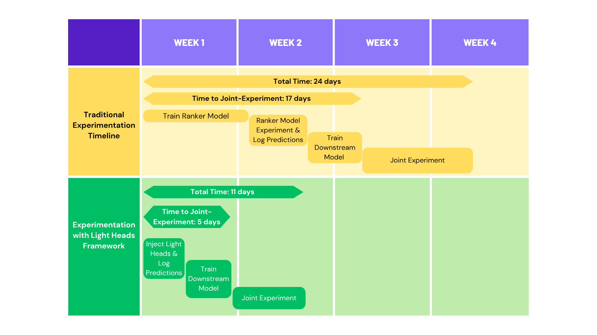

# YouTube：加一个精排新任务，从改代码变成改配置，验证周期 24 天压到 11 天

关注我，每天为你精挑细选最优质、最新鲜的推荐算法paper，陪你一起保持进步、不断精进！

### 论文：Lightweight Ranking Heads: Accelerating Multi-Task Experimentation in Production Recommender Systems
### 网址：https://arxiv.org/abs/2609.25433
### 公司：Google（YouTube）
### 思想：配置化的多模型协同
### 方向：ml-infra

## 解读：

本文讲的是**怎么把一个新任务的验证周期压下来**。做法是**给精排模型挂一个梯度不回传、也不存 checkpoint 的浅塔**，主模型对它完全无感，新任务不必等主干冷启就能验证。但光有浅塔还不够，真正让它敢上生产的是另外两件事——任务定义外置到中心化配置，几十个下游模型一次性跟上，不用挨个改代码；再加一套缺失兜底、导出门禁和监控看板，保证某个 head 挂了也不波及线上。最终把周期从 24 天缩到 11 天。

下面先讲背景，再讲在三方面的工作。

## 背景：为什么加一个新任务要等几个月

假设你想在精排里加一个新的预估目标。听上去是加个 head 的事，实际卡在两个量级的问题上。

**单个模型这边**：新 head 的梯度会回传到共享层，主模型得冷启重训，几十亿参数跑一轮几天到几周；共享层被新目标拽着走，原有任务还会掉点，也就是负迁移。

**整个模型群那边**：上游多出一个预估值，下游消费这个分数的几十个模型接口对不上，得一个个跟着改、跟着重训。追赶期里有的模型已经有新任务、有的还没有，这个割裂状态一拖就是几个月，期间谁也不敢上线。

所以真实开销从来不是训练那几天，是这一整条链路的排队。

## 1 浅塔：让主模型对新任务无感

**结构上就是个浅塔**，几层隐层，挂在和主 head 同一层上，输入是同样的共享表征。

**底部加梯度截断**，这是整套设计的要害。反向传播只更新这个浅塔自己的隐层，共享层一点都不动——主模型对这个新 head 的存在完全无感，因此不用冷启、不会负迁移，原有任务的指标不受影响。

**不存 checkpoint，每次训练重新初始化**。听着反直觉，但省掉的是状态管理：不用管版本、不用管兼容、摘掉就是摘掉。代价是每轮训练开头指标会掉一下，几步之内就恢复——浅塔本来就在单轮训练内收敛得完。

## 2 中心化配置：让几十个模型一次性跟上

上面三条解决的是单个模型的开销，但「下游几十个模型要跟着补」那个问题还在。办法是把任务定义抽到中心化配置里——label、损失函数、激活函数、评估指标全部外置，和模型代码解耦，于是同一个新任务能一次性注入所有正在做实验的模型，不用挨个改代码。

图里看得很清楚：每个模型都是「共享塔 → 顶层共享层 → 任务塔（黄）+ 浅塔（绿）」，浅塔接入处标着 Stop Gradients；上方那个中心化配置用虚线一次连到 50+ 个模型的浅塔上。

## 3 工程兜底：让它敢挂到主模型上

动态注入在生产里一定会出岔子——配置还没传到、模型槽位是陈旧的、某个模型压根没挂上这个 head。论文给了三件套：

**serving 侧缺失兜底**。框架允许为每个 Light Head 定义默认值，线上取不到这个 head 时直接用默认值顶上，不至于让整个请求挂掉。

**导出前自动质量门禁**。模型导出上线之前跑自动评估，所有对外服务的 head——包括 Light Head——都必须过阈值才放行。

**监控看板**。汇总所有在服模型上 Light Head 的质量，在放量到生产之前把outlier的 head 挑出来。

还有一条容易被忽略的设计：**配置在训练开始时读一次，整轮训练期间冻结**。这样即便中心化配置改了，正在跑的任务也不会中途变卦，对那些还没拉取到最新配置的陈旧模型也是安全的。

## 效果

**周期**：联合实验的启动时间从 17 天降到 5 天，整个实验周期从 24 天降到 11 天。

**顺带捞到的收益**：有个 light head 是专门给付费用户做的——YouTube 上可以订阅第三方频道看剧集、电影和体育直播，这个 head 只服务已经付费的那批人，结果把他们对这类内容的互动拉了 **+13.83%**。只服务一小撮用户的定向实验，在原来的排期下根本轮不上；周期压下来之后，它才有机会被验证。

## 心得：
* 这篇真正的贡献是把「实验的组织方式」当成可优化对象，而不是又调了一版模型。大部分团队的迭代瓶颈确实不在训练，在等上下游对齐——而解决这一半的是中心化配置，不是浅塔。只做浅塔不做配置外置，省下的仍然只是单个模型的时间。
* 梯度截断 + 不落盘，等于给主模型装了一个「只读探针」。这个模式不依赖 YouTube 的规模，任何共享底座、多任务的排序系统都能抄。

## 愚见

## 可信度：生产（YouTube Home 和 Watch Next 精排，线上已部署）

## 推荐等级：有实践价值

**请帮忙点赞、转发，谢谢。欢迎干货投稿 \ 论文宣传\ 合作交流**

### 【铁粉】请入微信群，群内我会给出更深入的解读，还可以共同讨论技术方案、发招聘广告、内推和交友等。
* 铁粉标准：关注公众号一个月以上，且在公众号上累计15次互动（评论、爱心、转发）、或投稿1次、或打赏199，只欢迎技术同学。
* 入群方法：请您加个人微信lmxhappy，我拉您入群，请备注【公司】（只我个人看，不公开）。

## 推荐您继续阅读：
* [IEFF — 特征优雅下线，又快又稳 (Meta)](meta-ieff.md)
* [A-MLE — 排序模型调优交给Agent，迭代吞吐翻几倍 (Meta)](../auto-research/meta-amle.md)
