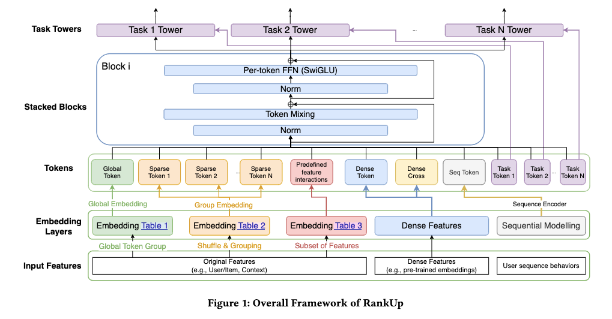

# 腾讯，解决大规模排序模型“表示坍缩”，GMV最高+9.67%

关注我，每天为你精挑细选最优质、最新鲜的推荐算法paper，陪你一起保持进步、不断精进！

### 论文：RankUp: Towards High-rank Representations for Large Scale Advertising Recommender Systems
### 网址：https://arxiv.org/html/2604.17878
### 公司：腾讯
### 思想：正则化、知识蒸馏、注入先验
### 方向：表示学习
## 解读：
通过 5 个输入阶段的增强机制，让 MetaFormer类模型的特征秩保持"初始高、深层稳定"。

### 背景与问题

近年推荐系统的新范式，用 Token Mixer（如 Attention、MLP-Mixer）替代传统 MLP，代表做有Hiformer、RankMixer等。它们可以统一称呼为MetaFormer类模型。这类模型，存在一个问题，即随着网络深度增加，秩不断衰减，到最后一层时，信息大量流失，排序效果下降。

针对这一问题，在不改动 MetaFormer 骨干（Token Mixer + FFN 完全不变）的情况下，在输入表示构建阶段提出 5 个互补的高秩增强机制。这些机制能够有效提升初始表示秩，并维持深层秩的稳定性，从而显著提高了模型的 AUC 和在线 GMV。

### （1）随机置换分割
将输入的稀疏特征field，随机打乱特征顺序，然后再基于打乱后的顺序，按照传统的手段进行分组，做分词化。这样，大大降低Token间相关性，让每个Token携带更独特的信息。实验证明，这对长尾特征特别有效，互信息矩阵显示冗余显著降低。

随机性即正则化，类似于 Dropout、Shuffle Data Augmentation、Random Masking 等经典技巧——随机扰动输入的结构，迫使模型不能依赖任何固定的“捷径”，必须学习更鲁棒、更通用的表示。

注意，有人会问：下游的网络层不在意输入的顺序吗？
传统的MLP模型，特征field的顺序必须固定。第一层线性层（或全连接层）的权重是位置绑定的：第 17 个特征永远对应第 17 个权重。如果你把特征顺序打乱，模型相当于“认错了人”，权重完全匹配不上 → 模型彻底失效。

但是MetaFormer类模型里，在分词化后的Token Mixer的工作方式是：把 T 个 Token 看作一个无序的集合，在所有 Token 之间做对称的混合。它学习的是“任意两个 Token 之间应该如何交互”，而不是“第 3 个 Token 必须跟第 5 个 Token 交互”。这种设计天生具有置换不变性或通过学习获得对任意顺序的鲁棒性。

注意，只有本机制是严格只针对稀疏特征的，下面另外4个机制的适用范围不限于稀疏特征。

### （2）多嵌入表示范式
每个稀疏特征不再只用 1 个 Embedding Table，而是 K 个独立的 Embedding Table（K>1），多个 Embedding 向量在 Token 形成时拼接或聚合后，形成高维冗余初始化，为后续层提供更丰富的起点。

**设计思想**：冗余不是浪费，而是保障。多个独立视角看同一个特征 → 更全面的特征表达 → 初始秩更高。

### （3）全局 Token 集成
引入一个基于所有特征显式池化构造的全局 Token，与所有局部特征 Token 一起全程参与 MetaFormer 计算。这样，每一个局部 Token 都能在每一层 Token Mixer 中直接与全局上下文交互，形成高效的‘全局-局部’信息流动，显著缓解了深层 FFN 的秩收缩现象。

**设计思想**：避免信息孤岛。单个 Token 的信息可能衰减，但全局 Token 充当"信息枢纽"，确保深层网络始终有一个高维的"参考点"。

### （4）跨域预训练嵌入交叉集成
利用其他域预训练好的用户嵌入和物品嵌入，做逐元素乘法（模拟特征级交互）后再线性投影，获得一个新 Token。这样，注入外部先验知识，进一步丰富初始表示空间。

**设计思想**：知识蒸馏与迁移学习。不重新学习，而是直接利用其他域已学到的用户/物品语义，快速提升当前域的初始秩。

### （5）任务特定 Token 解耦
为每个任务，引入一个可学习的专用 Token（与共享 Token 一起参与所有 L 层计算）。这样，任务专用 Token 在共享骨干中独立演化，减少梯度干扰，让每个任务都能充分利用高秩表示空间。在训练时，被对应任务的梯度“专门拉扯”，逐步获得该任务特有的表示信息。

**关键点**：任务专用 Token 从**输入层就开始加入**，与共享 Token 一起走完整 L 层 MetaFormer，最后才被各自的任务塔使用。它不是”后期补丁”，而是”全程伴随”的专用表示载体。

**设计思想**：多任务学习中的解耦。避免不同任务梯度相互干扰，每个任务有专属的表示通道，更好地保持各自的秩。

### 补充——秩 (Rank) 与 erank 的通俗解释

**秩是什么？** — 特征信息的"独特性"指标

想象你有10个推荐员工：
- **秩低**：10人都来自同一所学校、同一专业、同样背景 → 他们的想法高度重复，虽然有10个人，但只相当于"1个独特思路"
- **秩高**：10人来自不同领域、不同背景、不同经历 → 他们各有独特视角，能提出10种不同方案 → 信息丰富、互补性强

**为什么要关心秩？** 在深度学习中，低秩意味着特征重复浪费，高秩意味着信息丰富可利用。

**erank是什么？** — "有效秩"，衡量真正在干活的维度

虽然你有100维特征，但可能只有20维在真正发挥作用（梯度大、更新活跃），其他80维在"打瞌睡"。**erank ≈ 20**。

### A/B：
论文在线全量上线已验证，在微信视频号/公众号/朋友圈三大场景带来 2.12%~4.81% GMV 提升，冷启动场景更高达 9.67%。

## 心得：
* follow up知名的公司的知名模型，并深入研究模型的每一个组件，发现问题，解决问题，拿到好的结果。这是一条比从0开始做模型更好的工作路径。本文明显就是跟踪RankMixer的工作，发现了随着层数的增高，出现低秩问题，并提出了针对性的解决方案。5种机制没有哪一种是fancy到普通算法工程师想不到的。

## 愚见
* 本文的方法适用于metaFormer类模型，并不适用于MLP做骨干的排序模型。

## 可信度：生产

## 推荐等级：有实践价值

**请帮忙点赞、转发，谢谢。欢迎干货投稿 \ 论文宣传\ 合作交流**

### 【铁粉】请入微信群，群内我会给出更深入的解读，还可以共同讨论技术方案、发招聘广告、内推和交友等。
* 铁粉标准：关注公众号一个月以上，且在公众号上累计15次互动（评论、爱心、转发）、或投稿1次、或打赏199，只欢迎技术同学。
* 入群方法：请您加个人微信lmxhappy，我拉您入群，请备注【公司】（只我个人看，不公开）。

## 推荐您继续阅读：

