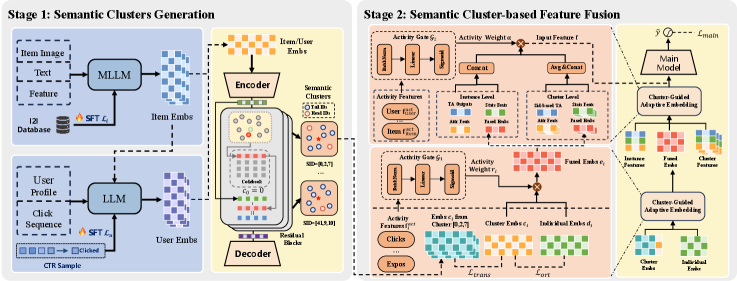

# 阿里，增加聚类相关特征，GMV提高3%

关注我，每天为你精挑细选最优质、最新鲜的推荐算法paper，陪你一起保持进步、不断精进！

### 论文：From Head to Tail: Asymmetric Knowledge Transfer in Long-tail Recommendation with Generative Semantic IDs
### 网址：https://arxiv.org/pdf/2605.23310
### 公司：阿里
### 思想：聚类、对比学习
### 方向：特征工程

## 解读：
在原有特征的基础上，增加了user和target的所在簇的相关特征。

具体的，将 user 和 item 的表征显式分解为 Cluster Embedding 与 Individual Embedding，并通过对比学习和正交正则化，提升了 cluster 级表征的质量。在此基础上，通过 Target Attention 建模个体粒度用户兴趣；同时，利用 semantic ID 进行硬检索，聚合同簇特征，建模簇粒度用户兴趣。最终通过自适应门控将两个视图融合，得到更全面的表示输入主网络。

### （1） user和item的量化
都分别通过RQ-VAE对user和item做量化，分别获得其SID。第一层SID通过embed layer获得embed，称之为cluster embedding。
这样，user和item都获得了cluster embedding。

### （2）user和target的表征拆解
先将user和target item的表征拆解成两种表征，分别叫cluster embedding和个体嵌入（Individual Embedding）。前者就是上面获得的，后者就是每个user（item）所特有的；后者是通过embed layer对user id（item id）获得的。两个表征的优化：
* 通过in-batch的对比学习，添加infoNCE损失，优化了这个cluster embedding。
* 添加两个表征的正交的辅助损失。

user（target）的最终表征，就是这两种表征的加权和。它是一个高质量、去噪、语义丰富的表示。
其中，权重是一个门控网络，输入是user（item）的动态统计特征。

### （3）两种粒度的特征
构建个体粒度和簇粒度两个并行特征视图，然后自适应融合。
#### 个体粒度：都是target item粒度的，是相对于下面的cluster而说的。下面三类特征表征的拼接：
* user的属性特征、统计特征、上面user嵌入的拼接；
* target的属性特征、统计特征、上面item嵌入的拼接；
* 用户兴趣：使用 Target Attention，query 就是上面获得target item 的 embedding，key和value是序列item，是个体嵌入+ 商品属性 + 统计特征 + 用户历史的拼接。注意，论文没有提，但是query、key和value要先做一个线性变换，再做attention，虽然论文没提这点。因为size不同，生成方式不同而导致的query和key/value不在一个空间。
    * Query 用融合后的 embedding 是因为它需要高质量的语义表示去主动检索历史；Key/Value 用个体嵌入 + 特征拼接是因为历史 item 需要保留更多原始细节信息，同时兼顾计算效率。
#### 簇粒度：在同一语义簇内聚合特征。下面三类特征表征的拼接：
* user所属cluster下所有的user的表征（同上）的平均。其中，所属cluster是user的第一级SID。
* target所属cluster下所有的item的表征（同上）的平均。
* 用户兴趣：模型SIM，即先hard search出来子序列，再对子序列做Target Attention。query、key和value都同上。其中，做SIM之前，序列item也要转成SID，用target item的第一级SID，搜索序列item的第一级SID，将相同的，从序列里筛选出来，组成子序列。

个体粒度和Cluster粒度都分别获得了一个表征，这两个表征，做加权求和。（只有）这个表征接入主网络，预测CTR等。
其中，权重用一个门控网络。输入是用户活跃度 + 商品活跃度 + 交叉活跃度。

### A/B：
天猫，CTR +2.76%，GMV +3.47%

## 心得：
* 本文就是增加了更粗粒度的特征——簇特征，从多个角度出发的，如user、item，以及行为序列建模也用簇来hard search。

## 愚见
* 论文说头部item向tail item做知识转移，我没有看明白。都用的是它们相同的cluster embedding，无法体现出来两者的转移。加入聚类特征天然就能提高长尾item的建模效果的。

## 可信度：生产

## 推荐等级：有实践价值

**请帮忙点赞、转发，谢谢。欢迎干货投稿 \ 论文宣传\ 合作交流**

### 【铁粉】请入微信群，群内我会给出更深入的解读，还可以共同讨论技术方案、发招聘广告、内推和交友等。
* 铁粉标准：关注公众号一个月以上，且在公众号上累计15次互动（评论、爱心、转发）、或投稿1次、或打赏199，只欢迎技术同学。
* 入群方法：请您加个人微信lmxhappy，我拉您入群，请备注【公司】（只我个人看，不公开）。

## 推荐您继续阅读：

