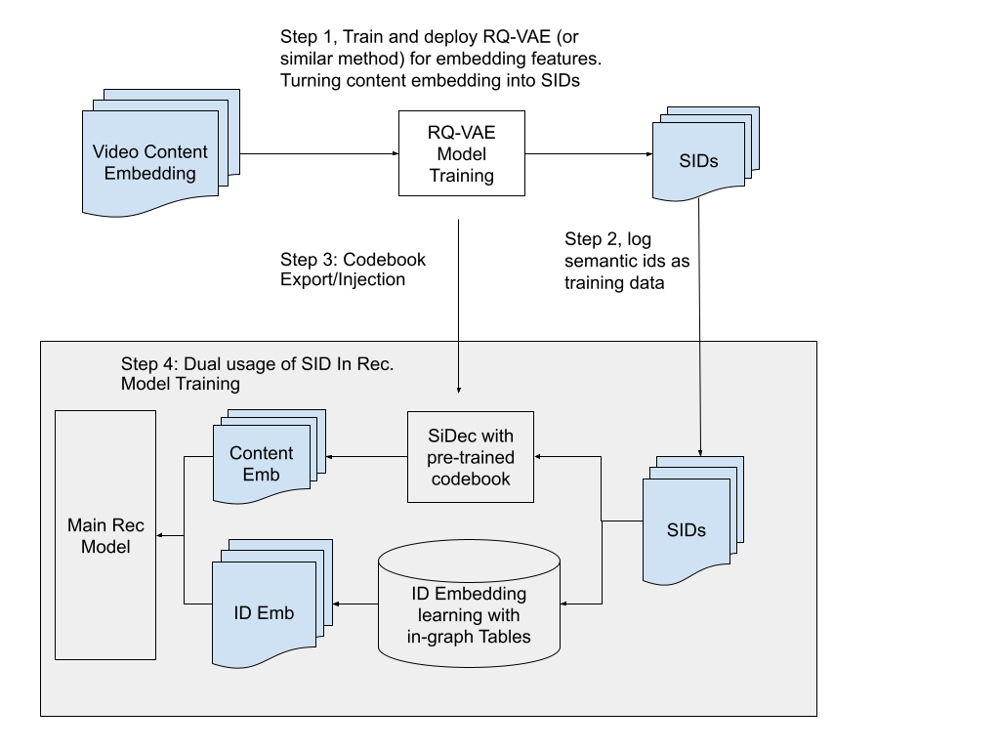

# YouTube：从 SID 重建内容 embedding，长序列终于用得起

关注我，每天为你精挑细选最优质、最新鲜的推荐算法paper，陪你一起保持进步、不断精进！

### 论文：Tokens are All You Need: Dual-purpose Semantic IDs for Achieving LLM-Level I/O Efficiency in Recommendation Systems
### 网址：https://arxiv.org/abs/2607.24865
### 公司：Google
### 思想：以算力换带宽
### 方向：SID

## 解读：

这篇拿了 RecSys 2026 工业赛道的最佳论文提名。做法是：日志里不记 item 的内容 embedding，只记它的 SID；训练和推理时再用一个小模型把 SID 转回内容 embedding，序列 item 和目标 item 都用上，以此提升建模效果。

为什么要绕这一圈：长序列下每个位置都搬一个稠密内容向量，代价扛不住，内容特征在实践中早被砍了；而 SID 作为身份特征，本来就已经躺在日志里。所以这篇做的事，是让**内容信号搭上一趟已经付过费的便车**。

下面两步：先讲 SID 怎么生成出来，再讲同一串 token 怎么同时当身份和内容用；最后展开一下协同那一路的实现细节。

## 1 日志里只存 token

先用 **RQ-VAE（残差量化）** 把内容向量变成一串整数。做法是：准备一本「码本」——可以理解成一册预先聚类出来的标准向量，每条有个编号；拿目标向量去里面找最接近的一条，记下编号，再把「原向量减去这条」的残差拿去找第二条，如此重复几轮。最后得到的几个编号，就是这个视频的 Semantic ID。

**省在哪？** 一个 256 维的内容向量，FP32 下是 256×32 = 8192 bit。量化之后假设用 8 轮、码本有 4096 条（每个编号占 12 bit），一共只要 8×12 = 96 bit——**不到原来的百分之一**。论文给的压缩区间是 50 到 100 倍。（具体用了几轮、码本多大，论文没公开，这里是按压缩比反推的示意。）

日志里直接记这串编号、不记原始向量（图里 Step 2），码本则离线导出、注入到推荐模型（Step 3），不跟着样本流动。这也是整件事能成立的原因：**码本大小只和「有多少条标准向量」有关，和「有多少个视频」无关**，所以小到能塞进模型图里。

## 2 双重身份：同一串 token 干两件事

「双重身份」指的不是两个模型，而是**同一串 token 被复用了两次**（图里 Step 4）。两条路参数独立、训练目标也独立，最后在模型里拼到一起。

**一路当协同身份。** 把每个 token 当类别特征，查一张可学习的 embedding 表，跟着主模型的推荐损失一起训。这路学的是「这个视频被谁喜欢」，是纯协同信号，和内容语义无关。

**另一路重建内容。** 同一串 token 去查注入进来的码本，再过一个叫 **SiDec** 的轻量解码器（就是RQ-VAE里的decoder，一般实现为 MLP 或浅层 Transformer），现场算出内容向量的近似值。这路的目标是 MSE 拟合原始内容 embedding，学的是「这个视频内容上是什么」。论文试了两版，v0 解到 64 维、v1 解到 256 维，v1 更好。

**分工很清楚：前者管记忆，后者管泛化。** 协同那一路对高频 item 很准，但新视频没人看过，表里那行还停在初始化状态；内容那一路不依赖任何交互历史，视频一上传就有信号——**冷启和长尾靠它兜底**。

而存储侧自始至终只有整数 token，稠密向量在加速器上实时重建。本质是拿算力换带宽：算 MLP 很便宜，搬 200KB 很贵。

### 细节：协同那一路，token 该怎么组织

同一串 token，组织方式不同，记忆和泛化的权衡就不同。论文列了四种：**Unigram** 每个 token 独立查表再聚合，最省内存但丢掉层级关系；**重叠 Bigram** 滑窗取相邻两个 token 的组合查表，能捕捉语义邻域；**嵌套 N-gram** 按前缀逐级查表——第 1 个 token 一张表、前 2 个一张表、前 3 个一张表，语义相近的 item 共享高层 embedding；**SentencePiece** 则不人工指定，按数据分布自己学怎么切分组合。

论文没给全局最优，但明确说**嵌套 N-gram 和 SPM 在冷启场景更合适**，道理就是前缀共享——长尾 item 能借到高频 item 的参数。

## A/B效果
在 YouTube 精排和召回两套模型上都做了。精排：全站满意互动 +0.09%，观看页 +0.80%，首页 +0.08%~0.22%。召回：全站 +0.06%，首页 +0.13%。论文强调收益**不成比例地集中在新账号和长尾内容**上。

## 补充——内容特征进模型的历史时间线

这篇要放在一条演化线上看，否则会觉得「不就是存个 token」。

**阶段 0：内容 embedding 直接用。** 文本、视频、图像的表征当 side feature 拼进模型，那时序列不长，稠密向量的搬运成本还扛得住，交互信号和内容语义都能学到。

**阶段 1：序列变长，内容 embedding 用不起了。** 长用户历史被证明对排序质量帮助明显，序列从几十涨到几百上千，每个位置都要搬一个稠密向量，I/O 随长度线性膨胀。论文给了具体的账：历史长度 200、维度 256，一条训练样本光这部分就是 51200 个浮点数、FP32 下 **200KB**，乘上几十亿条样本直接顶到带宽天花板。于是实践中内容特征被降级甚至砍掉，序列里只留便宜的 ID 类特征。

**阶段 2：SID 登场，解决身份的泛化问题。** RQ-VAE 把内容 embedding 量化成层级语义 ID，最早用于生成式检索（Rajput 2023），后来被带进 YouTube 排序（Singh 2024）：原子 ID 记忆强但泛化差，原始内容表征泛化好但记忆弱，SID 的层级子块结构两头兼顾。SID 就此成为生产中序列 item 的标准身份特征。**但它只承载了「身份」**——模型知道这个 item 和谁长得像，却拿不到当初被量化掉的内容语义。

**阶段 3：SiDec 让内容特征搭 SID 的便车。** 核心洞察很简单——SID 本来就是从内容 embedding 量化来的，它**就是**内容语义的压缩码。既然生产已经为 SID 付过 I/O 了，就不必再为内容 embedding 付第二遍：用码本查表加一个轻量解码器，在加速器上把内容向量现场算出来。

一句话：**内容 embedding 从来没离开过模型，变的是它进模型的通道**——从每次搬运稠密向量，到只搬整数 token，再到搬整数 token、内容信号现场算出来。

## 心得：
* 主要是降本，其次才是提效。同样把 SID 当特征，以往比的是「加了这个特征，AUC 涨多少」，这篇比的是「这个特征有多便宜」。效果只要不掉，能大幅降本就够上线了。
* 收益集中在长尾和新账号，两条路都有功劳：内容那一路不依赖交互历史，新视频天然就有信号；协同那一路走嵌套 N-gram 的前缀共享，低频 item 能借到高频 item 的参数。两者都比「给低频 ID 多训几轮」实在——样本量摆在那，多训也训不出来。
* 本文给出的SID的协同使用方法，是值得业界使用和尝试的。

## 愚见

## 可信度：生产（YouTube 精排与召回，线上 A/B 已部署）

## 推荐等级：有实践价值

**请帮忙点赞、转发，谢谢。欢迎干货投稿 \ 论文宣传\ 合作交流**

### 【铁粉】请入微信群，群内我会给出更深入的解读，还可以共同讨论技术方案、发招聘广告、内推和交友等。
* 铁粉标准：关注公众号一个月以上，且在公众号上累计15次互动（评论、爱心、转发）、或投稿1次，只欢迎技术同学。
* 入群方法：请您加个人微信lmxhappy，我拉您入群，请备注【公司】（只我个人看，不公开）。

## 推荐您继续阅读：
* [QuaSID — SID 量化新方法，GMV+2% (快手)](kuaishou-quasid.md)
* [AKT-Rec — 聚类相关特征提升长尾，GMV+3% (阿里)](alibaba-akt-rec.md)
